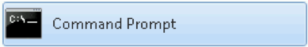
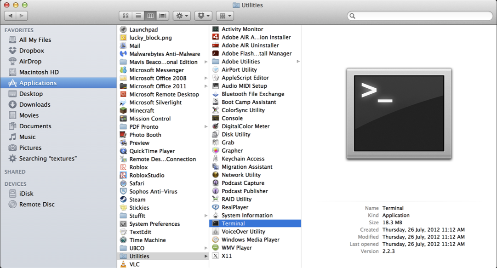

### Why learn command line?
The command line is the text interface to the computer.
Understanding the command line allows you to interact with the computer in ways that you often cannot with the graphical user interface (GUI).
The command line is commonly used for scripting and automation of tasks and when accessing remote systems.
It will also be useful to run programs that make use of the command line (eg. github).
 
### What is the Command Line?

The <b>command line </b>is the text interface to the computer that accepts commands that the computer will execute. These commands include:
􏰏- starting programs
- navigating directories and manipulating files 
- searching, sorting, and editing text files 
- system and environment configuration

### Why use command line?
The command line is part of the operating system (OS), which is software that manages your computer including all devices and programs.
􏰏 
- Common operating systems include Windows, Mac OS, and Linux/Unix.
􏰏- Some commands will be OS specif

You might be wondering why we would ever prefer command line over using the graphical user interface (GUI).
􏰏 􏰏- Certain tools may only be available to command line. 
 - Sometimes command line is faster.
 
 ### Windows Command Line

The command line on Windows dates back to the original Microsoft operating system called DOS (Disk Operating System) in 1981.

This command line interface is still part of all modern Windows operating systems and is accessible as the "Command Prompt".


To access this, navigate to the start menu with your mouse (or click the windows button on your keyboard) and type “cmd" then
ENTER .

### Command Line - Windows


### Mac OS Command Line
The command line for Mac OS uses the same commands as Linux. It can be opened using Finder then Utilities then Terminal.



Alternatively, we could type Cmnd + spacebar, then type “Terminal" and press ENTER
### Command Line - Mac/Linux


### Entering a Command
Enter a command at a prompt. The prompt may be a > or a $ or
customized by the user.

Press ENTER to execute the command.

On Windows, commands are mostly case-insensitive while on Mac/Linux they are case-sensitive.


```text
ls
For example, the ls/dir (Mac/Windows), lists all the contents (i.e files and folders) inside or your current directory.
```
### File System
The file system organizes data on a device as a hierarchy of directories and files (like a tree).
Each folder (AKA directory) has a name and can contain any number of files or subdirectories.
Each file has a name.
The user can change (navigate) directories in the hierarchy


### File System
The tree is rooted at, well, the root.
􏰏 - There is only one root of a directory hierarchy.
Every item in the tree is either a file or a directory (AKA folder).
􏰏 - You can think of a directory as a container that may contains
files and/or other directories.
􏰏 - Files on the other hand holds information (and cannot contain other files or directories) .

If directoryC is contained in directoryP, then directoryC is a child of directoryP and directoryP is said to be the parent to directoryC.
􏰏 - A directory may have many children, but can only have one parent.

### Absolute versus Relative Path
􏰏
􏰏- The root of the file system is the directory "/" 􏰏
   - There is only one root of a directory hierarchy.
- A path to a new location (from your current location) can be specified as an absolute path from the root (this will work no matter where we are in the file system):
           cd /Users/ivrbik/301/level1
or a relative path from your current location (this will only work if we are in /Users/ivrbik/):
           cd 301/level1
- The directory separator is a forward slash ‘/’ for Macs/Linux.
In windows you may use forward or backward slashes ‘/’ or ‘\’
􏰏
### Short forms
􏰏 - ‘.’ is the short-form for the current directory
􏰏 - ‘..’ signifies the parent directory (akin to pressing Cmnd +↑
on a Mac)
􏰏 - For example, to navigate (i.e. change directories) to the parent directory of the current directory, use the command:
     cd ..
- Note that this command is dependant on your current directory (i.e. the folder you are currently in).
```text
pwd/cd
To print your current working directory type pwd/cd (Mac/Windows) then ENTER .
```
### Absolute versus Relative Path Question
 ```text 
 Example
Given this directory hierarchy and that the user is currently in the directory level2 and level1 directory contains a file test.txt. How many of the following statements are TRUE?
1. A relative path to change to directory 301 is ..
2. Absolute path to test.txt is /Users/ivrbik/301/level1/test.txt
3. Relative path to test.txt is ../test.txt
4. Relative path to test.txt is different if
user was currently in level3 directory.
5. There is only one root of the directory hierarchy.
A) 0 B) 1 C) 2 D) 3 E) 4 
```

   
### makdir
Download this filesystem as a zip file on Canvas.
􏰏 - To create a new folder in the current directory we use mkdir.
􏰏 - To complete this task we need to specify the directory name as an argument.
􏰏 - For example, the following creates a folder called NewFolder in the current directory:
          
  ```
  mkdir NewFolder
  ```
  
 ```text
Exercise: mkdir
Navigate to the 301 folder and create a new folder called Demo.
```

### touch
􏰏-  We can create files using the touch command.
􏰏-  Like mkdir we need to specify a argument.
􏰏-  Rather than a folder name, we provide a filename as the argument.
􏰏-  For example, the following command creates a new file named empty.txt inside the current working directory.
```
touch empty.txt
```
```text
touch
Navigate to the Demo folder and type touch abc.txt
```
    
### notepad/nano
􏰏
􏰏- To create a file with actually text, we can use the notepad/nano command (Windows/Mac).
- Typing nano will open a blank file for editing.
- We can then type the desired text and save using the shortcuts
given on the bottom of the window. More shortcuts [here](https://skorks.com/2009/09/bash-shortcuts-for-maximum-productivity/).
- N.B. the standard shortcuts we might be used to wont work in
this command line (eg. Ctrl /Cmnd + C for copy);


