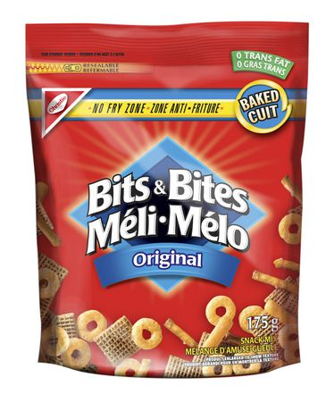
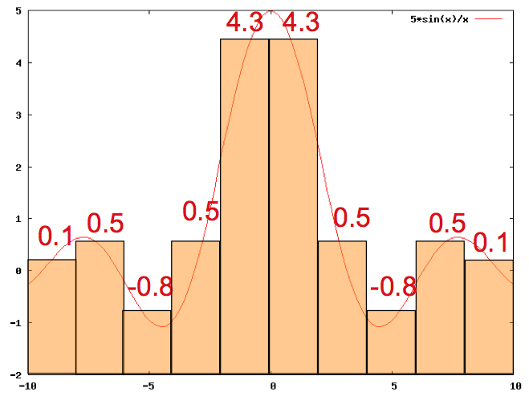
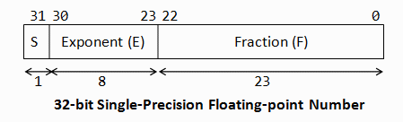
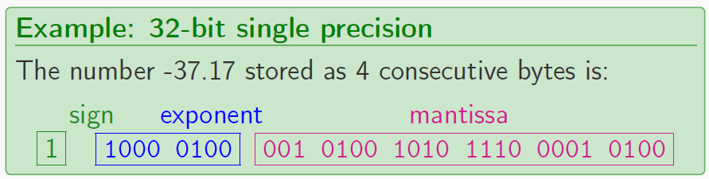

## Data Representation

### Computer Terminology
There is a tremendous amount of terminology related to technology.\
Using terminology precisely and correctly demonstrates understanding of a domain and simplifies communication.\
We will introduce terminology as needed.

### Basic Computer Terminology
- A **computer** is a device that can be programmed to solve problems.
- **Harware** includes the physical components of computer
    - (eg. central processing unit, monitor, keyboard, computer data storage, graphic card, speakers).
- **Software** programs that a computer follows to perform
functions
    - (eg. operating system, internet browser).
- **Memory** is a device which allows the computer to store data either temporarily (lost when computer reboots, eg.
RAM) or permanently (data is preserved even if power is lost, eg. hard drive).
- There are many different technologies for storing data with varying performance.
- Some live inside your computer while others are portable and can be used on difference devices (e.g. USB drives).

### “The Cloud”
“The Cloud" is not part of your computer but rather a network
of distributed computers on the Internet that provides storage,
applications, and services for your computer.

Examples:
- **Dropbox** is a cloud service that allows you to store your files on machines distributed on the Internet.
Automatically synchronizes any files in folder with all your machines.
- **iCloud** is an Apple service that stores and synchronizes your data, music, apps, and other content across Apple devices.
- [**Google Docs**](https://www.google.com/docs/about/) you can write, edit, and collaborate wherever you are. For free.

### What is data?
> **Data**: information, especially facts or numbers, collected to be examined and considered and used to
help decision-making, or information in an electronic form that can be stored and used by a computer.
– [Cambridge Dictionary](https://dictionary.cambridge.org/dictionary/english/data)

However, is can be argued (see [this article](https://siliconangle.com/2014/03/05/data-does-not-equal-information-bigdatasv/) for example) that
data &ne; information.\
In addition, on might refer to *raw* data as a collection of number/facts that don’t have meaning until it has been analyzed or has been given meaning.

### How is data measured?
- Computers represent data [digitally](https://homepage.cs.uri.edu/faculty/wolfe/book/Readings/Reading02.htm)
meaning that data is represented using discrete units called as bits (Binary Digits).
- The real-world is *analog* where the information is encoded on a continuous signal (spectrum of values, ie. infinite sounds/colours).
> “Like with the artist’s abstract composition, the trick is to take all of the real-world sound, picture,
number, etc. data that we want in the computer and convert it into the kind of data that can be
represented in (on/off) switches.” – [University of Rhode Island](https://computing-concepts.cs.uri.edu/wiki/Data_Representation_For_Computing)

Data size is measured in bytes.

- A bit is either a 0 or a 1.
- A *byte* contains 8 *bits* (*B*inary Dig*its*)
- A *nibble* contains 4 *bits* (*B*inary Dig*its*)  
**Larger units**:
- kilobyte (KB) = 1000 bytes 
- megabyte (MB) = 106 bytes (or 1000 KB) 
- gigabyte (GB) = 109 bytes (or 1000 MB) 
- terabyte (TB) = 1012 bytes (or 1000 GB) 
- petabyte (PB) = 1015 bytes (or 1000 TB) 
- exabyte (EB) = 1018 bytes (or 1000 PB) 
- zettabyte (ZB) = 1021 bytes (or 1000 EB) 

### Memory/Data Size
**Memory size** is a measure of memory storage capacity in bytes. It represents the maximum capacity of data in the device.

**Example 1**\
Given this flask, assume the red liquid is data and each mark represents 100 MB of data. Select a true statement.\
A) Memory size is 200 MB.\
B) Flask can hold 0.5 GB of data.\
C) Data size is about 200 KB.\
D) Data size of 1000 KB would "overflow device".\
E) All of the above statements are false.

### START SOLUTIONS HERE
**Example 1**\
Given this flask, assume the red liquid is data and each mark represents 100 MB of data. Select a true statement.\
A) Memory size is 200 MB. *~500MB*\
**B) Flask can hold 0.5 GB of data.**\
C) Data size is about 200 KB. *~200 MB*\
D) Data size of 1000 KB would "overflow device". *1000 KB = 1 MB < 500 MB*\
E) All of the above statements are false.
### END SOLUTIONS HERE

### Analog vs. Digital: Thermometer example
A thermometer contains liquid which expands and contracts in response to temperature changes.

The liquid level is analog, and its expansion continuous over the temperature range.  

This information can be represented using discrete units using digital thermometer, for example.

     

### Conversion of Analogue to Digital
How would you digitize this analog data into 10 discrete points? \

### Why go digital over analogue?
1. Computers are digital and many home electronics are interfacing with computers.
1. Analog signals are more susceptible to noise that degrades the quality of the signal (sound, picture, etc.). The effect of
noise also makes it difficult to preserve the quality of analog signals across long distances.
1. Reading data stored in analog format is susceptible to data loss and noise. Copying analog data leads to declining quality.

A computer memory consists of billions of bits which allows for an almost limitless number of possible states.
Bits are combined to allow more information to be represented including characters and numbers
- eg. 0 = off, 1= on
- 01100010 = “b”
To do this, it needs a set of rules on how to translate binary information into things like numbers, text, photos, video, etc.

### Bits and Bytes
Numbers are encoded in a computer using a fixed number of bits (usually 32 or 64).
| # of bits | Unique patterns | # of unique patterns |
| ----------- | ----------- | ----------|
| 1 | 0,1 | 21 = 2 |
| 2 | 00, 01, 10, 11 | 22 = 4 |
| 3 | 000, 001, 010, 100, 011, 101, 110, 111 | 23 = 8|
|...|...|...|
| 32 |...|232 = 4, 294, 967, 296|
| 64 |...|264 > 18 quintillion|

The more bits you have, the more values you can represent.

### Decimal System
- Assuming we use a 32-bit register, we now need a way of mapping or converting these unique patterns of 0s and 1s to a specific meaning (in this case a number).
- A **binary number** is a number expressed using only 0s and 1s (ie. in the base-2 numeral system or **binary numeral system**).
- Before discussing the binary system, let’s first discuss a conversion system you should all be familiar with: the **decimal system**.

The decimal system uses digit placeholders, say ,  :white_large_square: , that can take on values from the set {0; 1; 2; 3; 4; 5; 6; 7; 8; 9} \
The number of digits in the set is called the **base**. So the base for this system is 10. \
Reading from right to left, the first placeholder represents ones, the second, 10s, the third hundreds, and so on . . .

> We write eight million, two hundred ninety thousand, eight hundred forty one as:\
 :eight::two::nine::zero::eight::four::one: \
= 8 * 106 + 2 * 105 + 9 * 104 + 0 * 103 + 8 * 102 + 4 * 101 + 1 * 100

### Representing Data: Integers
A binary system works in the same way, only now, the placeholder must take a value from the set {0; 1}.\
To put another way, instead of using base 10 wherein: 
ones=100, tens=101, hundreds=102, thousands=103, etc.\
we use base 2 where:
ones=20, ‘twos’=21, ‘fours’=22, ‘eights’=23, etc. .

> For example, the integer 164 would be expressed as \
 :one::zero::one::zero::zero::one::zero::zero: \
164 = 128 + 32 + 4 \
1 * 27 + 0 * 26 + 1 * 25 + 0 * 24 + 0 * 23 + 1 * 22 + 0 * 21 + 0 * 20

### Converting decimal to binary
There are a number of websites online ([ex 1](https://www.rapidtables.com/convert/number/decimal-to-binary.html), 
[ex 2](https://binary-system.base-conversion.ro/convert-positive-unsigned-integers-from-decimal-system-to-unsigned-binary.php)) 
that can convert numbers from our decimal system (or simply decimal)
to the binary system (or simply binary). However the steps to do it on paper are quite easy:
1. Divide the decimal number by 2.
1. Keep track of the integer quotient for the next iteration.
1. Keep track of the the remainder for the binary digit.
1. Repeat steps 1–3 until the quotient is equal to 0.
1. Construct the base 2 representation, by taking all the remainders starting from the bottom up.

Let’s look at an example . . .
>**Exercise**\
Convert 3710 from base 10 (i.e decimal) to binary base 2.

>**Try it!**\
Convert 13210 from base 10 (i.e decimal) to binary base 2.

>**Question**\
Does any see a problem with this system?\
**Hint**: this system is called *unsigned binary*

### Representing Data: Integers
Recall a 32-bit register can store 232 different values. \
The range of integer values it will represent depends on the *encoding* type.

**Unsigned Binary** Range is 0 through 4,294,967,295 = (232 - 1)

**2’s compliment** We use the first bit to store the sign (0=+, 1=-), so the range is -2,147,483,648 (-231) through 2,147,483,647 (231 - 1) .

### Representing Data: Real Numbers
There are many standards for representing real numbers which include integers, rationals, fractions (eg -4, &Sqrt;2, 1/3).\
The most common is [IEEE 754](https://en.wikipedia.org/wiki/IEEE_754) format which uses floating-point (FP) representation.

Similar to scientific notation, FP expresses real numbers using a base and an exponent:
N = m * r e
- m = mantissa (the decimal component of a number)
- e = exponent
- r = radix\
IEEE 754 adopts a binary FP where r = 2.

### Representing Data: Doubles and Floats [Photo souce](https://blog.penjee.com/binary-numbers-floating-point-conversion/)
Modern computers adopt *IEEE 754* for floating-point numbers with two representation schemes:

**32 bit/single-precision (or “float’)** 1-bit sign; 8-bit exponent; 23-bit mantissa

**64 bit/double-precision** 1-bit sign; 11-bit exp; 52-bit mantissa

- As before, let’s revisited a related concept (which we all would have learned about in high school) to make this
new concept easier to understand.
- Scientific notation operates in very much the same way as FP representation.
- Key features of normalized standard scientific notation:
    - There is a single non-zero digit to the left of the decimal point
    - The power indicates how far we’ve moved the decimal point to the left (+ exponent) or right (- exponent)

### Representing Data: Normalized scientific notation
> **Example: Normalized scientific notation:**\
The number 55,125.17 in normalized scientific notation is:
5.512517 * 104

Key features of normalized standard scientific notation:
- 5.512517 is our **mantissa**
- 4 is our **exponent**
- 10 is our **radix**

> **Example: Normalized scientific notation:**\
The number 0.000 000 007 51 in normalized scientific notation is:
7.51 * 10-9

Key features of normalized standard scientific notation:
- 7.51 is our **mantissa**
- -9 is our **exponent**
- 10 is our **radix**

### Converting decimal fraction to binary - Phase 1
1. Convert the integer part of decimal to binary (as on [this secton](#converting-decimal-to-binary))
1. Convert the fractional part of decimal to binary equivalent
    1. Multiply the fractional part by 2.
    1. Keep track of the integer part for the binary digit
    1. Keep track of the fractional part for the next iteration
    1. Repeat steps 1–3 until the fractional part is equal to 0 or we have enough digits to fill the mantissa
    1. Construct the base 2 representation, by taking all the integer parts starting from the top
1. Write the result from step 1 to the left of the decimal and the result from step **2** to the right of the decimal.
### Converting decimal fraction to binary - Phase 2
4. Normalize the result from step 3 by shifting the decimal (either left or right) so that only one non zero digit
remains to the left of the decimal. The number of places we shift will determine our exponent
5. Adjust the exponent by adding 2(8-1) - 1 to the exponent
6. Convert the result in step 5 to to binary (as on [this section](#converting-decimal-to-binary))
7. Construct the binary number:
    1. Fill in the sign bit (0 = positive, 1 = negative)
    1. Fill in the exponent bits with the result from step 6
    1. Fill in the mantissa with the first 23 digits to the right of the decimal from step 4
    
    
    
### Representing Data: Doubles and Floats

**Example: 32-bit single precision**

The number -37.17 stored as 4 consecutive bytes is: 
| sign | exponent | mantissa |
| ----------- | ----------- | ----------|
| 1 | 1000 0100 | 001 0100 1010 1110 0001 0100 |

**Step 1** Convert the number to binary scientific notation
- Integer part (37) in binary 100101 (as shown in the [previous exercise](#converting-decimal-to-binary))

**Step 2** Convert the fractional part of decimal to binary equivalent
1) 0.17 * 2 = 0 + 0.34 
2) 0.34 * 2 = 0 + 0.68    
3) 0.68 * 2 = 1 + 0.36
4) 0.36 * 2 = 0 + 0.72
5) 0.72 * 2 = 1 + 0.44
6) 0.44 * 2 = 0 + 0.88
7) 0.88 * 2 = 1 + 0.76
8) 0.76 * 2 = 1 + 0.52
9) 0.52 * 2 = 1 + 0.04
10) 0.04 * 2 = 0 + 0.08
11) 0.08 * 2 = 0 + 0.16
12) 0.16 * 2 = 0 + 0.32
13) 0.32 * 2 = 0 + 0.64
14) 0.64 * 2 = 1 + 0.28
15) 0.28 * 2 = 0 + 0.56
16) 0.56 * 2 = 1 + 0.12
17) 0.12 * 2 = 0 + 0.24
18) 0.24 * 2 = 0 + 0.48
19) 0.48 * 2 = 0 + 0.96
20) 0.96 * 2 = 1 + 0.92
21) 0.92 * 2 = 1 + 0.84
22) 0.84 * 2 = 1 + 0.68
23) 0.68 * 2 = 1 + 0.36
24) 0.36 * 2 = 0 + 0.72 \
. . . continued

We didn’t (and won’t) get a fractional part equal to zero but since we have enough iterations to fill the mantissa we can stop.\
0.1710 = 0.001010111000010100011110 2

**Step 3**: Write the result from step 1 to the left of the decimal and the result from step 2 to the right of the decimal.
37.1710 = 100101.001010111000010100011110102

**Step 4**: Normalize the result from step 3 by shifting the decimal (either left or right) so that only one non zero digit
remains to the left of the decimal (form 1.xxxxxx).\
= 100101.001010111000010100011110102
= 1.00101001010111000010100011110102 * 25

Since decimal moved 5 spaces to the left, the exponent becomes (positive) 5.

**Step 5** Adjust the exponent by adding 2(8-1) - 1 to the exponent \
5 becomes 5 + 2(8-1) - 1 = 132

**Step 6** Convert the result in step 5 to to unsigned binary (done on [this section](#converting-decimal-to-binary)) \
13210 = 1000 01002

### Why the exponent adjustment?

\
[Photo souce](https://blog.penjee.com/binary-numbers-floating-point-conversion/)

The 8-bits set aside for the exponent can represent 28 = 256 different values (0– 255 using unsigned binary)

However, had the decimal moved to the right, the exponent would have been a negative number.

To accommodate negative integers in unsigned binary system we simply allow he lower half of the range (0–127) to be used
for negative exponents and the upper other half (128–255) will be used for positive exponents.

- Our unadjusted positive exponent (eg 5) is now adjusted to 5 + (28..1 .. 1) = 5 + 127 = 13210 = 1000 01002.
- To provide another examples:
> -8 is represented as -8 + 127 = 11910 = 011101112\
  0 is represented as 0 + 127 = 12710 = 011111112\
  +1 is represented as +1 + 127 = 12810 = 100000002
- This scheme (called [Excess-127](https://en.wikipedia.org/wiki/Offset_binary#Excess-127)) supports unadjusted exponents of -127 to 128

**Step 7** Construct the binary number:
1. Fill in the sign bit (0 = positive, 1 = negative)
    1. since -37.17 is a negative number the first bit = 1.
    
    
1. Fill in the exponent bits with the result from step 6
    1. Recall our unadjusted positive exponent (eg 5) was adjusted to 5 + (2(8-1) - 1) = 5 + 127 = 13210 = 1000 01002.    
    
    
1. Fill in the mantissa with the first 23 digits to the right of the decimal from step 4 \
    <del>1.</del>00101001010111000010100<del>01111010</del> \
    
    
    
    
### Precision
Take note of the fact that we deleted some information in order to get the number -37.17 to fit into the 32-bit single representation.\
As a result, the storage of this number is -37.1699981689453125.
> **Lack of precision**\
Rounding errors will occur since some real numbers will have repeating bit representations. This lack of precision may be important in scientific applications!

Rational numbers of the form x=2k , where x and k are integers, can have exact fractional binary representation.
> For example:
- 0.015625 = 1/26, -1.5 = -3/2, 96 = 3/2-5 will have exact representation.
- 0.1, 123.4, 0.025 will not have exact representation.

> Try it! You can check your answer [here](https://binary-system.base-conversion.ro/convert-real-numbers-from-decimal-system-to-32bit-single-precision-IEEE754-binary-floating-point.php)
Convert 0.015625 to 32 bit single precision.  
**Step 1** Convert the integer part of decimal to binary \
**Step 2** Convert the fractional part of the decimal to binary \
**Step 3** Write the result from step 1 to the left of the decimal and the result from step 2 to the right of the decimal \
**Step 4** Normalize the result from step 3 \
**Step 5** Adjust the exponent by adding 2(8-1) - 1 to the exponent \
**Step 6** Convert the result in step 5 to to binary \
**Step 7** Construct the binary number:
i) Fill in the sign bit (0 = positive, 1 = negative) \
ii) Fill in the exponent bits with the result from step 6 \
iii) Fill in the mantissa with the first 23 digits to the right of the decimal from step 4

### Comment
- While 64-bit can accommodate a wider range of number as shown in the table below, in most scenarios, you will be fine using 32-bit. 
Table source: [here](https://chortle.ccsu.edu/java5/Notes/chap11/ch11_2.html)

| Type | Size | Range |
| ----------- | ----------- | ----------|
| float | 32 bits | -3.4E+38 to +3.4E+38 |
| double | 64 bits | -1.7E+308 to +1.7E+308 |

### Hexadecimal
We saw how binary and decimal systems consist of two and ten digits respectively.\
For that reason, binary is also known as **base 2** and decimal as **base 10**.\
**Hexadecimal** is another such system that contains sixteen digits and is therefore known as **base 16**.\
Like decimal, hexadecimal uses the same 10 digits (0–-9)\
In addition, it uses: A,B,C,D,E, and F.
| Hexadecimal  Base 16 | Decimal  Base 10 | Binary  Base 2 |
| ----------- | ----------- | ----------|
| 0 | 0 | 0 |
| 1 | 1 | 1 |
| 2 | 2 | 10 |
| 3 | 3 | 11 |
| 4 | 4 | 100 |
| 5 | 5 | 101 |
| 6 | 6 | 110 |
| 7 | 7 | 111 |
| 8 | 8 | 1000 |
| 9 | 9 | 1001 |
| A | 10 | 1010 |
| B | 11 | 1011 |
| C | 12 | 1100 |
| D | 13 | 1101 |
| E | 14 | 1110 |
| F | 15 | 1111 |

Notice, it takes 4 binary digits (a nibble) to represent a single hexadecimal digits. \
Consequently, hexadecimal provides a compact short hand for binary. \
Another benefit for using hexadecimal is that it is easier (for a human) to read. \
The most common place to see this hexadecimal notation is when describing colours, eg. \
Roses are #FF0000 (in decimal (255, 0, 0)) \
Violets are #0000FF (in decimal (0, 0, 255))

### Representing Data: Characters
A character is mapped to a sequence of bits using a *lookup* or *translation table*. \
A common encoding is *ASCII* (American Standard Code for Information Interchange), which uses 8 bits to represent characters.
| bits | character|
| ---- | ---------|
| 01000001 | A |
| 01000010 | B |
| 01000011 | C |
| 01000100 | D |
| 01000101 | E |
| 01000110 | F |
| . . . | . . . |

> Exercise: Try writing your name in ASCII!

**Example 2** \
What ASCII character is 0100 0101? \
A) T \
B) ! \
C) @ \
D) E 

### START SOLUTIONS HERE
**Example 2**\
What ASCII character is 0100 0101? \
A) A \
B) ! \
C) @ \
**D) E** 
### END SOLUTIONS HERE

**Example 3**\
What is “Test” encoded in ASCII?\
A) 01110100 01100101 01110011 01110100 \
B) 01010100 01100101 01110011 01110100 \
C) 01000101 01010110 00110111 01000111 \
D) 01010100 01000101 01010011 01010100

### START SOLUTIONS HERE
**Example 3**\
What is “Test” encoded in ASCII?\
A) 01110100 01100101 01110011 01110100 \
**B) 01010100 01100101 01110011 01110100** \
C) 01000101 01010110 00110111 01000111 \
D) 01010100 01000101 01010011 01010100
### END SOLUTIONS HERE

- While these conversions are useful to see, these conversions need not be done ‘by hand’.
- If there was a time when we need to see these conversions, there are countless sites available online for doing so, eg. [ASCII to Binary](https://www.binaryhexconverter.com/ascii-text-to-binary-converter)
> **Limitations with ASCII?** \
    Does anyone see a problem with using ASCII as a character encoding? \
    Although ASCII is suitable for English text, many world languages, including Chinese, require a larger number of symbols to represent their basic alphabet.

### Representing Text Beyond ASCII - Unicode
The *Unicode* standard uses patterns of 16-bits (2 bytes) to represent the major symbols used in all languages.
- First 256 characters exactly the same as ASCII.
- Maximum number of symbols: 65,536.
Unicode can be implemented by different character encodings (eg. UTF-8, UTF-16, UTF-32) with new versions released on a regular basis. \
UTF-8, the dominant encoding on the World Wide Web (used in over 92% of websites). \
As of May 2019 the most recent version, Unicode 12.1, contains 137,994 characters covering 150 modern and historic scripts, as well as multiple symbol sets and emojis. :raised_hands:

### Representing Data: Strings
A string is a sequence of characters allocated in consecutive memory bytes. \
A string has a terminator to know when it ends:
- **Null-terminated string** last byte value is ‘n0’ to indicate end of string.
- **length-prefixed** length of string in bytes is specified (usually in the first few bytes before string starts).

### Representing Data: Dates and Times
A *date* value can be represented in multiple ways: \
**Integer representation** number of days past since a given date
> Example: Julian Date (astronomy) – number of days since noon, January 1, 4713 BC. \
  [Why this date?](https://en.wikipedia.org/wiki/Julian_day#History)

**String representation** represent a date’s components (year, month, day) as individual characters of a string
> Example: YYYYMMDD or YYYYDDD

A *time* value can also be represented in similar ways: \
**Integer representation** number of sec since a given time
> Example: Number of seconds since Thursday, January 1, 1970 (UNIX)

**String representation** hours, minutes, seconds, fractions
> Example: HHMMSSFF

Read [here](https://en.wikipedia.org/wiki/Year_2038_problem) about the year 2038 problem (analogy to the Y2K problem).

### Encoding other data
We have seen how we can encode characters, numbers, and strings using only sequences of bits (and translation tables). \
The documents, music, and videos that we commonly use are much more complex. However, the principle is exactly the same. We use sequences of bits and interpret them based on the context to represent information. \
As we learn more about representing information, always remember that everything is stored as bits, it is by interpreting the context that we have information.

### Metadata
*Metadata* is data that describes other data.
> **Examples of metadata include:** \
    - names of files \
    - column names in a spreadsheet \
    - table and column names and types in a database

Metadata helps you understand how to interpret and manipulate the data.

### Files
A *file* is a sequence of bytes on a storage device.
- A file has a name.
- A computer reads the file from a storage device into memory to use it.

The operating system manages how to store and retrieve the file bytes from the device.

The program using the file must know how to interpret those bytes based on its information (e.g. metadata) on what is stored in the file.

### File Encoding
A file *encoding* is how the bytes represent data in a file.

A file encoding is determined from the file extension (e.g. .txt or .xlsx) which allows the operating system (OS) to know how to process the file.

The extension allows the OS to select the program to use.\
The program understands how to process the file in its format.

### [Binary vs Text files](https://www.nayuki.io/page/what-are-binary-and-text-files)
- At a generic level of description, there are two kinds of computer files: text files and binary files.
- The difference between binary and text files is in how these bytes are interpreted.
- A text file is a file encoded in a character format such as ASCII or Unicode. These files are readable by humans.
- Data analytics will often involve processing text files.
- We can usually tell if a file is binary or text based on its file extension.

### File Encodings: Text Files
There are many different text file encodings:
- *Web standards*: html, xml, css, svg, json, ...
        - *JSON file* data encoded in JSON (JavaScript Object Notation) format
        - *XML file* data encoded in XML (Extensible Markup Language) format
- *Tabular data*: csv, tsv, . . .
        - *CSV comma-separate file* each line is a record, fields separated by commas
        - *tab-separated file* each line is a record, fields separated by tabs
- *Documents*: txt, tex, markdown, asciidoc, rtf, ps, ...

**Question**: \
In these file encodings, what is data and what is metadata? \

### File Encodings: Binary File
A *binary file* encodes data in a format that is not designed to be human-readable and is in the format used by the computer.

Binary files are often faster to process as they do not require translation from text form and may also be smaller.

Processing a binary file requires the user to understand its encoding so that the bytes can be read and interpreted properly.

There are many different text file encodings:
- *Image*: jpg, png, gif, bmp, tiff, psd, . . .
- *Videos*: mp4, mkv, avi, mov, mpg, vob, . . .
- *Audio*: mp3, aac, wav, flac, ogg, mka, wma, . . .
- *Documents*: pdf, doc, xls, ppt, docx, odt, . . .
- *Archive*: zip, rar, 7z, tar, iso, . . .
- *Database*: mdb, accde, frm, sqlite, . . .
- *Executable*: exe, dll, so, class, .. . .

> **Exercise**: \
Use the **fileEncodings.xlsx** file and save the file as **CSV**, **tab-separated**, and **XML**. Look at each file in a text editor.\

**Try It:File Encodings** \

**Opening xlsx in Excel** \

**Opening csv in text editor** \

**Opening tab-separated in text editor** \

**Opening xml in text editor** \

### UPC Barcodes
*Universal Product Codes (UPC)* encode manufacturer on left side and product on right side. Each digit uses 7 bits with different bit combinations for each side (can tell if upside down). \

### QR code
A *QR* (*Q*uick *R*esponse) code is a 2D optical encoding developed in 1994 by Toyota with support for error correction. \
 \
Make your own codes at: [www.qrstuff.com](https://www.qrstuff.com/). 

### NATO Broadcast Alphabet
The code for broadcast communication is purposefully inefficient, to be distinctive when spoken amid noise. \
A Alpha         J Juliet            S Sierra \
B Bravo         K Kilo              T Tango \
C Charlie       L Lima              U Uniform \
D Delta         M Mike              V Victor \
E Echo          N November          W Whiskey \
F Foxtrot       O Oscar             X X-ray \
G Golf          P Papa              Y Yankee \
H Hotel         Q Quebec            Z Zulu \
I India         R Romeo 

### Advanced: The Time versus Space Tradeoff
A fundamental challenge in computer science is encoding information efficiently both in terms of space and time.

At all granularities (sizes) of data representation, we want to use as little space (memory) as possible. However, saving space often makes it harder to figure out what the data means (think of compression or abbreviations). In computer terms, the data takes longer to process.

The *time versus space tradeoff* implies that we can often get a faster execution time if we use more memory (space). Thus, we often must strive for a balance between time and space.

### Review: Memory Size

**Example 4** \
Which is bigger? \
A) 10 TB \
B) 100 GB \
C) 1,000,000,000,000 bytes \
D) 1 PB

### START SOLUTIONS HERE
**Example 4** \
Which is bigger? \
A) 10 TB =10,000 GB \
B) 100 GB \
C) 1,000,000,000,000 bytes = 1000 GB \
**D) 1 PB = 1,000,000 GB**
### END SOLUTIONS HERE

### Review: Metadata vs. Data
**Example 5** \
How many of the following are TRUE? 
- It is possible to have data without metadata.
- Growth rates of data generation are decreasing.
- It is possible to represent all decimal numbers precisely on a computer.
- A character encoded in Unicode uses twice as much space as ASCII. 
A) 0  B) 1  C) 2  D) 3  E) 4 

### START SOLUTIONS HERE
**Example 5** \
How many of the following are TRUE? 
- It is possible to have data without metadata. :heavy_check_mark:
- Growth rates of data generation are decreasing. :x:
- It is possible to represent all decimal numbers precisely on a computer. :x:
- A character encoded in Unicode uses twice as much space as ASCII. :heavy_check_mark: \
A) 0  B) 1  **C) 2**  D) 3  E) 4 
### END SOLUTIONS HERE

### Conclusion
- All *data* is encoded as bits on a computer.
- *Metadata* provides the context to understand how to interpret the data to make it useful.
- Memory capacity and data sizes are measured in bytes.
- *Files* are sequences of bytes stored on a device. A *file encoding* is how the bytes are organized to represent data
        - Text files (comma/tab separated, JSON, XML) are often processed during data analytics tasks.
        - Binary files are usually only processed by the program that creates them.
As a data analyst, understanding the different ways of representing data is critical as it is often necessary to transform data from one format to another.

### Objectives
- Define: computer, software, memory, data, memory size/data size, cloud
- Explain "Big Data" and describe data growth in the coming years.
- Compare and contrast: digital versus analog
- Explain how integers, doubles, and strings are encoded.
- Explain why ASCII table is required for character encoding.
- Explain why Unicode is used in certain situations instead of ASCII.
- Explain the role of metadata for interpreting data.
- Define: file, file encoding, text file, binary file
- Encode using the NATO broadcast alphabet.
- Discuss the time-versus-space tradeoff.
