## Spreadsheets: Microsoft Excel Part 1 of 3

### Why Spreadsheets and Microsoft Excel?
Spreadsheets are the most common, general-purpose software for data analysis and reporting.

Microsoft Excel is the most popular spreadsheet program with hundreds of millions of installations.
- The spreadsheet concepts translate to other products. 

Excel and spreadsheets are not always the best tool for data analysis, but they are great for quick analysis, reporting, and
sharing.

Follow along with the examples by downloading the **03ExcelPartI.xlsx** and **DemoPartI.xlsx** file from CANVAS.

### Spreadsheet Overview
A spreadsheet organizes information into a two-dimensional array of cells (a table).

A cell has two components:
- an address - specified given a column letter and row number
- a location - that can store a number, text, or formula

The power of a spreadsheet is that we can write simple formulas (commands) to perform calculations and immediately see the results of those calculations.

Spreadsheets are very common in business and reporting applications.

### Excel Ribon
**ribbon** The Excel ribbon is the strip of icons above the worksheet area. It replaces the menus and toolbars found in Excel 2003 and earlier.  
**ribbon tab** contains multiple commands logically sub-divided into groups  
  
[image source](https://www.ablebits.com/office-addins-blog/2019/07/02/excel-ribbon-guide/)

### Workbook vs. worksheets
**workbook** A workbook is the name given to an Excel file and contains one or more worksheets.  
**worksheet** A worksheet (or sheet/spreadsheet) is a single page in a file created with an electronic spreadsheet program.  
For example 03ExcelPartI.xlsx is a *workbook* that contains two *worksheets*. The name of these worksheets are QuarterSales and AnnualSales.

### Adding and renaming worksheets
To add a new worksheet we simply the plus sign located to the right of the worksheets.  
  
By default, the worksheets are named Sheet1, Sheet2, Sheet3, and so on, but you can change these names by double clicking on the tab and typing an alternate name.  

- To Move a sheet, drag the sheet tab to the location that you want along the row of sheet tabs.
- To Copy a sheet
    1. Hold down Ctrl /Option (Windows/Mac).
    2. Drag the sheet tab to the location that you want the copied sheet to appear along the row of sheet tabs.
**Important** Release the mouse button before you release Option /Ctrl .
- To move/copy your worksheet to another workbook, you can right click the corresponding worksheet tab and select Move
- Copy. Select the desired workbook from the dropdown menu. Alternatively, you could follow the options outlined [here]
(https://support.microsoft.com/en-us/office/move-or-copy-worksheets-or-worksheet-data-47207967-bbb2-4e95-9b5c-3c174aa69328?ui=en-us&rs=en-us&ad=us)


### Spreadsheet Addressing
A cell is identified by a column letter and row number.
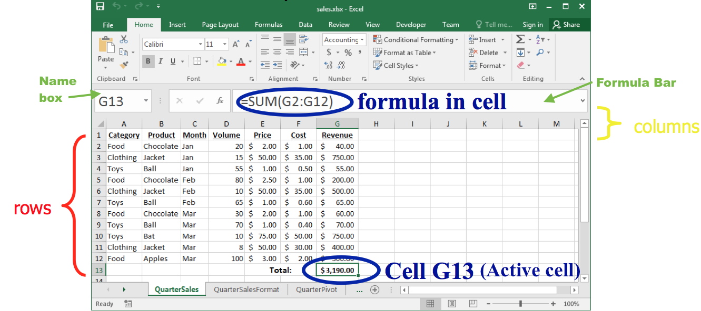  
Notice how the *active cell* (the cell highlighted by the green rectangle in the spreadsheet) also displays its cell identifier in name
box located to the left of the formula bar.

- The *rows* in a spreadsheet are *numbered* starting from 1.
- The *columns* are represented by *letters*.
    - **A** is column 1, **B** is column 2, . . . , **Z** is column 26, **AA** is column 27, . . .
- A cell is identified by putting the column letter first then the row number.
    - e.g. **B3** is the 2nd column and the 3rd row.
Question: What column number is **AD**? How about **BAD**?  
  

### Spreadsheet Data Entry
An entry is added to a cell by clicking on it and typing in the data.
- The spreadsheet attempts to detect the data type and format it accordingly. It is also possible to manually *format* the data
   

### Date and Type Formats
- Excel stores dates and time as a date serial number.
- The earliest date permitted by Excel is January 1, 1900 (which has a date serial number equal to 1).
- [DATEVALUE()](https://support.microsoft.com/en-us/office/datevalue-function-df8b07d4-7761-4a93-bc33-b7471bbff252?ui=en-us&rs=en-us&ad=us)
function converts text to a date serial number which we can then format to display the day however we want
- Alternatively we could use the [DATE(year, month, day)](https://exceljet.net/excel-functions/excel-date-function) function which takes the arguments:  
**year** - Number for year.  
**month** - Number for month.  
**day** - Number for day.  
- It is important to note that Excel dates require a year, month, and day.
- That is, if you are missing a year, for example, Excel won’t be able to format that cell as a date unless we provide a year.
- One trick is to give your data an arbitrary year that you hide when you format your cells.
- For example, we could replace January with January 1, 2019 and format the cell to only display the month.

|Cell Format| Cell display|  |
|----| ---- | ----- |
|General| January |(treated as text)|
|Date |2019-01-01 |(treated as serial number 43466)|
|Custom |January |(treated as serial number 43466)|

- Formatting data helps users read and understand data and is especially important for numbers and dates.
- To change the format of a serial date, click the down arrow in the format drop down menu and select **More Number Formats**; this will open up the Format Cells pop-up box
  

- You can use either built-in or custom formats or [custom formatting]
(https://www.ablebits.com/office-addins-blog/2015/03/11/change-date-format-excel/#custom-date-format) (see a summary of these on the next slide)
- For example, applying the custom format of dd/mmm-yy on the date January 1, 2005 would display 01/Jan-05.
- You can also accomplish this type of formatting using the [TEXT()](https://www.ablebits.com/office-addins-blog/2015/04/08/convert-date-text-excel/) 
function. These cells, however, will be treated as text, not dates.

### Custom Date Options
Here are some examples of custom formatting options. [Source: ablebits.com](https://www.ablebits.com/office-addins-blog/2015/03/11/change-date-format-excel/#custom-date-format)

**Example (January 1, 2005)**  
|**Code**| Description| Result|
|-----|------------|------|
|m| Month number without a leading zero |1|
|mm |Month number with a leading zero |01|
|mmm |Month name, short form |Jan|
|mmmm |Month name, full form |January|
|mmmmm |Month as the first letter |J <sup>1</sup>|
|d |Day number without a leading zero |1|
|dd |Day number with a leading zero |01|
|ddd |Day of the week, short form |Mon|
|dddd |Day of the week, full form |Monday|
|yy |Year (last 2 digits) |05|
|yyyy |Year (4 digits) |2005|  

<sup>1</sup>(stands for January, June and July)  

### Currency vs Accounting
It is worth mentioning the difference between *Currency* and *Accounting* as they are very similar.
- Currency places the dollar sign to the immediate left of the number while Accounting places the dollar sign on the left edge of the cell.
- Currency displaces zeros as $0.00 while Accounting denotes zeros with dashes
- The Accounting format displays negative numbers in parentheses.
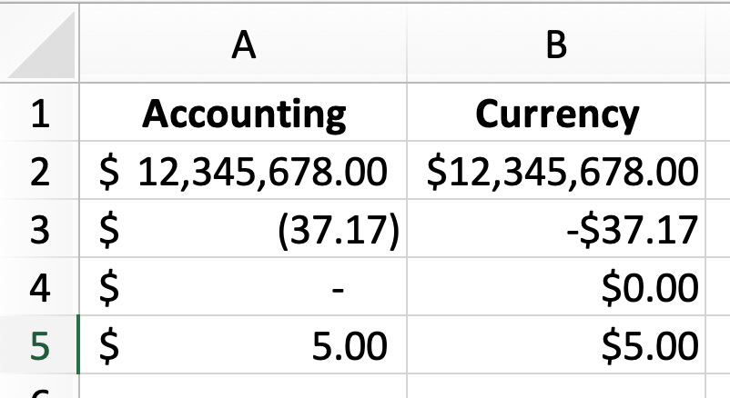   


### Spreadsheet Formatting (Windows)
A text editor shortcut will allow you to format cells in bold, italics, underline, fonts, colours, justify, etc.  
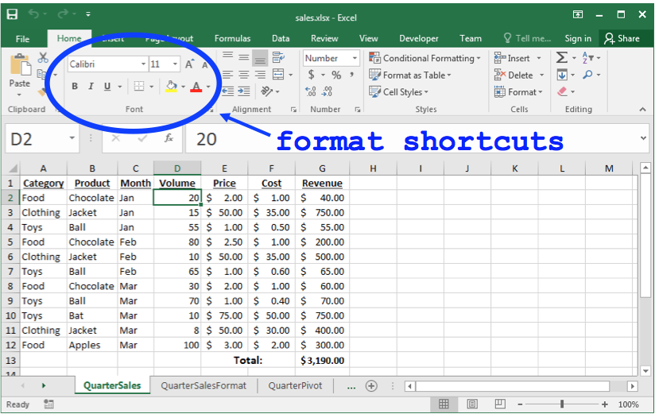  

### Try It!
> **Exercise** \
Make a copy of the QuarterSales worksheet and call it QuarterSalesFormat. Format the headers of the QuarterSales worksheet to be **bold**, <ins>underlined</ins> and centered.  

> **Exercise** \
Format all monetary cells to the format *Currency*


### Spreadsheet Selecting Multiple Cells
There are a number of ways of selecting multiple cells at a time:
1. With the mouse, (left) click and drag mouse to select a rectangle region of cells.
1. With keyboard, hold SHIFT key and use arrow keys to select a rectangle region of cells.
1. With mouse and keyboard, while holding CTRL (windows)/Cmnd (mac) key, (left) click on individual cells to select non-contiguous cells.
1. Click on a row number to select a whole row<sup>2</sup> or select the first column in that row and press SHIFT + Cmnd /Cntrl + :arrow_right:
1. Click on a column header to select a whole column2 or select the first row in that column and SHIFT + Cmnd /Ctrl + :arrow_down:
See more keyboard shortcuts [here](https://exceljet.net/keyboard-shortcuts). (eg. Cmnd /Ctrl + A select entire worksheet) [See demo](https://www.youtube.com/watch?v=L9n3tbufCyk&feature=youtu.be)  

<sup>2</sup> or until the first empty cell


### Range Selecting Cells Example
  

### Selecting non-contiguous
  

### Manipulating Cells
Once you have selected one or more cells, there are several common actions you can perform:
1. DELETE
- delete the contents of all cells by pressing delete key
- delete the contents and the cell locations (then shift remaining) by selecting Edit menu, Delete. . . or Delete. . . pop-up menu (brought up by right click).
2. Cut, Copy, Paste
- cut - copies selected cells to clipboard and removes from document (Cmnd /Ctrl + X )
- copy - copies selected cells to clipboard (Cmnd /Ctrl + C )
- paste - copies cells in clipboard to sheet starting at currently selected cell (Cmnd /Ctrl + V )
3. Add selected cells to a formula (requires that you were previously constructing a formula before selecting the cells).

### Cut, Copy, Paste
Alternatively you could use the command button shortcuts located in the *Home* tab on the ribbon.  
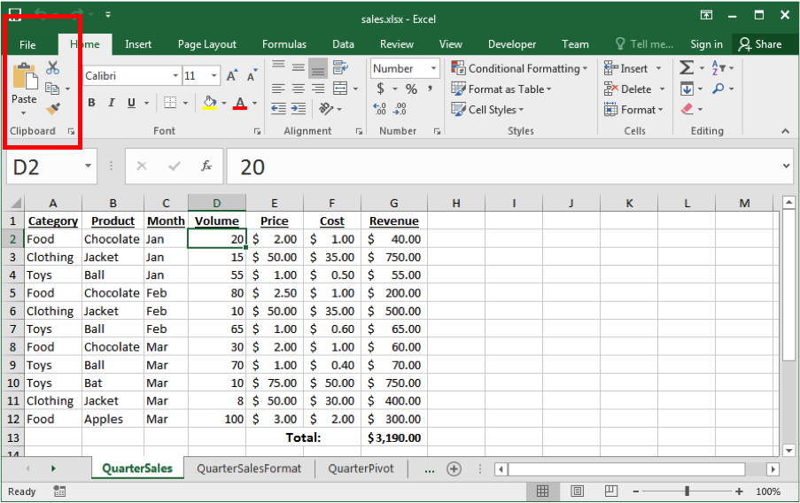  


### Paste Button Ribbon
- Some buttons in the ribbon open a menu with additional options.
- For example, the Paste button opens a menu with additional pasting options such as **Paste Values**, **Formulas**,. . .which will be useful to us later.
  

### Manipulating Cells - Filling
*Filling* combines copy and paste. There is a small box or tab beyond the cell’s lower right corner (fill handle). Grab it with the cursor and pull to other cells.  
  

Double clicking that lower corner will quickly copy and paste that formula to the end of the data (or until the first blank row).  
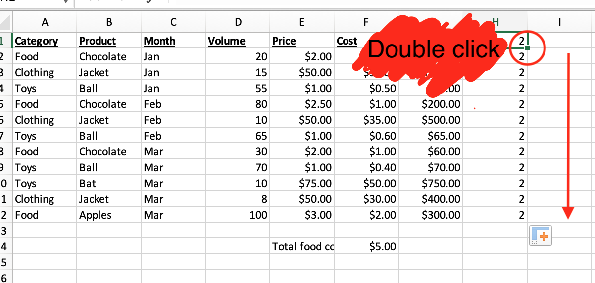  

[See demo on YouTube](https://www.youtube.com/watch?v=O8c9N6CIqWM&feature=youtu.be)

### Hiding Columns and Rows
You can hide a column or row by right-clicking on the column or row header and selecting *Hide*.
- The column/row still exists but will not be displayed or printed until we select *Unhide*. [Link to my demo on YouTube](https://www.youtube.com/watch?v=2Z0kPQfhDbE&feature=youtu.be)  
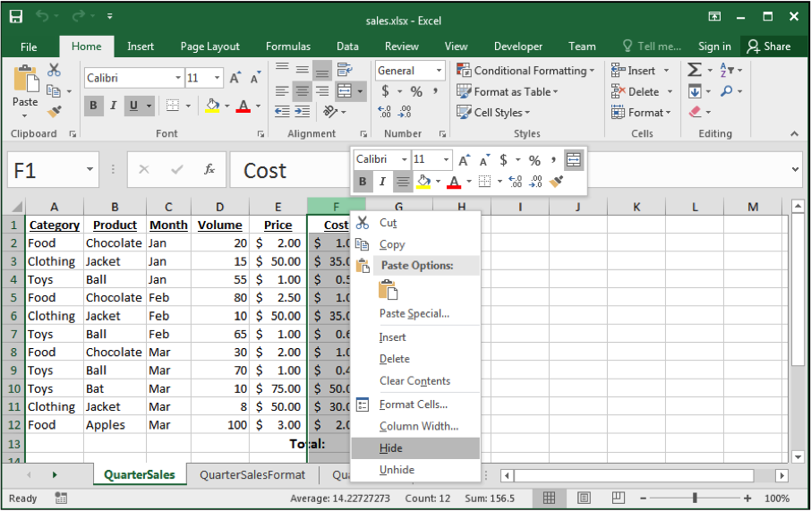  

### Selecting Cells Question
**Example 1**  
Which method allows you to select non-contiguous cells in a spreadsheet?  
A) hold SHIFT key and use arrow keys  
B) With the mouse left click on a cell and drag mouse  
C) hold CTRL (windows)/Cmnd (mac) key and use arrow keys  
D) hold CTRL (windows)/Cmnd (mac) key and left click on cells  

### START SOLUTIONS HERE
**Example 1**  
Which method allows you to select non-contiguous cells in a spreadsheet?  
A) hold SHIFT key and use arrow keys  
B) With the mouse left click on a cell and drag mouse  
C) hold CTRL (windows)/Cmnd (mac) key and use arrow keys  
**D) hold CTRL (windows)/Cmnd (mac) key and left click on cells**  
### END SOLUTIONS HERE

### Entering Formulas
A *formula* is any expression that begins with an equal sign (=).
- The equal sign means that a calculation must be done to compute the cell value.
  

### Formula Expressions
A formula expression can consist of literals (numbers, text strings), operators, functions (eg. MAX(), AVERAGE()), and cell references.

Simple mathematical expressions:
- = 1 + 5
- = 1.5 * 3.14 + 42

Common functions:
```
 = ROUND(PI(),2) // Result is 3.14
 = CONCATENATE("Hello", " World") // Hello World
```
Other common functions for trigonometry, dates, and finance are available. See a full list of functions [here](https://support.microsoft.com/en-us/office/excel-functions-alphabetical-b3944572-255d-4efb-bb96-c6d90033e188?ui=en-us&rs=en-us&ad=us)


### Using Formulas
- In order to use functions correctly, you need to follow a certain structure, or *syntax*.
- The basic syntax for a function is the equals sign (=), the function name (eg, SUM), and one or more *arguments/inputs* within parenthesis. For example:
    ```
    =SUM(1,2,3)
    ```
    Once we press ENTER (or leave the cell), it will display the result, i.e. *output*, of the formula (in this case is 6). Returning to that cell will display the formula in the formula bar.
- N.B. if you function has no arguments, you will still need to type the parenthesis. For example =NOW() returns the current date and time as output.


### Using Excel Functions
- You can get help on any function by searching its name in Excel’s drop down Help menu
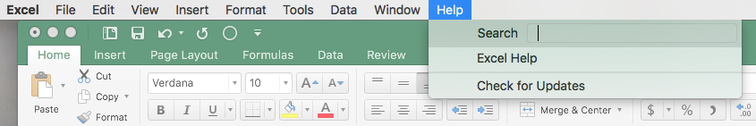  

- Alternatively, you can navigate to the **Formulas** tab in the ribbon and select the  button (there is also a shortcut to this button directly beside the formula bar 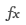). This will bring up a **Formula Builder** window which contains the name of all the functions in Excel, with a search and description on how to use each function.


### Arrays
Alternatively we could have created an array using {} to compute our sum:
`=SUM({1,2,3})`
This is equivalent to the following calculation:  
  
These examples and others can be found in DemoPartI.xlsx on Canvas


### Cell Referencing 
The power of formulas comes from using cell references (similar to variable names in programming).  
Cell reference examples: 
- = A1 + A2 
- = B1 + A3 - A4 

Cell address will appear in different coloured font within your formula for ease of viewing. In addition, the cell itself will be outlined with the same colour when the formula is selected.    
   

**TIP** Rather than typing out cell names while constructing a formula, you can select them using your mouse or keyboard as done on [this](#Spreadsheet-Selecting-Multiple-Cells) slide. You can refer to a single cell, a range of cells, a location in another worksheet, or a location in another workbook.

**Figure**: Example of using cell references across worksheets. General syntax: `<SheetName>!<CellAddress>`    
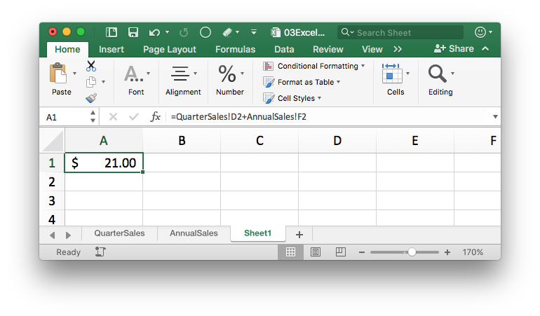


### Formula Questions
Excel follows the BEDMAS order or operations (Brackets, Exponents, Division, Multiplication, Addition, Subtraction).  

**Example 2**  
Question: A cell contains the following: `=2+4*3` What is the value of the cell? 
A) 14   
B) 18   
C) `=2+4*3`  
D) None of the above

### START SOLUTIONS HERE
**Example 2**  
Question: A cell contains the following:`=2+4*3` What is the value of the cell?  
**A) 14**   
B) 18   
C) `=2+4*3`   
D) None of the above

### END SOLUTIONS HERE


**Example 3**
A cell contains the following: `=(2+4)*3^2` What is the value of the cell?   
A) 38   
B) 54   
C) 324   
D) None of the above

### START SOLUTIONS HERE
**Example 2**  
A cell contains the following:`=(2+4)*3^2` What is the value of the cell?   
A) 38   
**B) 54**   
C) 324   
D) None of the above

### END SOLUTIONS HERE


### Using Excel Functions
- Excel will attempt to autocomplete your formulas.
- To accept a suggestion, press `TAB` .
- Excel will provide a guideline of how the function is used in the lower right corner of the cell. Optional arguments appear in
square brackets []  


For example, in **H6** we have `=POWER(G2,2) = 252 = 625`. POWER is the function and G2 and 2 are the inputs and 625 is the output.  
  

### Try Entering Formulas
>**Exercise** \
Calculate the total Revenue in cell **G13**. Add the label of **Total Revenue**: to cell **F13**.

**Tip**: Try using the  button (located in the **Formula** tab in the ribbon) to save time! **Directions**: Select a cell next to the numbers you want to sum (or simply select cell **G13**, click the AutoSum button, then press `Enter`.  

>**Exercise** \
Add a column for expenses and profit as below. (Expense is volume multiplied by cost and profit is revenue minus expense).  
  


### Concatenation
String concatenation is when two or more strings are combined by appending them in order. The function to do this in Excel is CONCATENATE() or & operator.  
   
Notice that we needed to add spaces " " in order for the words to be separated. In addition, numbers work as arguments too!


### Titles and Merged Cells
- On the previous slide I added a title to my spreadsheet. To do this:
        1. Click View from the toolbar menu and select Header and Footer.
        2. Click on the Add Header box and insert the desired text.
        3. To return to the default view, click View from the toolbar menu and select Normal.
- I also utilize the merge cell option in order to center text over a section of a spreadsheet. To do this:
        1. Highlight or select a range of cells.
        2. Right-click on the highlighted cells and select Format Cells....
        3. Click the Alignment tab and place a checkmark in the checkbox labeled Merge cells.
 
Alternatively, you can merge and center a group of cells using the Merge and Center  button located on the `Home` tab.

### Formulas Question
**Example 4** \
A cell contains the following: ='ABC'+'DEF'. What is the value of the cell?  
A) error  
B) ABCDEF  
C) ’ABC’+’DEF’  

### START SOLUTIONS HERE
**Example 3**  
A cell contains the following: ='ABC'+'DEF'. What is the value of the cell?    
**A) error**    
B) ABCDEF  
C) ’ABC’+’DEF’  

### END SOLUTIONS HERE


### LOOKUP function
- The LOOKUP function searches for a value in either a row (or column) and returns a corresponding value from a neighbouring row (or column).
        - This function works like searching for numbers in a phonebook: by searching for their name in the phonebook, you can determine their listed phone number.
- VLOOKUP does the same thing, only it is restricted to **V**ertical (column) searches
- HLOOKUP on the other hand, is restricted to **H**orizontal (row) searches
- Some consider [LOOKUP](https://support.microsoft.com/en-us/office/lookup-function-446d94af-663b-451d-8251-369d5e3864cb?ui=en-us&rs=en-us&ad=us) as better than VLOOKUP [Source](https://corporatefinanceinstitute.com/resources/excel/functions/lookup-vs-vlookup/) while others consider [VLOOKUP](https://support.microsoft.com/en-us/office/video-vlookup-when-and-how-to-use-it-9a86157a-5542-4148-a536-724823014785?ui=en-us&rs=en-us&ad=us) is an improved version of LOOKUP [Source](https://support.microsoft.com/en-us/office/lookup-function-446d94af-663b-451d-8251-369d5e3864cb?ui=en-us&rs=en-us&ad=us).  
- We will go through the advantages and disadvantages of each.

The LOOKUP function has the following form:  
`LOOKUP(lookup_value, lookup_vector, [result_vector])`  
- lookup_value is the value we would like to match (eg. the name in our phonebook analogy)
- lookup_vector the corresponding <ins>column</ins> (or row) containing the values from which we are searching for lookup_vector (eg. the column of names in our phonebook analogy)
- result_vector the corresponding <>ins>column</ins> (or row) containing the information we are trying to obtain (eg. the column of phone numbers in our phonebook analogy); this has to be the same size as the lookup_vector

It is common that we store the lookup_value in a cell so that we might change it easily for future use of the formula.  

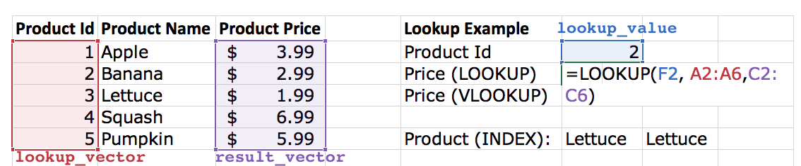     

Formula: `=LOOKUP(F2, A2:A6,C2:C6)`
Output: `$2.99`
[YouTube Demo](https://www.youtube.com/watch?v=jvcK_nbxCZM&feature=youtu.be)  

### A comment on LOOKUP function
**Important**  
- The values in lookup_vector must be placed in **ascending order**: . . . , -2, -1, 0, 1, 2, ..., A-Z, FALSE, TRUE; otherwise, LOOKUP might not return the correct
value.
- Uppercase and lowercase text are treated as equivalent.

**Example 5**  
Use the lookup function to determine the product ID of a certain product name.  
1. What happens when you try and look up the ID of *Pumpkin*?  
2. How can we fix this problem?  

### VLOOKUP function
`VLOOKUP(lookup_value, table_array, col_index_num,[range_lookup])`  

- lookup_value is the value we would like to match (eg. the name in our phonebook analogy)
- table_array the corresponding <ins>array</ins> (or matrix) containing the values from which we are searching for **and** the information we are trying to obtain. (eg. a matrix contain the columns of names **and** phone numbers in our phonebook analogy)
- col_index_num corresponding to the column number containing the information we are trying to obtain (eg. the column of phone numbers in our phonebook analogy)
- range_lookup An [optional argument] indicating if you want exact (FALSE) or approximate (TRUE (default)) matching.  
    

Formula: `=VLOOKUP(F2,A2:C6,3)`  
Output: `$2.99`  

[Youtube Demo](https://www.youtube.com/watch?v=q575W8vM7FY&feature=youtu.be)  

**Some warnings about VLOOKUP**  
- The column of lookup values (the equivalent lookup_vector from the LOOKUP example) is expected to be in the left-most column of the table_array.
- If the fourth optional argument range_lookup is left blank, it defaults to TRUE
        - FALSE allows only exact matches while TRUE allows for partial matches
- If range_lookup is TRUE (the default setting) the first row of the table must be sorted in ascending order.
Otherwise, VLOOKUP may return an incorrect or unexpected value.  
`N.B. HLOOKUP` works in the exact same way as `VLOOKUP` only now we look across rows instead of columns.  
     

Formula: `=VLOOKUP(B9,A2:C6,2,TRUE<sup>3</sup>)` where **B9** = 1.2  
Output: `Apple`  
Formula: `=VLOOKUP(B9,A2:C6,2,FALSE)` where **B9** = 1.2  
Output: `#N/A`    

<sup>3</sup>N.B doesn’t look for the "nearest" value but the greatest value smaller than or equal to the lookup value.


**Example 6**  
1. Can you use vlookup function to determine the product ID of a certain product name?  
2. Use vlookup function to determine the price a certain product name. Use the default setting of `range_lookup = TRUE`?  
3. Test this function with the entry: *Pumpkin*.  
4. Test this function with the entry: *Pumpkin*, this time using `range_lookup = FALSE`  


### LOOKUP vs. VLOOKUP
The *pros* of LOOKUP              
- Accommodates left-to-right and right-to-left lookups              
- Less restrictive in terms of lookup/result_vector  

The *cons* of LOOKUP
- Requires ascending ordered lookup_vector
- Partial matching (no option to for exact matches)

The *pros* of VLOOKUP
- option to force exact matches  

The *cons* of VLOOKUP
- Accommodates only left-to-right lookups
- Requires a table (more restrictive)
- Requires ascending ordered lookup_vector  

Both have unexpected behaviour with duplicates


### INDEX function
The syntax for the INDEX function in Microsoft Excel is:   
'INDEX( table, row_number, column_number )'
It returns the value from within a table or range (i.e. an array of cells) at the given index. (Think of indexing a matrix in R using 'mat[i,j]' with i is your row_number and j is your col_number)  

  

### Formulas Question
**Example 7**
How many of the following statements are TRUE?  
1. CONCATENATE function can take 3 arguments.
2. There is an Excel function that has 0 arguments.
3. =INDEX({1,3,5},2) returns 5.
4. =LOOKUP(5,{1,3,5},{"a","b","c"}) returns "c".  
A) 0  
B) 1  
C) 2  
D) 3  

### START SOLUTIONS HERE
**Example 7**
How many of the following statements are TRUE?  
1. CONCATENATE function can take 3 arguments. :heavy_check_mark:  
2. There is an Excel function that has 0 arguments. :heavy_check_mark:    
3. =INDEX({1,3,5},2) returns 5.  :x:
4. =LOOKUP(5,{1,3,5},{"a","b","c"}) returns "c".  :heavy_check_mark:
A) 0  
B) 1    
C) 2  
**D) 3**  

### END SOLUTIONS HERE


### Advanced Spreadsheet Addressing
The dollar sign “$” is a symbol that indicates an *absolute address*.
- By default, addresses are "relative" in the sense that if they are in a formula that is copied to another cell, they will be changed relative to where they were copied from their origin.
Example:
- Cell **A1** has the formula =A2+B1
- Copy contents of cell **A1** to cell **C4** (+ 2 columns + 3 rows).
- Formula changes to =C5+D4 because moved down three rows and over two columns. (eg. col**A** + 2col = **C**, row**2** + 3 = 5;
hence **A2** changes to **C5**)  
If cell **A1** had the formula =$A$2+$B$1, then the same formula would be copied in cell **C4**.

There are three different ways you can specify an absolute address
- By row eg. =B$1 (column will change but row will not)
- By column eg. =$B1 (row will change but col will not)
- By cell (row and column) eg. =$B$1 (neither row nor col will change)

> Question: How would the formula =$A2+B$3 in cell **D3** be changed when copied to **E5**?

**D3** to **E5**: :arrow_right: one column, :arrow_down: two rows
- $A2: + <del>:arrow_right: one column</del>, :arrow_down: two rows = $A4
- B$3: + :arrow_right: one column, + <del>:arrow_down: two rows</del> = C$3

**Needs formatting**

> Answer: The copied formula would appear as `=$A4+C$3` in cell **E5**


### Formulas and Reference Question
**Example 8** \
Cell **A1** contains the following: =$B2+D$4. What is the formula if the cell is copied to cell D3?
- error
- =$B2+D$4
- =$B4+F$4
- =$B4+G$4  
For more examples see the **Absolute** worksheet on DemoPartI

### START SOLUTIONS HERE
**Example 8** \
Cell **A1** contains the following: =$B2+D$4. What is the formula if the cell is copied to cell D3?
- error
- =$B2+D$4
- =$B4+F$4
- **=$B4+G$4**  

### END SOLUTIONS HERE


### Tips
> Tip:  
You can change a cell from relative to absolute with the shortcut `F4` . You can continue to press F4 to have Excel cycle through the different reference types.  
>Tip:  
To show all the formulas in a worksheet (rather then their result), click the 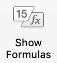 button located in the Formulas tab in the ribbon.


** Claire you are at page 74/122


