## Spreadsheets: Microsoft Excel Part 1 of 3

### Why Spreadsheets and Microsoft Excel?
Spreadsheets are the most common, general-purpose software for data analysis and reporting.

Microsoft Excel is the most popular spreadsheet program with hundreds of millions of installations.
- The spreadsheet concepts translate to other products. 

Excel and spreadsheets are not always the best tool for data analysis, but they are great for quick analysis, reporting, and
sharing.

Follow along with the examples by downloading the **03ExcelPartI.xlsx** and **DemoPartI.xlsx** file from CANVAS.

### Spreadsheet Overview
A spreadsheet organizes information into a two-dimensional array of cells (a table).

A cell has two components:
- an address - specified given a column letter and row number
- a location - that can store a number, text, or formula

The power of a spreadsheet is that we can write simple formulas (commands) to perform calculations and immediately see the results of those calculations.

Spreadsheets are very common in business and reporting applications.

### Excel Ribon
**ribbon** The Excel ribbon is the strip of icons above the worksheet area. It replaces the menus and toolbars found in Excel 2003 and earlier.  
**ribbon tab** contains multiple commands logically sub-divided into groups  
  
[image source](https://www.ablebits.com/office-addins-blog/2019/07/02/excel-ribbon-guide/)

### Workbook vs. worksheets
**workbook** A workbook is the name given to an Excel file and contains one or more worksheets.  
**worksheet** A worksheet (or sheet/spreadsheet) is a single page in a file created with an electronic spreadsheet program.  
For example 03ExcelPartI.xlsx is a *workbook* that contains two *worksheets*. The name of these worksheets are QuarterSales and AnnualSales.

### Adding and renaming worksheets
To add a new worksheet we simply the plus sign located to the right of the worksheets.  
  
By default, the worksheets are named Sheet1, Sheet2, Sheet3, and so on, but you can change these names by double clicking on the tab and typing an alternate name.  

- To Move a sheet, drag the sheet tab to the location that you want along the row of sheet tabs.
- To Copy a sheet
    1. Hold down Ctrl /Option (Windows/Mac).
    2. Drag the sheet tab to the location that you want the copied sheet to appear along the row of sheet tabs.
**Important** Release the mouse button before you release Option /Ctrl .
- To move/copy your worksheet to another workbook, you can right click the corresponding worksheet tab and select Move
- Copy. Select the desired workbook from the dropdown menu. Alternatively, you could follow the options outlined [here]
(https://support.microsoft.com/en-us/office/move-or-copy-worksheets-or-worksheet-data-47207967-bbb2-4e95-9b5c-3c174aa69328?ui=en-us&rs=en-us&ad=us)


### Spreadsheet Addressing
A cell is identified by a column letter and row number.
  
Notice how the *active cell* (the cell highlighted by the green rectangle in the spreadsheet) also displays its cell identifier in name
box located to the left of the formula bar.

- The *rows* in a spreadsheet are *numbered* starting from 1.
- The *columns* are represented by *letters*.
    - **A** is column 1, **B** is column 2, . . . , **Z** is column 26, **AA** is column 27, . . .
- A cell is identified by putting the column letter first then the row number.
    - e.g. **B3** is the 2nd column and the 3rd row.
Question: What column number is **AD**? How about **BAD**?  
  

### Spreadsheet Data Entry
An entry is added to a cell by clicking on it and typing in the data.
- The spreadsheet attempts to detect the data type and format it accordingly. It is also possible to manually *format* the data
   

### Date and Type Formats
- Excel stores dates and time as a date serial number.
- The earliest date permitted by Excel is January 1, 1900 (which has a date serial number equal to 1).
- [DATEVALUE()](https://support.microsoft.com/en-us/office/datevalue-function-df8b07d4-7761-4a93-bc33-b7471bbff252?ui=en-us&rs=en-us&ad=us)
function converts text to a date serial number which we can then format to display the day however we want
- Alternatively we could use the [DATE(year, month, day)](https://exceljet.net/excel-functions/excel-date-function) function which takes the arguments:  
**year** - Number for year.  
**month** - Number for month.  
**day** - Number for day.  
- It is important to note that Excel dates require a year, month, and day.
- That is, if you are missing a year, for example, Excel won’t be able to format that cell as a date unless we provide a year.
- One trick is to give your data an arbitrary year that you hide when you format your cells.
- For example, we could replace January with January 1, 2019 and format the cell to only display the month.

|Cell Format| Cell display|  |
|----| ---- | ----- |
|General| January |(treated as text)|
|Date |2019-01-01 |(treated as serial number 43466)|
|Custom |January |(treated as serial number 43466)|

- Formatting data helps users read and understand data and is especially important for numbers and dates.
- To change the format of a serial date, click the down arrow in the format drop down menu and select **More Number Formats**; this will open up the Format Cells pop-up box
  

- You can use either built-in or custom formats or [custom formatting]
(https://www.ablebits.com/office-addins-blog/2015/03/11/change-date-format-excel/#custom-date-format) (see a summary of these on the next slide)
- For example, applying the custom format of dd/mmm-yy on the date January 1, 2005 would display 01/Jan-05.
- You can also accomplish this type of formatting using the [TEXT()](https://www.ablebits.com/office-addins-blog/2015/04/08/convert-date-text-excel/) 
function. These cells, however, will be treated as text, not dates.

### Custom Date Options
Here are some examples of custom formatting options. [Source: ablebits.com](https://www.ablebits.com/office-addins-blog/2015/03/11/change-date-format-excel/#custom-date-format)

**Example (January 1, 2005)**  
|**Code**| Description| Result|
|-----|------------|------|
|m| Month number without a leading zero |1|
|mm |Month number with a leading zero |01|
|mmm |Month name, short form |Jan|
|mmmm |Month name, full form |January|
|mmmmm |Month as the first letter |J <sup>1</sup>|
|d |Day number without a leading zero |1|
|dd |Day number with a leading zero |01|
|ddd |Day of the week, short form |Mon|
|dddd |Day of the week, full form |Monday|
|yy |Year (last 2 digits) |05|
|yyyy |Year (4 digits) |2005|  

<sup>1</sup>(stands for January, June and July)  

### Currency vs Accounting
It is worth mentioning the difference between *Currency* and *Accounting* as they are very similar.
- Currency places the dollar sign to the immediate left of the number while Accounting places the dollar sign on the left edge of the cell.
- Currency displaces zeros as $0.00 while Accounting denotes zeros with dashes
- The Accounting format displays negative numbers in parentheses.
   


### Spreadsheet Formatting (Windows)
A text editor shortcut will allow you to format cells in bold, italics, underline, fonts, colours, justify, etc.  
  

### Try It!
> **Exercise** \
Make a copy of the QuarterSales worksheet and call it QuarterSalesFormat. Format the headers of the QuarterSales worksheet to be **bold**, <ins>underlined</ins> and centered.  

> **Exercise** \
Format all monetary cells to the format *Currency*


### Spreadsheet Selecting Multiple Cells
There are a number of ways of selecting multiple cells at a time:
1. With the mouse, (left) click and drag mouse to select a rectangle region of cells.
1. With keyboard, hold SHIFT key and use arrow keys to select a rectangle region of cells.
1. With mouse and keyboard, while holding CTRL (windows)/Cmnd (mac) key, (left) click on individual cells to select non-contiguous cells.
1. Click on a row number to select a whole row<sup>2</sup> or select the first column in that row and press SHIFT + Cmnd /Cntrl + :arrow_right:
1. Click on a column header to select a whole column2 or select the first row in that column and SHIFT + Cmnd /Ctrl + :arrow_down:
See more keyboard shortcuts [here](https://exceljet.net/keyboard-shortcuts). (eg. Cmnd /Ctrl + A select entire worksheet) [See demo](https://www.youtube.com/watch?v=L9n3tbufCyk&feature=youtu.be)  

<sup>2</sup> or until the first empty cell


### Range Selecting Cells Example
  

### Selecting non-contiguous
  

### Manipulating Cells
Once you have selected one or more cells, there are several common actions you can perform:
1. DELETE
- delete the contents of all cells by pressing delete key
- delete the contents and the cell locations (then shift remaining) by selecting Edit menu, Delete. . . or Delete. . . pop-up menu (brought up by right click).
2. Cut, Copy, Paste
- cut - copies selected cells to clipboard and removes from document (Cmnd /Ctrl + X )
- copy - copies selected cells to clipboard (Cmnd /Ctrl + C )
- paste - copies cells in clipboard to sheet starting at currently selected cell (Cmnd /Ctrl + V )
3. Add selected cells to a formula (requires that you were previously constructing a formula before selecting the cells).

### Cut, Copy, Paste
Alternatively you could use the command button shortcuts located in the *Home* tab on the ribbon.  
  


### Paste Button Ribbon
- Some buttons in the ribbon open a menu with additional options.
- For example, the Paste button opens a menu with additional pasting options such as **Paste Values**, **Formulas**,. . .which will be useful to us later.
  

### Manipulating Cells - Filling
*Filling* combines copy and paste. There is a small box or tab beyond the cell’s lower right corner (fill handle). Grab it with the cursor and pull to other cells.  
  

Double clicking that lower corner will quickly copy and paste that formula to the end of the data (or until the first blank row).  
  

[See demo on YouTube](https://www.youtube.com/watch?v=O8c9N6CIqWM&feature=youtu.be)

### Hiding Columns and Rows
You can hide a column or row by right-clicking on the column or row header and selecting *Hide*.
- The column/row still exists but will not be displayed or printed until we select *Unhide*. [Link to my demo on YouTube](https://www.youtube.com/watch?v=2Z0kPQfhDbE&feature=youtu.be)  
  

### Selecting Cells Question
**Example 1**  
Which method allows you to select non-contiguous cells in a spreadsheet?  
A) hold SHIFT key and use arrow keys  
B) With the mouse left click on a cell and drag mouse  
C) hold CTRL (windows)/Cmnd (mac) key and use arrow keys  
D) hold CTRL (windows)/Cmnd (mac) key and left click on cells  

### START SOLUTIONS HERE
**Example 1**  
Which method allows you to select non-contiguous cells in a spreadsheet?  
A) hold SHIFT key and use arrow keys  
B) With the mouse left click on a cell and drag mouse  
C) hold CTRL (windows)/Cmnd (mac) key and use arrow keys  
**D) hold CTRL (windows)/Cmnd (mac) key and left click on cells**  
### END SOLUTIONS HERE

### Entering Formulas
A *formula* is any expression that begins with an equal sign (=).
- The equal sign means that a calculation must be done to compute the cell value.
  

### Formula Expressions
A formula expression can consist of literals (numbers, text strings), operators, functions (eg. MAX(), AVERAGE()), and cell references.

Simple mathematical expressions:
- = 1 + 5
- = 1.5 * 3.14 + 42

Common functions:
```
 = ROUND(PI(),2) // Result is 3.14
 = CONCATENATE("Hello", " World") // Hello World
```
Other common functions for trigonometry, dates, and finance are available. See a full list of functions [here](https://support.microsoft.com/en-us/office/excel-functions-alphabetical-b3944572-255d-4efb-bb96-c6d90033e188?ui=en-us&rs=en-us&ad=us)


### Using Formulas
- In order to use functions correctly, you need to follow a certain structure, or *syntax*.
- The basic syntax for a function is the equals sign (=), the function name (eg, SUM), and one or more *arguments/inputs* within parenthesis. For example:
    ```
    =SUM(1,2,3)
    ```
    Once we press ENTER (or leave the cell), it will display the result, i.e. *output*, of the formula (in this case is 6). Returning to that cell will display the formula in the formula bar.
- N.B. if you function has no arguments, you will still need to type the parenthesis. For example =NOW() returns the current date and time as output.


### Using Excel Functions
- You can get help on any function by searching its name in Excel’s drop down Help menu
  

- Alternatively, you can navigate to the **Formulas** tab in the ribbon and select the  button (there is also a shortcut to this button directly beside the formula bar ). This will bring up a **Formula Builder** window which contains the name of all the functions in Excel, with a search and description on how to use each function.


### Arrays
Alternatively we could have created an array using {} to compute our sum:
`=SUM({1,2,3})`
This is equivalent to the following calculation:  
  
These examples and others can be found in DemoPartI.xlsx on Canvas


### Cell Referencing 
The power of formulas comes from using cell references (similar to variable names in programming).  
Cell reference examples: 
- = A1 + A2 
- = B1 + A3 - A4 

Cell address will appear in different coloured font within your formula for ease of viewing. In addition, the cell itself will be outlined with the same colour when the formula is selected.    
   

**TIP** Rather than typing out cell names while constructing a formula, you can select them using your mouse or keyboard as done on [this](#Spreadsheet-Selecting-Multiple-Cells) slide. You can refer to a single cell, a range of cells, a location in another worksheet, or a location in another workbook.

**Figure**: Example of using cell references across worksheets. General syntax: `<SheetName>!<CellAddress>`    


### Formula Questions
Excel follows the BEDMAS order or operations (Brackets, Exponents, Division, Multiplication, Addition, Subtraction).  

**Example 2**  
Question: A cell contains the following: `=2+4*3` What is the value of the cell? 
A) 14   
B) 18   
C) `=2+4*3`  
D) None of the above

### START SOLUTIONS HERE
**Example 2**  
Question: A cell contains the following:`=2+4*3` What is the value of the cell?  
**A) 14**   
B) 18   
C) `=2+4*3`   
D) None of the above

### END SOLUTIONS HERE


**Example 3**
A cell contains the following: `=(2+4)*3^2` What is the value of the cell?   
A) 38   
B) 54   
C) 324   
D) None of the above

### START SOLUTIONS HERE
**Example 2**  
A cell contains the following:`=(2+4)*3^2` What is the value of the cell?   
A) 38   
**B) 54**   
C) 324   
D) None of the above

### END SOLUTIONS HERE


### Using Excel Functions
- Excel will attempt to autocomplete your formulas.
- To accept a suggestion, press `TAB` .
- Excel will provide a guideline of how the function is used in the lower right corner of the cell. Optional arguments appear in
square brackets []  


For example, in **H6** we have `=POWER(G2,2) = 252 = 625`. POWER is the function and G2 and 2 are the inputs and 625 is the output.  
  

### Try Entering Formulas
>**Exercise** \
Calculate the total Revenue in cell **G13**. Add the label of **Total Revenue**: to cell **F13**.

**Tip**: Try using the  button (located in the **Formula** tab in the ribbon) to save time! **Directions**: Select a cell next to the numbers you want to sum (or simply select cell **G13**, click the AutoSum button, then press `Enter`.  

>**Exercise** \
Add a column for expenses and profit as below. (Expense is volume multiplied by cost and profit is revenue minus expense).  
  


### Concatenation
String concatenation is when two or more strings are combined by appending them in order. The function to do this in Excel is CONCATENATE() or & operator.  
   
Notice that we needed to add spaces " " in order for the words to be separated. In addition, numbers work as arguments too!


### Titles and Merged Cells
- On the previous slide I added a title to my spreadsheet. To do this:
        1. Click View from the toolbar menu and select Header and Footer.
        2. Click on the Add Header box and insert the desired text.
        3. To return to the default view, click View from the toolbar menu and select Normal.
- I also utilize the merge cell option in order to center text over a section of a spreadsheet. To do this:
        1. Highlight or select a range of cells.
        2. Right-click on the highlighted cells and select Format Cells....
        3. Click the Alignment tab and place a checkmark in the checkbox labeled Merge cells.
 
Alternatively, you can merge and center a group of cells using the Merge and Center  button located on the `Home` tab.

### Formulas Question
**Example 4** \
A cell contains the following: ='ABC'+'DEF'. What is the value of the cell?  
A) error  
B) ABCDEF  
C) ’ABC’+’DEF’  

### START SOLUTIONS HERE
**Example 3**  
A cell contains the following: ='ABC'+'DEF'. What is the value of the cell?    
**A) error**    
B) ABCDEF  
C) ’ABC’+’DEF’  

### END SOLUTIONS HERE


### LOOKUP function
- The LOOKUP function searches for a value in either a row (or column) and returns a corresponding value from a neighbouring row (or column).
        - This function works like searching for numbers in a phonebook: by searching for their name in the phonebook, you can determine their listed phone number.
- VLOOKUP does the same thing, only it is restricted to **V**ertical (column) searches
- HLOOKUP on the other hand, is restricted to **H**orizontal (row) searches
- Some consider [LOOKUP](https://support.microsoft.com/en-us/office/lookup-function-446d94af-663b-451d-8251-369d5e3864cb?ui=en-us&rs=en-us&ad=us) as better than VLOOKUP [Source](https://corporatefinanceinstitute.com/resources/excel/functions/lookup-vs-vlookup/) while others consider [VLOOKUP](https://support.microsoft.com/en-us/office/video-vlookup-when-and-how-to-use-it-9a86157a-5542-4148-a536-724823014785?ui=en-us&rs=en-us&ad=us) is an improved version of LOOKUP [Source](https://support.microsoft.com/en-us/office/lookup-function-446d94af-663b-451d-8251-369d5e3864cb?ui=en-us&rs=en-us&ad=us).  
- We will go through the advantages and disadvantages of each.

The LOOKUP function has the following form:  
`LOOKUP(lookup_value, lookup_vector, [result_vector])`  
- lookup_value is the value we would like to match (eg. the name in our phonebook analogy)
- lookup_vector the corresponding <ins>column</ins> (or row) containing the values from which we are searching for lookup_vector (eg. the column of names in our phonebook analogy)
- result_vector the corresponding <>ins>column</ins> (or row) containing the information we are trying to obtain (eg. the column of phone numbers in our phonebook analogy); this has to be the same size as the lookup_vector

It is common that we store the lookup_value in a cell so that we might change it easily for future use of the formula.  

     

Formula: `=LOOKUP(F2, A2:A6,C2:C6)`
Output: `$2.99`
[YouTube Demo](https://www.youtube.com/watch?v=jvcK_nbxCZM&feature=youtu.be)  

### A comment on LOOKUP function
**Important**  
- The values in lookup_vector must be placed in **ascending order**: . . . , -2, -1, 0, 1, 2, ..., A-Z, FALSE, TRUE; otherwise, LOOKUP might not return the correct
value.
- Uppercase and lowercase text are treated as equivalent.

**Example 5**  
Use the lookup function to determine the product ID of a certain product name.  
1. What happens when you try and look up the ID of *Pumpkin*?  
2. How can we fix this problem?  

### VLOOKUP function
`VLOOKUP(lookup_value, table_array, col_index_num,[range_lookup])`  

- lookup_value is the value we would like to match (eg. the name in our phonebook analogy)
- table_array the corresponding <ins>array</ins> (or matrix) containing the values from which we are searching for **and** the information we are trying to obtain. (eg. a matrix contain the columns of names **and** phone numbers in our phonebook analogy)
- col_index_num corresponding to the column number containing the information we are trying to obtain (eg. the column of phone numbers in our phonebook analogy)
- range_lookup An [optional argument] indicating if you want exact (FALSE) or approximate (TRUE (default)) matching.  
    

Formula: `=VLOOKUP(F2,A2:C6,3)`  
Output: `$2.99`  

[Youtube Demo](https://www.youtube.com/watch?v=q575W8vM7FY&feature=youtu.be)  

**Some warnings about VLOOKUP**  
- The column of lookup values (the equivalent lookup_vector from the LOOKUP example) is expected to be in the left-most column of the table_array.
- If the fourth optional argument range_lookup is left blank, it defaults to TRUE
        - FALSE allows only exact matches while TRUE allows for partial matches
- If range_lookup is TRUE (the default setting) the first row of the table must be sorted in ascending order.
Otherwise, VLOOKUP may return an incorrect or unexpected value.  
`N.B. HLOOKUP` works in the exact same way as `VLOOKUP` only now we look across rows instead of columns.  
     

Formula: `=VLOOKUP(B9,A2:C6,2,TRUE<sup>3</sup>)` where **B9** = 1.2  
Output: `Apple`  
Formula: `=VLOOKUP(B9,A2:C6,2,FALSE)` where **B9** = 1.2  
Output: `#N/A`    

<sup>3</sup>N.B doesn’t look for the "nearest" value but the greatest value smaller than or equal to the lookup value.


**Example 6**  
1. Can you use vlookup function to determine the product ID of a certain product name?  
2. Use vlookup function to determine the price a certain product name. Use the default setting of `range_lookup = TRUE`?  
3. Test this function with the entry: *Pumpkin*.  
4. Test this function with the entry: *Pumpkin*, this time using `range_lookup = FALSE`  


### LOOKUP vs. VLOOKUP
The *pros* of LOOKUP              
- Accommodates left-to-right and right-to-left lookups              
- Less restrictive in terms of lookup/result_vector  

The *cons* of LOOKUP
- Requires ascending ordered lookup_vector
- Partial matching (no option to for exact matches)

The *pros* of VLOOKUP
- option to force exact matches  

The *cons* of VLOOKUP
- Accommodates only left-to-right lookups
- Requires a table (more restrictive)
- Requires ascending ordered lookup_vector  

Both have unexpected behaviour with duplicates


### INDEX function
The syntax for the INDEX function in Microsoft Excel is:   
'INDEX( table, row_number, column_number )'
It returns the value from within a table or range (i.e. an array of cells) at the given index. (Think of indexing a matrix in R using 'mat[i,j]' with i is your row_number and j is your col_number)  

  

### Formulas Question
**Example 7**
How many of the following statements are TRUE?  
1. CONCATENATE function can take 3 arguments.
2. There is an Excel function that has 0 arguments.
3. =INDEX({1,3,5},2) returns 5.
4. =LOOKUP(5,{1,3,5},{"a","b","c"}) returns "c".  
A) 0  
B) 1  
C) 2  
D) 3  

### START SOLUTIONS HERE
**Example 7**
How many of the following statements are TRUE?  
1. CONCATENATE function can take 3 arguments. :heavy_check_mark:  
2. There is an Excel function that has 0 arguments. :heavy_check_mark:    
3. =INDEX({1,3,5},2) returns 5.  :x:
4. =LOOKUP(5,{1,3,5},{"a","b","c"}) returns "c".  :heavy_check_mark:
A) 0  
B) 1    
C) 2  
**D) 3**  

### END SOLUTIONS HERE


### Advanced Spreadsheet Addressing
The dollar sign “$” is a symbol that indicates an *absolute address*.
- By default, addresses are "relative" in the sense that if they are in a formula that is copied to another cell, they will be changed relative to where they were copied from their origin.
Example:
- Cell **A1** has the formula =A2+B1
- Copy contents of cell **A1** to cell **C4** (+ 2 columns + 3 rows).
- Formula changes to =C5+D4 because moved down three rows and over two columns. (eg. col**A** + 2col = **C**, row**2** + 3 = 5;
hence **A2** changes to **C5**)  
If cell **A1** had the formula =$A$2+$B$1, then the same formula would be copied in cell **C4**.

There are three different ways you can specify an absolute address
- By row eg. =B$1 (column will change but row will not)
- By column eg. =$B1 (row will change but col will not)
- By cell (row and column) eg. =$B$1 (neither row nor col will change)

> Question: How would the formula =$A2+B$3 in cell **D3** be changed when copied to **E5**?

**D3** to **E5**: :arrow_right: one column, :arrow_down: two rows
- $A2: + <del>:arrow_right: one column</del>, :arrow_down: two rows = $A4
- B$3: + :arrow_right: one column, + <del>:arrow_down: two rows</del> = C$3

**Needs formatting**

> Answer: The copied formula would appear as `=$A4+C$3` in cell **E5**


### Formulas and Reference Question
**Example 8** \
Cell **A1** contains the following: =$B2+D$4. What is the formula if the cell is copied to cell D3?
- error
- =$B2+D$4
- =$B4+F$4
- =$B4+G$4  
For more examples see the **Absolute** worksheet on DemoPartI

### START SOLUTIONS HERE
**Example 8** \
Cell **A1** contains the following: =$B2+D$4. What is the formula if the cell is copied to cell D3?
- error
- =$B2+D$4
- =$B4+F$4
- **=$B4+G$4**  

### END SOLUTIONS HERE


### Tips
> Tip:  
You can change a cell from relative to absolute with the shortcut `F4` . You can continue to press F4 to have Excel cycle through the different reference types.  
>Tip:  
To show all the formulas in a worksheet (rather then their result), click the  button located in the Formulas tab in the ribbon.


### Naming Cells

Instead of referring to cells by their address, you can give a cell a name and use that name in cell formulas. 
- This makes it easier to read and understand formulas. 
- Like programming variables where we use names instead of addresses to refer to data locations.

Step for naming cells: 
- Select the cell(s) you want to name 
- Click the Name box located to the left of the formula bar 
- Type a valid one-word name for the list, e.g. Hours œ Press `ENTER`  
[See YouTube demo here](https://www.youtube.com/watch?v=eEFbCBCLLFM&feature=youtu.be)  
Alternatively: click the letter of the column you want to change and then click the “Formulas” tab. Click “Define Name” in the Defined Names group in the Ribbon to open the New Name window.  

  


### Naming Rules
- While these names can included numbers, the first character must be a letter or an underscore. 
- These names cannot include spaces or special characters beside underscores and periods. 
- Finally this name should not conflict with an existing name in the workbook. 
- For example, I wouldn’t want to use the name DAY1 since that already exists as a cell address by default.


### Try It! 
Complete the following in the *NamedCells* worksheet in the DemoPartI workbook. 

**Example 9**  
Rename **A3** *Day_1* and **A9** *Day_7*. Calculate the di ff erence between these two dates using the [DATEDIF](https://exceljet.net/excel-functions/excel-datedif-function) function.  

**Example 10**  
Find the total hours using named cells. That is, rename the cells **E3:E9** *Total* and calculate `=SUM(Total)`.   

**Example 11** (Advanced array formulas)   
RecalculatetheTotalsusingthenamedcells. Thatis, renamethe cells **C3:C9** *Hours* and **D3:D9** *Rate*, and calculate `Hours*Rate`.

To answer this last exercise, we will need to know more about [array formulas](#array-formulas). 


### Array Formulas
- If you are using Office 2010 – Office 2019 array formulas require first selecting the entire output range, then confirming the formula with `Ctrl` +`Shift` +`Enter` . They are commonly referred to as CSE formulas.  
- In Office 365 any formula that can return multiple results will automatically spill them either down, or across into neighboring cells by pressing `Enter `.  
- To see Total cost of each activity, select cells **F3:F9**, enter the formula `=Hours*Rate`, and then press `Ctrl` +`Shift` +`Enter` .  
- N.B. To see the grand Total of all activities, we could select cell **F10** and enter the formula `=SUM(Hours*Rate)` and then press `Ctrl` +`Shift` +`Enter` .  
Read more about array formulas [here](https://support.microsoft.com/en-ie/office/guidelines-and-examples-of-array-formulas-7d94a64e-3ff3-4686-9372-ecfd5caa57c7?ui=en-us&rs=en-ie&ad=ie). See my YouTube demo [here](https://www.youtube.com/watch?v=rHqKVJJmuFs&feature=youtu.be).

### Aggregate Functions
An *aggregate* function computes a summary function over a range of cells. The values can either be data values or cell locations.  
Common functions are: 
|Function|Description|
|--------|----------|
|`=MIN(<value list>)` |returns minimum value in list|
|`=MAX(<value list>)`| returns maximum value in list|
|`=SUM(<value list>)`| returns sum of all values in list|
|`=AVERAGE(<value list>)`| returns average of values in list|
|`=COUNT(<value list>)`| returns count of values in list|
|`=MEDIAN(<value list>)`| returns median value of list|

If specifying an array, give the upper left and lower right corners, separated by a colon. 
|Function|Description|
|--------|----------|
|`AVERAGE(A3:E6)`| returns the average value in the array of 4 rows and 5 columns|


### Aggregate Functions Example
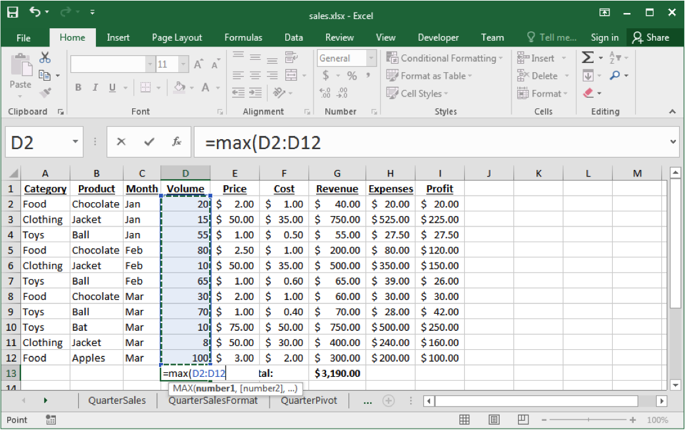  

### Try it!
>**Exercise**   
Find the a) maximum volume b) average price c) minimum cost and d) total revenue in the *QrSales* worksheet.  

### Aggregate Functions Question

**Example 12**  
Assume the cells in the range A1:C4 each contain a number that is equal to their row number (e.g. **B3** contains 3). How many of the following statements are TRUE?   
1. The number of cells in the range is 12.  
2. The value of `SUM(A1:C4)` is 20.   
3. The value of `COUNTIF(A1:B4,">2")` is 4.  
4. `AVERAGE(A1:C4)` > `MAX(C2:C3)`  
A) 0 B) 1 C) 2 D) 3 E) 4

### START SOLUTIONS HERE
**Example 12**  
Assume the cells in the range A1:C4 each contain a number that is equal to their row number (e.g. **B3** contains 3). How many of the following statements are TRUE?   
1. The number of cells in the range is 12. :heavy_check_mark:   
2. The value of `SUM(A1:C4)` is 20. :x:    
3. The value of `COUNTIF(A1:B4,">2")` is 4. :heavy_check_mark:   
4. `AVERAGE(A1:C4)` > `MAX(C2:C3)` :x:   
A) 0 B) 1 **C) 2** D) 3 E) 4

### END SOLUTIONS HERE


**Example 13**   
Assume the three cells in the range A1:C1 contain numbers. Which of these formula output results is ALWAYS the largest?  
A) `MAX(A1:C1)`   
B) `MIN(A1:C1) `   
C) `COUNT(A1:C1)`   
D) `SUM(A1:C1)`   
E) None of the above are always guaranteed to be the largest  

### START SOLUTIONS HERE
**Example 13**   
Assume the three cells in the range A1:C1 contain numbers. Which of these formula output results is ALWAYS the largest?  
A) `MAX(A1:C1)`   
B) `MIN(A1:C1) `   
C) `COUNT(A1:C1)`   
D) `SUM(A1:C1)`   
**E) None of the above are always guaranteed to be the largest**    

### END SOLUTIONS HERE


### Other Formatting: Column Width 
*Resizing columns/rows:*  
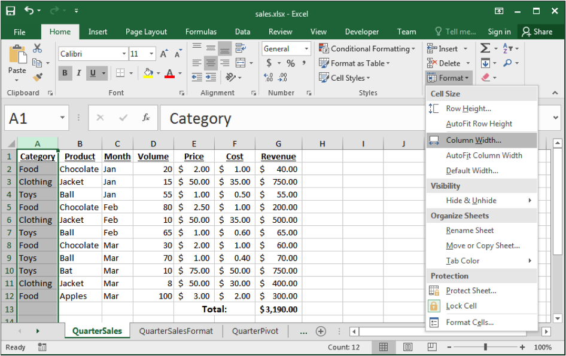   
> Auto-resize by double clicking on border between columns or selecting **Format– >Column–>AutoFit Selection**.  
    Drag the row/column border to manually resize. 


Lets see an example by doing this on the *Namecells* workbook in DemoPartI


### Conditional Formatting
*Conditional formatting* allows you to change the cell format based on data values. This is accessible under **Format–>Conditional Formatting**.  
- Other options: data bars, color scales, icon sets  

   

A shortcut to this feature (along with some great default options) can be found in the Conditional Formatting button 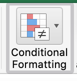  
   


### Conditional Formatting Result 
The format painter button allows you to copy formatting to many cells. Select the cell, click paint button, then highlight cells to have identical formatting.  

   


### Try it: Conditional Formatting
Format Volume column to be:  
1. bold/green if volume >50  
2. italics/red if volume <10  
3. yellow background otherwise as below:  
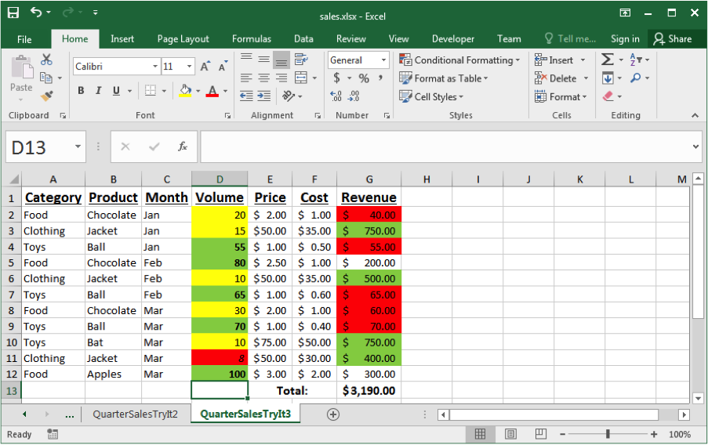   

> Question: Take the previous formatting and apply it to whole row:

> Hint: Highlight the whole table, go to Conditional Formatting, select the “Classic" option from the Style drop down menu and select “Use a formula to determine which cells to format"
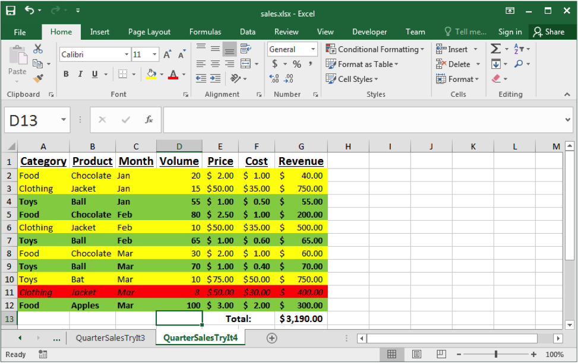   
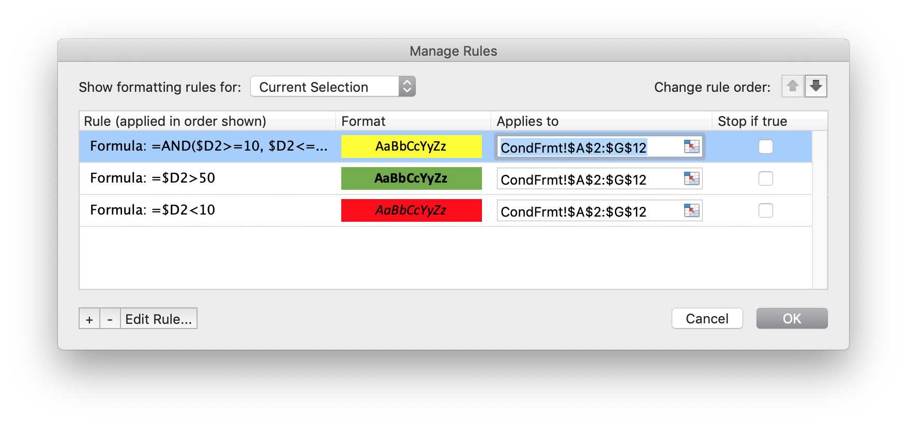   
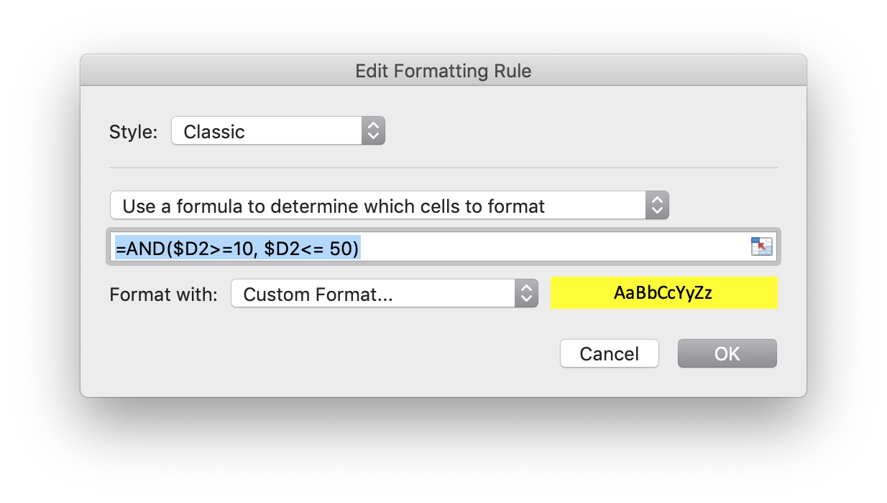   


### Spreadsheet for Data Management
A spreadsheet is often used as a "database". A *database* collects, stores and manages information so users can retrieve, add, update or remove such information.  
- Examples: schedules and calendars, timesheets, expenses and finances, records, notes, and recipes, data research/analysis  

We can use a spreadsheet as a database by:  
- Using a row to store all the information about something we want to represent.  
- Giving each column a meaningful name. A column represents a property or feature of the object stored in the row.  
- Using the formulas to calculate new facts from the data.  
- Using sorting to organize the data by key features.  
- Using simple filtering (querying) to only show the most important data or data of interest.


### Sorting Data
Data can be sorted by selecting the **Sort** option under the **Data** menu. Select the column(s) to sort on and order to sort by.  
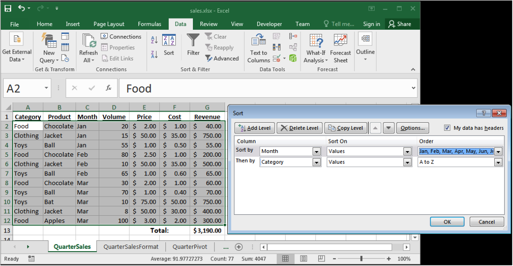   

### Try it: Sorting Data
> Exercise: Sort the data by revenue (desc) then product (asc).

  


### Filtering
A *filter* shows a subset of the rows in the spreadsheet that pass a given condition (test).

Select **Auto Filter** under the **Data** then **Filter** menu.

Once you select **Auto Filter**, each column heading has a drop-down list. By selecting a filtering criteria from the list, you can limit the rows that are displayed.

It is possible to filter on more than one column at the same time.

### Filter Example 
Filter on Revenue column: Select value(s), Top 10, or custom filter.  

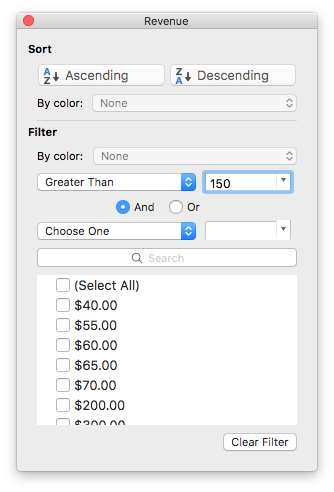  

Filter on Revenue column: Custom filter with Revenue > 150  

  

### Try It: Filter Challenge
> Exercise: Filter the data so only products with volume < 20 or revenue &ge; $500 are shown.  

  

### Removing Duplicates  
To remove duplicates, select your Data then Remove Duplicates from the **Data** tab in the ribbon.  
    
Note that we can also remove duplicates using a filter:  
Data>Sort&Filter>Advanced  

By default, it will look for duplicates over the all of the selected columns. You can delete entire rows based on particular columns by selecting them the pop-up window:  
  

Notice how the Removing Duplicates feature is NOT case sensitive:  
    


### Sorting Question
Question: Given this spreadsheet and sort order, what is the output?  
    
    


> Clicker Question: Given this spreadsheet and sort order, what is the output?  
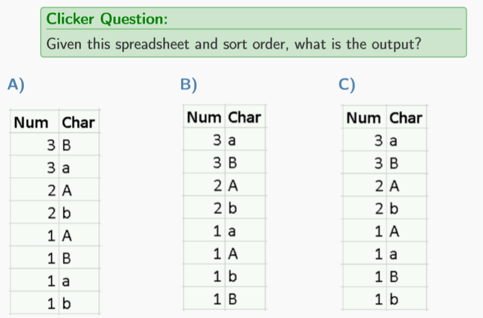    


### START SOLUTIONS HERE
> Clicker Question: Given this spreadsheet and sort order, what is the output?  
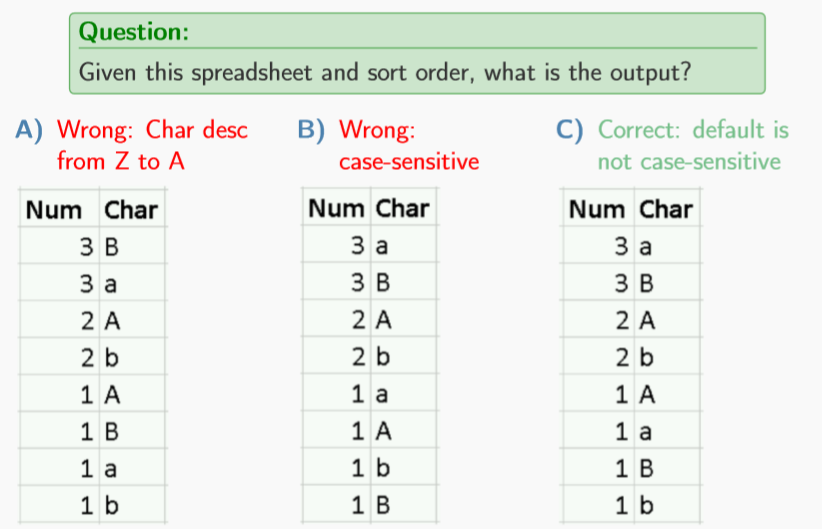    
### END SOLUTIONS HERE

### Sorting

If you want to make sorting on characters case sensitive, we need to select that in Options:  

    

### Filtering Question
**Example 14**  
Given this spreadsheet, how many of the sestatements are TRUE?  
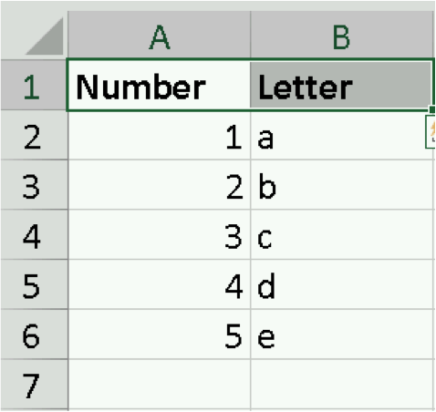    
1. The data is sorted ascending by Number.  
2. Filter Number > 3 shows 3 rows.  
3. Filter Letter >= "c" shows 3 rows.  
4. Filter Number < 3 ORLetter > "b" shows 5 rows.  
A) 0 B) 1 C) 2 D) 3 E) 4  

### START SOLUTIONS HERE
**Example 14**  
Given this spreadsheet, how many of the sestatements are TRUE?  
    
1. The data is sorted ascending by Number. :heavy_check_mark:   
2. Filter Number > 3 shows 3 rows. :x:   
3. Filter Letter >= "c" shows 3 rows. :heavy_check_mark:   
4. Filter Number < 3 ORLetter > "b" shows 5 rows. :heavy_check_mark:   
A) 0 B) 1 C) 2 **D) 3** E) 4  
### END SOLUTIONS HERE

N.B. The solution to the previous question required some [Advanced Filtering](https://www.ablebits.com/office-addins-blog/2016/09/07/excel-advanced-filter/) options:  

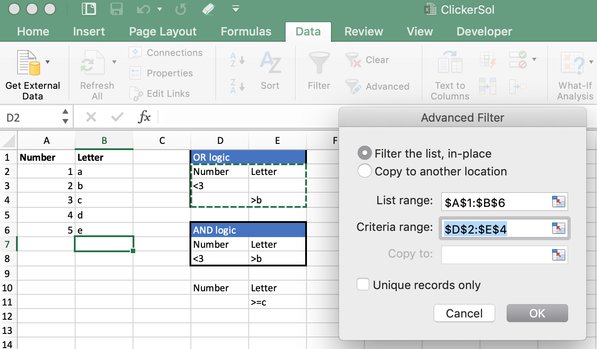    

### Conclusion
Spreadsheets are general purpose tools for data analysis that consist of a table of cells which contain data and formulas.  

Formulas contain data values, cell references, and functions.
- Aggregate functions summarize multiple data values into a single value.
- Functions exist for statistics, string manipulation, lookup/indexing, and decisions.


### Objectives
- Explain what a spreadsheet is.
- Explain how cells are addressed in a spreadsheet.
- List some of the ways to select cells in a spreadsheet.
- Define and explain: formula, function, argument, concatenation
- Use these functions: concatenate, lookup, index
- Explain the difference between an absolute and relative address.
- Explain how an aggregate function works. List some examples.
- Explain how to use conditional formatting.


## Spreadsheets: Microsoft Excel Part 2 of 3

### Charts
A *chart* is a graphical representation of spreadsheet data.  

Charts can help you visualize relationships between data and create maximum impact on your audience.  

When you create a chart, you can select from many chart types (eg, a stacked column chart or a 3-D exploded pie chart).  

To create a line/bar/pic/etc. chart, the user to supply the data that will be displayed.

Once your data is selected, navigate to the **Insert** tab, then click the desired **Chart** Icon. You can either choose one from the **Recommended Chart** button or select from the variety of chart types.

   

Sometimes the default graphic is not what we want,. . .  

For instance the recommended chart on the previous page shows an individual bar for each instance of the product type.  

We could instead create the total revenue for each product by selecting:
- The histogram icon 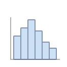 
- Double clicking on the bars
- Selecting the Series Options icon: 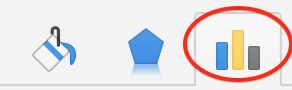 
- Selecting *By Category* in the **Bins** drop down menu.


### Chart Options
After you create a chart, you can customize it by applying chart quick layouts or styles. The **Chart Design** tab also provides a number of features for modifying things like chart color/type/position/etc.  

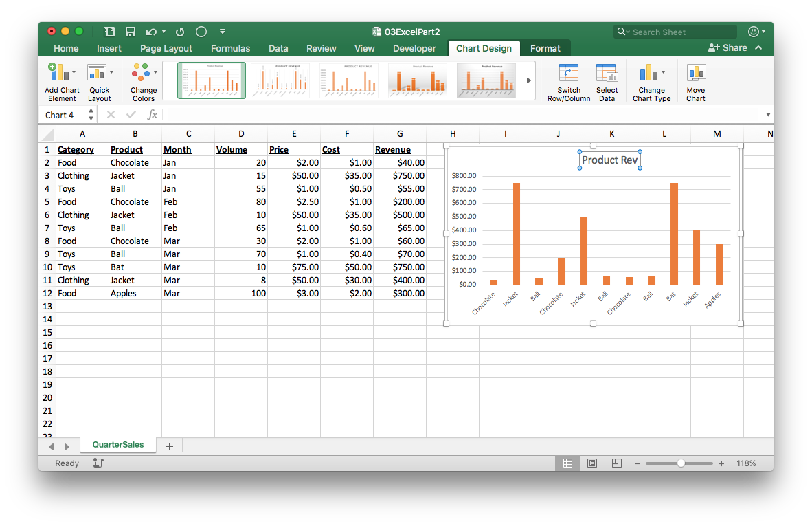   

> **Example 1**  
Navigate to the **Chart Design** tab and relocate your chart to a new worksheet called *barchart*.  

   

### Trendlines
- Trendlines can be easily added to a number of chart types.
- Click on chart, "Add Chart Element"...."Trendline"

   

Trendlines can be easily added to any chart.
- Linear treadline for monthly revenue. Good choice?  
> Probably not, as data appears to be seasonal
 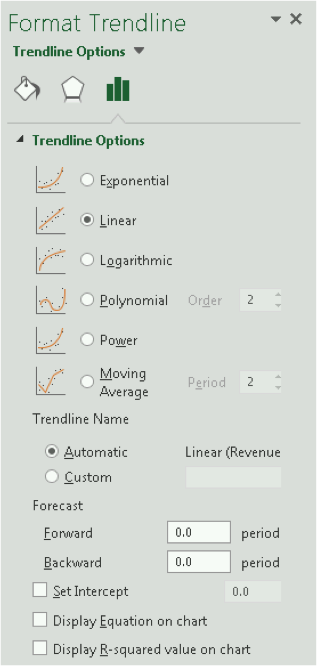   


### Try it! Trendline
Of course it wouldn’t really make sense to add a linear trend to the previous line chart since the data do not appear linear.  

> Apples  \
1. Create a line chart that plots the revenue per month for only Apples using the Annual Sales data.  
2. Add a linear trendline.  
3. In Chart Design tab, select a design that displays the months on a 45 degree angle.  


### Try It: Chart  

> Question:  
Create a Pareto chart (option under the histogram icon) to make it easy to see the best selling product.  
   


### Sparklines
A *sparkline* is a tiny chart in a worksheet cell for a quick data overview.  
- Click Insert then select Sparklines. . .
- Displayed below is an example of a line and column sparkline.
- You can change the style in the Sparkline tab in the ribbon.  
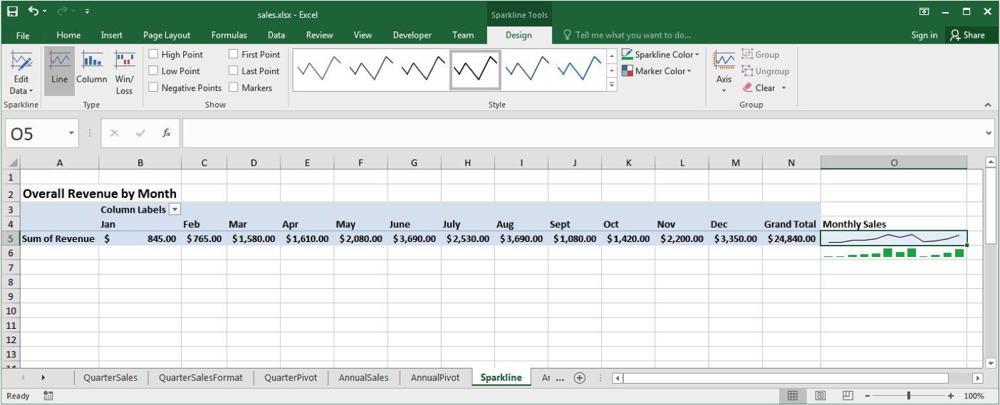   


### Pivot Tabels
*Pivot tables* allow for easily aggregating and exploring large data sets.  
- For example, our data set can be summarized by revenue by month.  
   


### Creating a Pivot Table
To create a pivot table  
1. Select the data (or click any single cell inside the data set).  
2. Navigate to the **Insert** tab, select the drop down **Tables** menu, and click the PivotTable icon.  
3. Click OK  
4. Add fields in the PivotTable Fields pane  

**Drag fields** To get the total revenue for each month, drag the following fields to the different areas.  
1. `Month` to the Rows area.  
2. `Revenue` to the Values area.  

The following dialog box appears. Excel automatically selects the data for you. The default location for a new pivot table is New Worksheet.   
   

*Pivot1* worksheet  
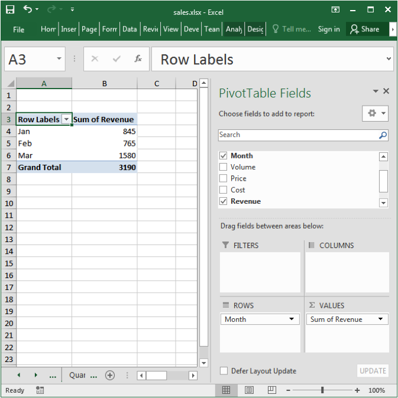    
Add fields to pivot table.  
Field may either be:
- ROWS value
- COLUMNS value
- Cell VALUES (aggregated)
- Used in a FILTERS (we could also filter using the drop down filter option; select the dropdown arrow located in cell A3, for example)  
N.B Right click on a cell in the pivot table and select Show/Hide Fields List to show/hide the pop-up window on the right.  

### Pivot Table Example
*Pivot2* worksheet  
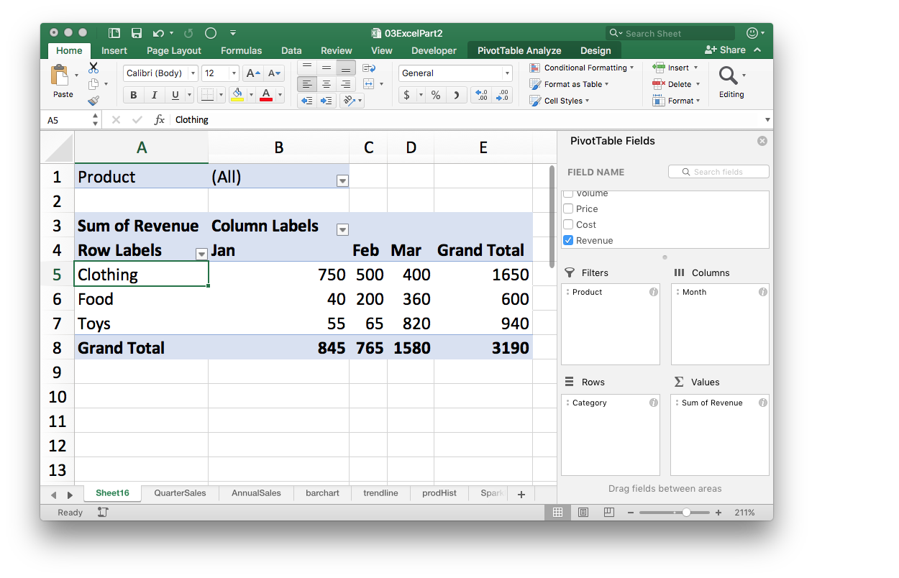    
- Categories are rows.
- Months are columns.
- Each cell is a sum of revenue per category for that month.
- We can filter on product (eg. filter out apples).

*Pivot3* worksheet  
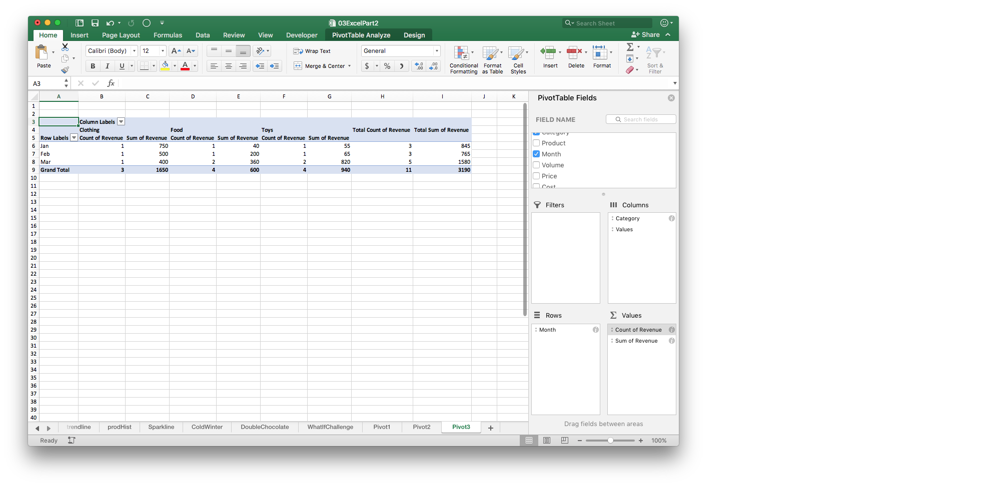    
- Notice that the same field can be used in VALUES multiple times
- In that way we can see multiple aggregate summaries (eg. total and count)
- To change the value aggregation function, click on the  icon
- Notice that a field can NOT be used in ROWS/COLUMNS/FILTER at the same time.

### Try It: Pivot Table
> Question:  
Create a pivot table using the annual sales data that shows the total revenue per month by category/product.  

    
N.B. The order in which your fields appear in ROWS will make a difference. Also, we can reformat the cells to display in currency format.   

### Pivot Charts
A pivot chart is a chart attached to a pivot table. Create it under **Insert** then **Pivot Chart**.
    

Below we have chosen a 100% stacked bar chart type.  
    


### Pivot Tables Question

**Example 2**  
How many of the following statements are TRUE?  
1. A pivot table field can be used in ROWS and COLUMNS at the same time.  
2. A pivot table field can be used in VALUES more than once.  
3. In our sales spreadsheet example, if Product and Category are both used in ROWS then the order they are list does not matter.  
A) 0 B) 1 C) 2 D) 3  


### START SOLUTIONS HERE
**Example 2**  
How many of the following statements are TRUE?  
1. A pivot table field can be used in ROWS and COLUMNS at the same time. :x:   
2. A pivot table field can be used in VALUES more than once. :heavy_check_mark:   
3. In our sales spreadsheet example, if Product and Category are both used in ROWS then the order they are list does not matter. :x:   
A) 0 **B) 1** C) 2 D) 3  

### END SOLUTIONS HERE


### Conditions and Decisions
A condition is an expression that is either TRUE or FALSE.  

Conditions are used to make decisions and perform different actions depending on the condition value.  

Excel condition and decision functions:  
`FALSE()` returns FALSE   
`TRUE()` returns TRUE   
`AND(cond1, cond2)` returns TRUE if both cond1 and cond2 are true  
`OR(cond1, cond2)` returns TRUE if either or both of cond1 and cond2 are true  
`NOT(cond)` returns TRUE if cond is FALSE  

### Decisions using IF()
The IF() function is used to make a decision based on a condition  
- `IF(condition, value_if_true, value_if_false)`

Example: If cell **A2** is less than 5, return 10 otherwise return 20.  
- ` = IF(A2 < 5, 10, 20)`

If the third argument is not specified, it’s default is FALSE()
- ` = IF(A2 < 5, 10) returns FALSE()` if **A2** is &ge; 5

The following statements are equivalent  
- = IF(A2 < 5, TRUE(), FALSE()) same as =A2 < 5  

Hence if we just want to check if a condition is met, we don’t need the IF() function.

### Try it: `IF()`
Question: Create two conditions:  
1. If cell **B2** &le; 10, then show **C2**, otherwise **D2**.
2. If cell **B2**< 15 and **C2**> 20, return B2\*C2, otherwise if D2 < 10, return 1, else 4.  
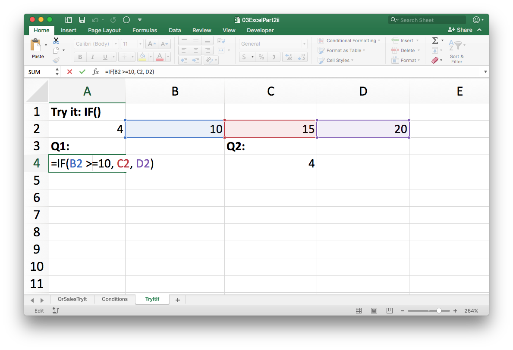    


### Decision Using `IF()` Question
**Example 3**  
How many of these statements are TRUE with **A1**=40, **A2**=10?  
1. `=AND(FALSE(), TRUE())`  
2. `=OR(FALSE(), NOT(TRUE()))`  
3. `=IF(A1=40, 5, 10)` returns 10.  
4. `=IF(OR(A1=40,A2>10),1, 2)` returns 2.  
5. `=IF(A2=10,IF(A1=40,FALSE()),TRUE())`  
A) 0 B) 1 C) 2 D) 3 E) 4  


### START SOLUTIONS HERE
**Example 3**  
How many of these statements are TRUE with **A1**=40, **A2**=10?  
1. `=AND(FALSE(), TRUE())` :x:   
2. `=OR(FALSE(), NOT(TRUE()))`  :x:     
3. `=IF(A1=40, 5, 10)` returns 10.  :x:    
4. `=IF(OR(A1=40,A2>10),1, 2)` returns 2.  :x:    
5. `=IF(A2=10,IF(A1=40,FALSE()),TRUE())`  :x:    
**A) 0** B) 1 C) 2 D) 3 E) 4  

### END SOLUTIONS HERE  


### What-If
*What-If* scenarios help understand different possibilities.  
There are three kinds of What-If Analysis tools:  
**Scenarios**  
**Goal Seek**  
**Data Tables**  
A what-if *scenario* is created under **Data** tab then **What-If Analysis** then **Scenario Manager**.  

To define a scenario, give it a name and list the cells that will change with this scenario.  

> Tip
It is usually a good idea to create a “Normal" scenario that you can go back to.  

Consider what happens with a cold winter and we predict to sell 50 jackets instead of the normal 15.  
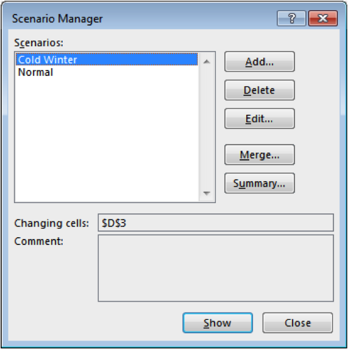         


User can easily select scenario and see the result.  
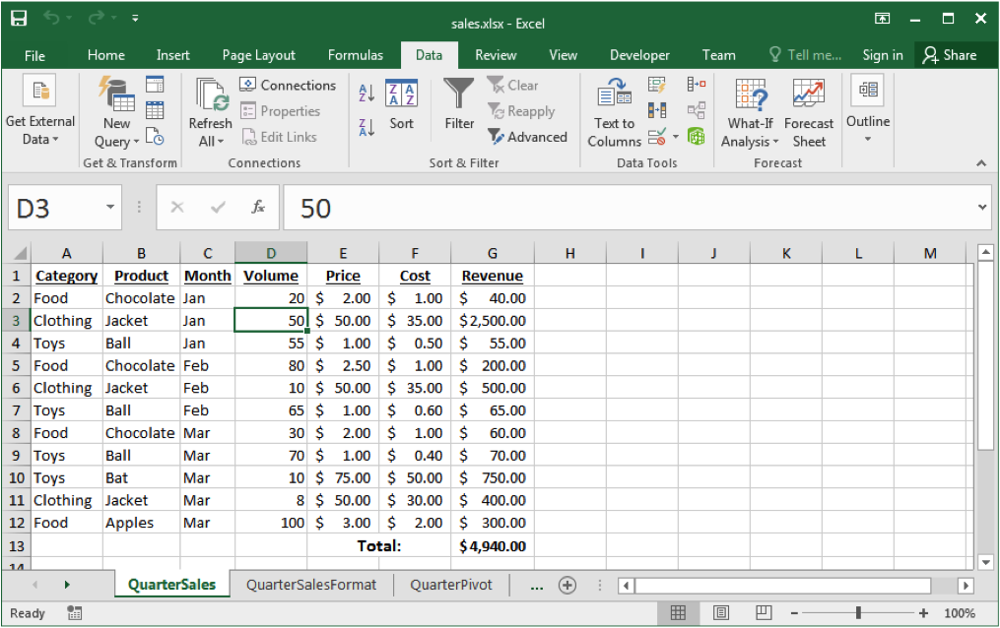    

### Scenario Summary
- After creating all of your scenarios, you can create a Scenario Summary Report.
- This report summaries how these scenarios impact a specified **Result Cell**
- For instance, to see how the *Cold Winter* scenario affects total revenue when compared with the Normal
        1. go to the **Data** tab then **What-If Analysis** then **Scenario Manager**.
        2. Select **Summary** in the pop up window.
        3. Select the **Scenario summary** report type and specify the **Result cell** (the value of interest these scenarios will impact).

A scenario report will display a summary in table form:  
    
**Figure**: Left: Step **3** from the previous slide. Right: the resulting Scenario Summary  

### Try it: What-If
> Question:  
Create a what-if scenario that wherever chocolates are sold, the volume is double than normal. Examine how it affects our total revenue.  
  

### Try it: What-If Scenario Challenge
> Question:  
Create a what-if scenario in which all costs go up by 10% and volume down by 20%.  
  


### Goal Seek and Solver
- Another way to ask Excel "what if" is by using the Goal Seek and Solver tools.
- *Goal seek* is used to determine what **value** needs to be in an input cell to achieve a desired result in a formula cell.
- *Solver* determines what **values** need to be in multiple input cells to achieve a desired result in a formula cell.
        - The Solver add-in is similar to Goal Seek, but it can accommodate more variables.
- These methods work to achieve a certain goal in the form of a formula output, while what-if scenarios looked at changing formula inputs.  

### Claire you are almost there!! page 43/85


