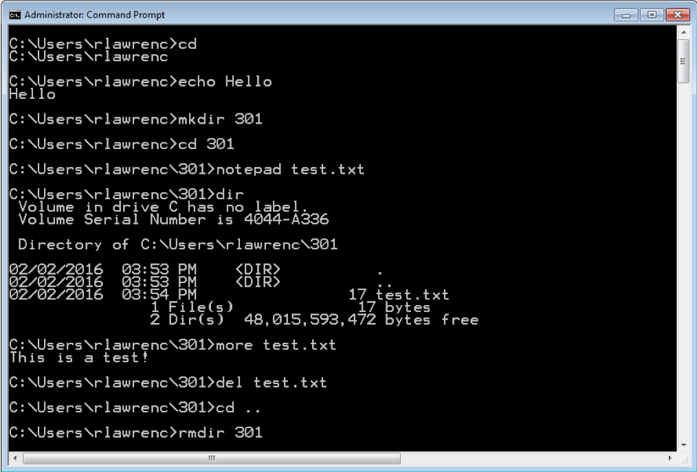
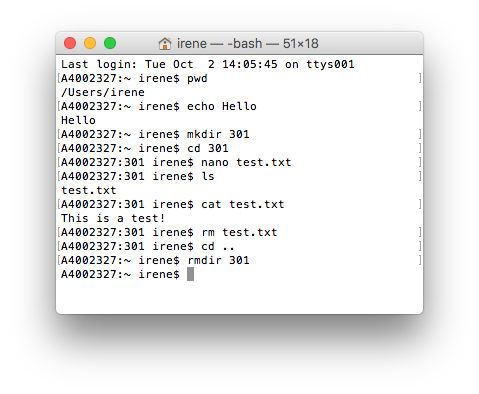
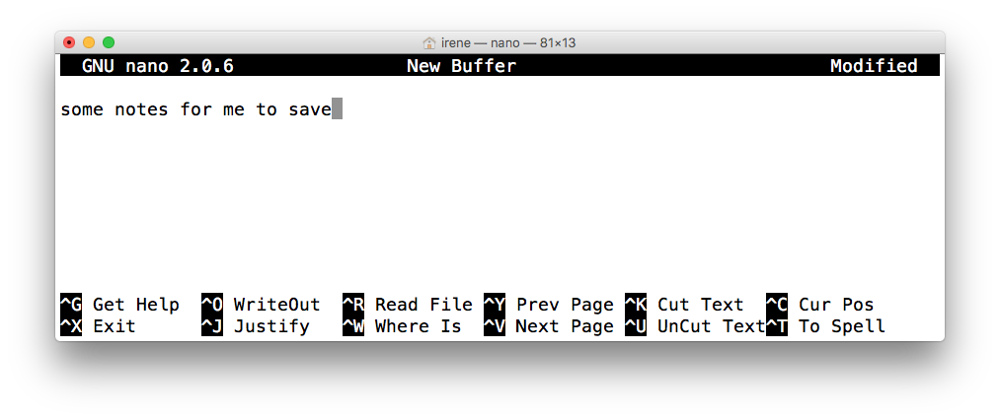
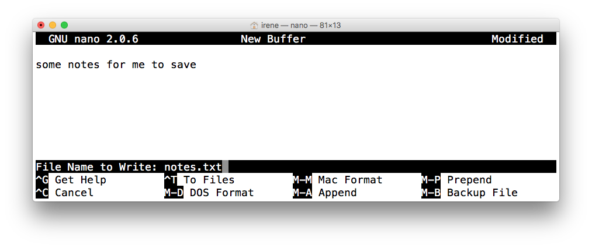

# Command Line

## Fill

### Why learn command line?
The command line is the text interface to the computer.
Understanding the command line allows you to interact with the computer in ways that you often cannot with the graphical user interface (GUI).
The command line is commonly used for scripting and automation of tasks and when accessing remote systems.
It will also be useful to run programs that make use of the command line (eg. github).
 
### What is the Command Line?

The <b>command line </b>is the text interface to the computer that accepts commands that the computer will execute. These commands include:
􏰏- starting programs
- navigating directories and manipulating files 
- searching, sorting, and editing text files 
- system and environment configuration

### Why use command line?
The command line is part of the operating system (OS), which is software that manages your computer including all devices and programs.
􏰏 
- Common operating systems include Windows, Mac OS, and Linux/Unix.
􏰏- Some commands will be OS specif

You might be wondering why we would ever prefer command line over using the graphical user interface (GUI).
􏰏 􏰏- Certain tools may only be available to command line. 
 - Sometimes command line is faster.
 
 ### Windows Command Line

The command line on Windows dates back to the original Microsoft operating system called DOS (Disk Operating System) in 1981.

This command line interface is still part of all modern Windows operating systems and is accessible as the "Command Prompt".


To access this, navigate to the start menu with your mouse (or click the windows button on your keyboard) and type “cmd" then
ENTER .

### Command Line - Windows



### Mac OS Command Line
The command line for Mac OS uses the same commands as Linux. It can be opened using Finder then Utilities then Terminal.


Alternatively, we could type Cmnd + spacebar, then type “Terminal" and press ENTER
### Command Line - Mac/Linux



### Entering a Command
Enter a command at a prompt. The prompt may be a > or a $ or
customized by the user.

Press ENTER to execute the command.

On Windows, commands are mostly case-insensitive while on Mac/Linux they are case-sensitive.


```text
ls
For example, the ls/dir (Mac/Windows), lists all the contents (i.e files and folders) inside or your current directory.
```
### File System
The file system organizes data on a device as a hierarchy of directories and files (like a tree).
Each folder (AKA directory) has a name and can contain any number of files or subdirectories.
Each file has a name.
The user can change (navigate) directories in the hierarchy


### File System
The tree is rooted at, well, the root.
􏰏 - There is only one root of a directory hierarchy.
Every item in the tree is either a file or a directory (AKA folder).
􏰏 - You can think of a directory as a container that may contains
files and/or other directories.
􏰏 - Files on the other hand holds information (and cannot contain other files or directories) .

If directoryC is contained in directoryP, then directoryC is a child of directoryP and directoryP is said to be the parent to directoryC.
􏰏 - A directory may have many children, but can only have one parent.

### Absolute versus Relative Path
􏰏
􏰏- The root of the file system is the directory "/" 􏰏
   - There is only one root of a directory hierarchy.
- A path to a new location (from your current location) can be specified as an absolute path from the root (this will work no matter where we are in the file system):
           cd /Users/ivrbik/301/level1
or a relative path from your current location (this will only work if we are in /Users/ivrbik/):
           cd 301/level1
- The directory separator is a forward slash ‘/’ for Macs/Linux.
In windows you may use forward or backward slashes ‘/’ or ‘\’
􏰏
### Short forms
􏰏 - ‘.’ is the short-form for the current directory
􏰏 - ‘..’ signifies the parent directory (akin to pressing Cmnd +↑
on a Mac)
􏰏 - For example, to navigate (i.e. change directories) to the parent directory of the current directory, use the command:
     cd ..
- Note that this command is dependant on your current directory (i.e. the folder you are currently in).
```text
pwd/cd
To print your current working directory type pwd/cd (Mac/Windows) then ENTER .
```
### Absolute versus Relative Path Question
 ```text 
 Example
Given this directory hierarchy and that the user is currently in the directory level2 and level1 directory contains a file test.txt. How many of the following statements are TRUE?
1. A relative path to change to directory 301 is ..
2. Absolute path to test.txt is /Users/ivrbik/301/level1/test.txt
3. Relative path to test.txt is ../test.txt
4. Relative path to test.txt is different if
user was currently in level3 directory.
5. There is only one root of the directory hierarchy.
A) 0 B) 1 C) 2 D) 3 E) 4 
```

   
### makdir
Download this filesystem as a zip file on Canvas.
􏰏 - To create a new folder in the current directory we use mkdir.
􏰏 - To complete this task we need to specify the directory name as an argument.
􏰏 - For example, the following creates a folder called NewFolder in the current directory:
          
  ```
  mkdir NewFolder
  ```
  
 ```text
Exercise: mkdir
Navigate to the 301 folder and create a new folder called Demo.
```

### touch
􏰏-  We can create files using the touch command.
􏰏-  Like mkdir we need to specify a argument.
􏰏-  Rather than a folder name, we provide a filename as the argument.
􏰏-  For example, the following command creates a new file named empty.txt inside the current working directory.
```
touch empty.txt
```
```text
touch
Navigate to the Demo folder and type touch abc.txt
```
    
### notepad/nano
􏰏
􏰏- To create a file with actually text, we can use the notepad/nano command (Windows/Mac).
- Typing nano will open a blank file for editing.
- We can then type the desired text and save using the shortcuts
given on the bottom of the window. More shortcuts [here](https://skorks.com/2009/09/bash-shortcuts-for-maximum-productivity/).
- N.B. the standard shortcuts we might be used to wont work in
this command line (eg. Ctrl /Cmnd + C for copy);



### notepad/nano
􏰏 - Upon saving (ie WriteOut via Ctrl + O ) you will be prompted to provide a filename to save the document under.
􏰏 - We could have supplied this information as an argument in our nano command as follows:
```
nano notes.txt

```

􏰏-  N.B. We will still be asked to verify the name upon exiting,
but we won’t have to type it again.

### Commonly Used File Navigation Commands

||Windows| Mac OS & Linux|
|---|---|---|
|List contents of directory <br>Change directory<br>Print working directory Make a directory  <br>Remove a directory <br> Rename a file<br>Remove a file <br> Copy a file <br> Move a file|dir <br>cd 301 <br>cd <br>mkdir 301 <br>rmdir 301 <br>ren old.txt new.txt <br>del file.txt<br>copy src.txt dest.txt<br> move <source> <dest>|ls <br>cd 301 <br>pwd <br>mkdir 301 <br>rmdir 301<br>mv old.txt new.txt <br>rm file.txt <br>cp src.txt dest.txt <br> mv source dest |

   
[Click here](https://www.lemoda.net/windows/windows2unix/windows2unix.html) for see some more Windows and Unix equivalents.

### Commonly Used Text Related Commands
||Windows| Mac OS & Linux|
|---|---|---|
|Open a text editor<br>Echo output<br>Output contents of a file<br> Search text files<br>Sort text files|notepad <br>echo Hello <br>more file.txt<br> find<br>sort|nano<br>echo Hello<br> cat file.txt <br>grep<br>sort |

### Wildcards
- A wildcard character allows for matching file names with more flexibility.
- The ? represents any one character in a file name. Example: file?.txt would match file1.txt.
- The * (asterisk) matches any number of characters (including no characters). Example: *.txt would match anything ending with .txt (i.e. all .txt files).
### Wildcards


Replace ls with dir if you are using Windows.

### Navigating the Command Line
||Windows| Mac OS & Linux|
|---|---|---|
|Previous command in history<br>Next command in history <br>First command in history<br>Last command in history<br>Move to start of line<br>Move to end of line<br>Auto-compete file name|Up<br>Down<br>PageUp<br>PageDown<br>Home<br>End<br>Tab|Up<br>Down<br> <br> <br>Ctrl+A<br> Ctrl+E<br> Tab<br>|

### Pausing or Cancelling Commands
## To pause a command:
- Windows: Press Ctrl +S or the Pause To resume, press any key. 
- Mac: Ctrl + Esc or Cmnd + .
To cancel a command, press Ctrl +C .
􏰏 - The command is canceled, and the command prompt returns.
􏰏 - However, any actions performed before the cancel are not undone.
```text
 Example
How many of the following statements are TRUE?
1. To cancel a command, press Ctrl +X .
2. To go to the most recent command, press Up arrow.
3. This wildcard expression te*a?.txt matches tea12.txt. 4. The command to change a directory is pwd.
A) 0 B) 1 C) 2 D) 3 E) 4
```
### Try It: Navigating Directories with Commands

```text
 Example
Using a terminal window, perform the following actions:
1. Create a directory called 301.
2. Change into the directory 301.
3. Echo I am awesome!
4. Show your current directory (print working directory). 
5. Create a text file called message.txt with a message in it. 
6. List the contents of your directory.
7. Rename the file message.txt to test.txt.Verify the name change.
8. Delete the test.txt file.
9. Change directory to directory above 301. 
10. Delete directory 301.
```
### Command Arguments - Windows
A command can take arguments that changes its behaviour.
􏰏 - Example: Path was an argument for the cd command. cd 301
On Windows, commands also can be modified by a switch (or extension) which is usually a slash then a letter (e.g. /S).
􏰏 - To find out what is available, run the command with: /?


### Command Arguments - Mac/Linux
On Mac/Linux arguments are separated by spaces and begin with ‘-’

An explanation of arguments can be found by using man then the command name. Example: man cp (to quit press q)


### Standard Input, Output, and Error
<b>Standard input</b> (stdin) is the default input device (usually a keyboard) into the terminal.
<b>Standard output</b> (stdout) is the location where output is sent after a command is run. The default is the terminal window.
<b>Standard error</b>(stderr) is the location where error messages are displayed (typically the terminal window).

### Redirecting Input
By default, a command gets its input from standard input and outputs results to standard output.
A command can get its input from the output of another command by using the pipe (|) symbol. Example:
```
cat test.txt | wc
```
Note the example commands are Mac OS/Linux only: wc (word
count) is not on Windows.
Also can use redirect input (<) to send input to a command. Ex:
```
cat < test.txt
```
same as
```
sort cat test.txt
```
### Redirecting Output
Redirect output using > which will overwrite the file: 
```
sort test.txt > sorted.txt
```
Use» to append to the existing file:
```
sort test.txt » sorted.txt
```

### Redirection Summary
| |Symbol|
|---|---|
|Redirect input| < |
|Redirect output| > |
|Redirect output (append)| >>| 
|Pipe output to input of next command|||


### Escape Symbol
An escape symbol is used when a command requires input that contains a character with a special meaning. The escape symbol indicates this character is data not part of the command.
Windows the caret (^) indicates that whatever character that follows it is data rather than part of the command.
􏰏- Example: cp test.txt a^&b.txt Linux use the backslash (\).
This is especially common when dealing with spaces in a file name. The other way to handle file names with spaces is to enclose them in double [quotes](https://wiki.bash-hackers.org/syntax/quoting%20):
```
cp test.txt "c:\program files\file spaces.txt"
```

### Environment Variable
Environment variables allow for customization and control of the command and system environment.

Current variables are seen using the set or env command. 

Important variables:

$PATH list of directories where commands/applications will be found

$HOME user home directory

### Finding Text in Files
The grep command allows for searching for text in files that match a pattern (Mac/Linux only, find on Windows).
􏰏 - grep stands for "global regular expression print"
􏰏 - Search is case-sensitive (use -i for case-insensitive) and can contain regular expressions.
􏰏     - grep -i will be case-insensitive
Example:
```
grep er *.txt
```
searches for er in any file that ends in .txt


###Batch Files
A batch program (also commonly called a batch file or command file) is a text file that contains a sequence of commands to be executed.

You define the sequence of commands, name the sequence, and then execute the commands by entering the name at a command prompt. Any action you can take by typing a command at a command prompt can be encapsulated in a batch program.

In Windows files typically end in .bat or .cmd and on Mac/Linux with .sh

Batch files can take arguments like other commands.

### Connecting to Another Computer using SSH

Secure shell or SSH is a protocol allowing remote login to other machines to execute commands.
􏰏- The network communication is encrypted for security. 􏰏
- An open-source program on campus is Putty.
Using SSH allows you to connect and execute commands on another machine even when you do not have physical access to that machine.

SSH may be used to send or retrieve data from other computers for analysis.

### Try it: Using Batch Files
Before creating the batch file, create a file called numbers.txt that has the numbers one, two, three, ... , ten.
```text
Example
Using a terminal window, create a batch file called myscript.bat (or .sh), to perform the following:
1. sort numbers.txt and output as sorted.txt.
2. output the word count on numbers.txt to count.txt.
3. take numbers.txt and append its data three times into the file output.txt.
4. search for "e" in output.txt and write results as file search.txt (use grep).
5. Output the contents of sorted.txt, output.txt, and search.txt .
6. Run your batch file.

```
### Conclusion
- The command line is the text interface to the computer that accepts commands that the computer will execute including running programs, manipulating files, and running scripts.

- The command line allows for automation and more control than may be available in the user interface. It may also be the only way to interact with the machine if connecting via SSH.

- The command environment allows for redirecting the standard input and output using input/output redirection and pipes.

### Objectives
􏰏 􏰏 􏰏
- Define command line and list some of its uses 
- Explain the purpose of an operating system
- Know how to open the command line window on Mac OS and Windows
- Be able to enter commands and stop them
- Define: file system, folder, file
- Explain the difference between an absolute and relative path Use command line shortcuts to save time
- Be able to match wildcards involving ? and *
- Be able to cancel a command

### Objectives cont’d
􏰏
- Explain standard input, standard output, and standard error
- Be able to use input and output redirection and pipes (?, >, < , »)
- Explain the reason for an escape symbol
- Define and explain the purpose of environment variables. Be able to use grep to search text files.
- Explain the purpose of a batch program.
- Be able to connect to another machine using SSH.


### Questions
