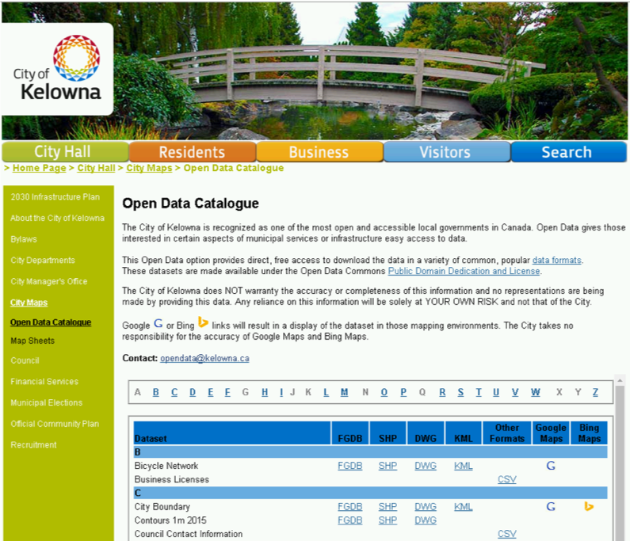
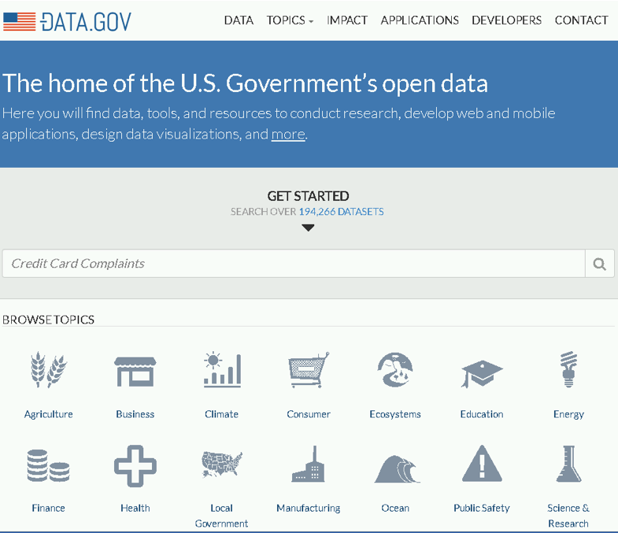
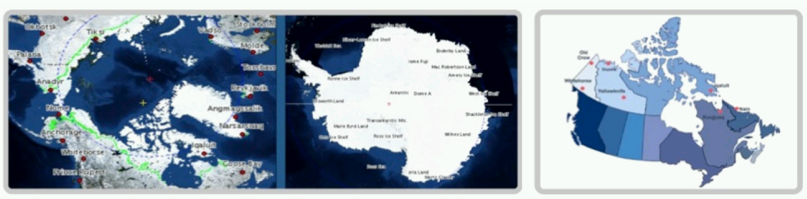

### Data 301 Data Analytics
## Open Data
### What is open data?
􏰏 - Open Data is the movement to make data freely available to all with no restrictions on use or copyright.
 - Governments have been major supporters and providers of open data as data collected by governments is primarily done to benefit its citizens.
 - Corporations and other organizations are both producers and consumers of open data.
 ### Open data in Canada
􏰏 - Federal, provincial, and local governments have all been involved in the open data movement.
- Canadian Federal government: http://open.canada.ca/en
􏰏       - How to use: http://open.canada.ca/en/working-data
􏰏       - Statistics Canada: http://www.statcan.gc.ca/eng/rdc/data
- British Columbia government: http://www.data.gov.bc.ca/
- City of Kelowna: http://opendata.kelowna.ca/
### Open Data in Canada

### Open Data in BC
- Example: MSP Blue Book
􏰏- For example, the BC Medical Services Plan’s (MSP) allows access to the annual financial statements including a detailed listing of total annual payments to all practitioners and organizations.
- Payments for 2010-11 to 2015-16 are provided [here](https://catalogue.data.gov.bc.ca/dataset/msp-blue-book) and statements for the last 10 years are currently posted on the Ministry website.
- Published by the Ministry of Health - Medical Services Licensed under Open Government Licence - British Columbia

### Open Data in BC
## Example: MSP Blue Book

### Open Data in BC
Example: DriveBC
􏰏 􏰏
- DriveBC is the British Columbia Ministry of Transportation and Infrastructure’s traveller information system.
- [This website](https://catalogue.data.gov.bc.ca/dataset/drivebc) provides timely road condition and incident information for the provincial highway system, motorists can decide when to travel and what route to take.
- This information is updated at regular intervals and as highway conditions change.
- Traveller information is provided only for provincially-managed transportation routes in British Columbia.
- Federal, municipal, forest service and industrial resource roads are not considered part of the provincial highway system, and therefore are not reported on through DriveBC.
- Published by the Ministry of Transportation and Infrastructure - Business Management Services
- Licensed under Access Only

### Open Data in Kelowna

### Open Data in United States
􏰏 - United States government: https://www.data.gov/ 􏰏 
 - Individual states have their own open data sites as well:
􏰏       - Example: Washington state: https://data.wa.gov/
### United States: Data.gov

### Open Data Worldwide
􏰏 􏰏
􏰏- UK: http://data.gov.uk
- The World Bank: http://data.worldbank.org/
􏰏      - Financial information and statistics 
- United Nations: http://data.un.org/
- OECD (Organisation for Economic Co-operation and Development): https://data.oecd.org/

### Open Data Aggregation
􏰏 - There are many sites that aggregate open data sets (and some data sets for a cost). A Canadian based site is [Quandl](https://www.quandl.com).
􏰏 - [Kaggle](https://www.kaggle.com/datasets) provides many data sets and competitions and techniques for data analytics and machine learning.
􏰏 - More recently, Google has released a search engine called [Dataset Search](https://datasetsearch.research.google.com) for finding data sets.
􏰏        - provides easier access to millions of datasets across thousands of data repositories on the web.

### Open Data from Companies
- Many companies either have public data or application programming interfaces (APIs) that allow people to use their data.
􏰏 􏰏 􏰏 􏰏 􏰏
- Google: public data explorer and Google Maps API 
- Facebook: https://developers.facebook.com/ (API) 
- reddit: https://www.reddit.com/dev/api (API)
- Twitter: https://dev.twitter.com/rest/public (API)
- Amazon: https://aws.amazon.com/public-data-sets/ (public data sets) and https://developer.amazon.com/ (API for developers)
- Best Buy: https://developer.bestbuy.com/ (API)

### Your turn
􏰏
- Explore the federal, provincial, and City of Kelowna data sets to discover “something interesting".
- From any Canadian government open data site, retrieve a data set and analyze and visualize it using one of our tools: Excel, R, Python, Tableau.

### Open Data for Researcher
􏰏
- Increasingly publicly funded researchers are responsible for making their data sets, procedures, and results available to the public (and other researchers).
􏰏      - Canadian researchers funded by [NSERC](https://www.nserc-crsng.gc.ca/NSERC-CRSNG/policies-politiques/OpenAccessFAQ-LibreAccesFAQ_eng.asp), SSHRC, CIHR must make their publications freely available within 12 months of publication.
􏰏      - Researchers in bioinformatics and other fields must make their data sets publically available in a database or repository.
- Researchers benefit by having access to public data sets and data sets of other researchers, but there is also a challenge as producing data sets (and perhaps commercializing results) may restrict open access.
### Open Data Biology/Bioinformatics
Huge number of databases with most related to [NCBI](https://www.ncbi.nlm.nih.gov) but distributed world-wide.

### Open Data in Chemistry
􏰏
- ChEMBL (https://www.ebi.ac.uk/chembl/) stores structures and properties of pharmacologically active molecules.
􏰏       - Over 1.5 million compounds.
- SureChEMBL (https://www.surechembl.org) is a database extracted automatically from patent applications.
       􏰏- Growing at 80,000 compounds a month and has 16 million compounds from over 13 million annotated patents.
- ChemSpider (http://www.chemspider.com/) is a free chemical structure database containing over 43 million structures.
􏰏       - Supported and hosted by Royal Society of Chemistry.

### Open Data in Computer Science
􏰏 - Computer scientists in various fields create standardized data sets for experimentation and research.
􏰏     - Databases: Standard performance benchmarks such as TPC (www.tpc.org).
􏰏     - Machine learning/data mining: UCI ML repository http://archive.ics.uci.edu/ml/
􏰏     - Game path finding: http://www.movingai.com/benchmarks/

### Open Data in Earth/Environment Science
􏰏
- Climate Change Data Portal: http://sdwebx.worldbank.org/climateportal/
- National Climatic Data Center: https://www.ncdc.noaa.gov/cdo-web/
- National Geographic Data Center: http://www.nodc.noaa.gov/submit/
- Polar Data Catalog: https://www.polardata.ca/

### Open Data in Physics
- Modern physics produces a HUGE amount in data in experiments like astronomical observations and the Large Hadron Collider (LHC; the worlds largest particle accelorator).
􏰏        - New research systems developed to handle the large amount of data produced.
􏰏        - CERN (The European Organization for Nuclear Research) open data portal: http://opendata.cern.ch/
􏰏         - Data produced is tens of petabytes/year. Large distributed computing of 170 facilities in 36 countries.
- Astronomy:
      - 􏰏Canadian Astronomy Data Centre:http://www3.cadc-ccda.hia-iha.nrc-cnrc.gc.ca/cadc/
      - National Space Science Data Center: http://nssdc.gsfc.nasa.gov/
### Open Data in Psychology and Social Sciences
- Archaeology:
􏰏      -  Archaeology Data Service: http://archaeologydataservice.ac.uk/
􏰏.     - Many museums have online exhibits and open data.
- Psychology:
􏰏      - Journals increasing requiring open data sets.
􏰏      - List of open data sites at: http: //guides.library.ucla.edu/c.php?g=180221&p=1188487
- History
      􏰏- Digital Archive Database Project (UBC): http://dadp.ok.ubc.ca
      
### Github
􏰏
􏰏- [Github](https://github.com) is another service that provides a platform for publishing open (as well as private data).
- GitHub also provides a [collection](https://github.com/collections/open-data) of open data
- Canada has an [Open Government](https://github.com/open-data) initiative that is housed on GitHub.
- There is a also a [US Open Data](https://usopendata.org) project on [Github](https://github.com/opendata)

### Google Analytics
􏰏- Google Analytics is an analysis service for tracking, optimizing, and understanding user interaction with a web site/service.
- Using [Google analytics](https://analytics.google.com/analytics/web/provision/?authuser=0%23/provision#/provision) is important for all business, but especially web companies, that rely on users interacting with their site to generate revenue and sales.
- Google analytics helps identify and improve content to make it more accessible to potential customers.
        - Google has a series of online [courses](https://analytics.google.com/analytics/academy/).
        
### Google Ads
- [Google Ads](https://ads.google.com/intl/en_CA/home/) (previous Google AdWords) is a service to provide advertisements during searches and as display advertisements on web sites and in apps.
􏰏- Companies bid on keywords and display opportunities that are presented by Google and affiliated sites.
- In 2017, the primary source of revenue from Google AdWords. [Source](https://www.investopedia.com/articles/investing/020515/business-google.asp).
- With great power comes great responsibility:
􏰏       - Google CEO Sundar Pichai [testifies before Congress](https://www.youtube.com/watch?v=8qS7eyUo_uk) about data breaches, misinformation campaigns, and concerns about working with China.

### Google Ads
- Terminology:
- Ad Impression - display of an advertisement. Pricing in cost-per-thousand impressions or cost per mille (CPM).
- Click through - user clicks on an advertisement (and directly to new location)
- Click through rate - fraction of impressions that are clicked on
- Pay-per-click (PPC) - companies are billed on each click of an advertisement. The pricing depends on the bid amount and the desirability of the ad location.
 
### Conclusion
􏰏
- Open Data is the movement to make data freely available to all with no restrictions on use or copyright.
- Open data has been widely supported by governments and companies wishing to engage users (and developers) with their services.
- Data analysts should use open data to help with their analysis whenever available.
- Researchers are often responsible for making their publications and data available in an open fashion.
- Google provides services for analytics and advertising that are valuable to understand as a business or site looking for user traffic.
􏰏
􏰏
### Objectives
􏰏
􏰏- Define open data and explain the motivations for making data “open”.
- List some of the governments and organizations that provide data in an open fashion.
- Use open data sets when applicable when performing data analysis.
