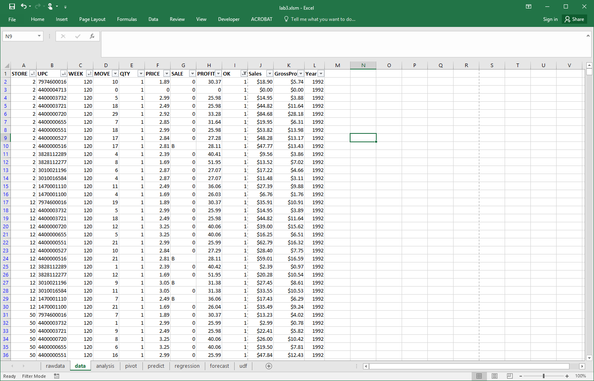
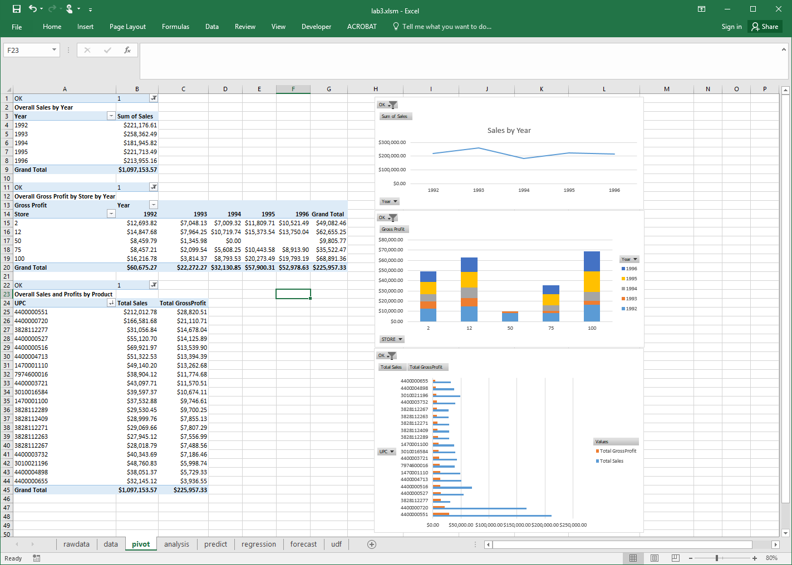
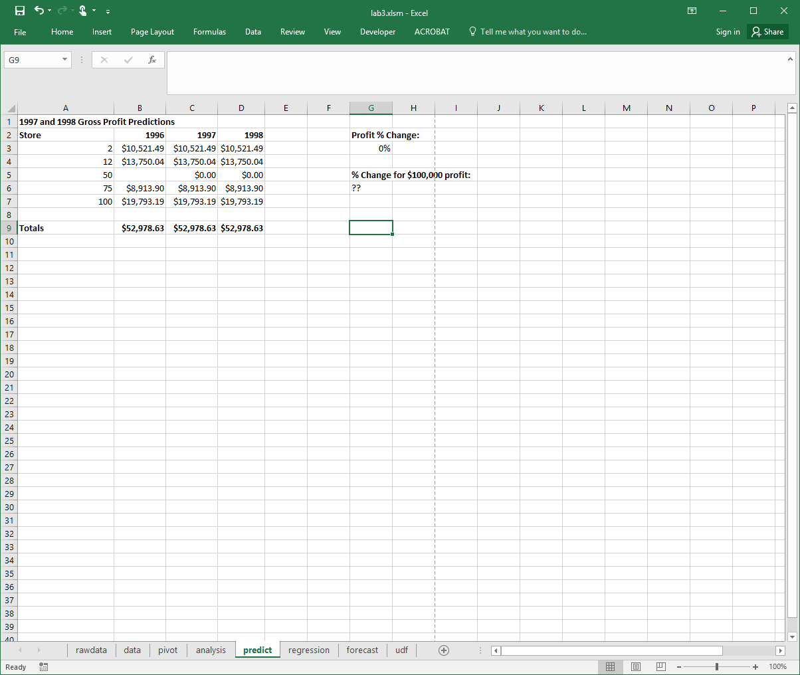

## DATA 530 Lab 3 - Excel Data Analysis

This lab practices using Microsoft Excel to perform analysis of business data including reporting and predictions.

### Objectives

  - Manipulate sales data commonly seen in business applications.
  - Create several pivot tables and pivot charts.
  - Develop what-if scenarios to make it easy to communicate possibilities.
  - Use goal seek and linear programming to determine sales targets.
  - Experiment with analysis toolpak.
  - Create a macro using the macro recorder.
  - Execute a recorded macro to automate a repetitive task.
  - Create a user-defined function in VBA using the Visual Basic Editor.
  - Use a user-defined function.
  
### Analysis Problem and Goals

This scenario involves analyzing real-world, historical business sales data.  This [data set](http://research.chicagobooth.edu/kilts/marketing-databases/dominicks) was collected by the University of Chicago from 1989 to 1997 for the company Dominick's Finer Foods.  From this large data set, we are going to perform an analysis on the store-level sales data which contains data for each UPC sold at every store on a weekly basis.  The format of the data is below and a [detailed description is available](http://research.chicagobooth.edu/~/media/5F29F56C65894FA194132DB8D36292B3.pdf).

|   Variable | Description  | Type |  Length |
|------------|--------------|------|---------|
upc     |		UPC Number    |		Numeric   |	  8 |
store   |		Store Number  |	  Numeric   |	  3 |
week    |		Week Number   |	  Numeric   |	  3 |
move    |		Number of unit sold|	Numeric |	8 |
price   |		Retail Price  |	  Numeric |	    8 |
qty     |		Number of item bundled together |	Numeric |	3 |
profit  |		Gross margin  |	  Numeric |	8 |
sale    |		Sale code (B, C, S) |	Character |	8 |
ok      |		1 for valid date, 0 for trash |	Numeric |	3 |

**Note: To calculate the gross sales, use ```price * move / qty```.  To calculate the gross profit, multiple sales by ```profit/100```.**

[Click to download the data set](data.csv) that consists of the sales for the top 20 products from the Cookie category for 5 stores from 1992 to 1996.

#### Goals

The analysis goals are:

1. **Loading -** load the input CSV file into Excel and convert into an Excel spreadsheet file.

2. **Cleaning -** filter out all data indicated as "trash" (value **0**) in **ok** field.

3. **Summary -** create pivot tables for analyzing sales and profits.
	
4. **Visualization -** create charts to display data from pivot tables.
	
5. **Analysis -** use the sales data to answer analysis questions such as most profitable items, future estimated sales, and what-if scenarios.	
	
### Marking and Evaluation

Marks are awarded by *precisely* following these requirements:

1. **Loading (1 mark) -** submit an Excel file called **lab3.xlsm** (Excel macros enabled) where the first sheet is called **rawdata** and contains the loaded data set with no changes.

2. **Cleaning (3 marks) -** create a second sheet called **data** that contains the data set after the following formatting and cleaning:
	  - Header fields must be in bold font.  UPC field must display entire value (make sure column width is wide enough). (0.5 marks)
	- Add a column called **Sales** which is calculated as: ```price * move / qty```.  Add a column called **GrossProfit** which is calculated as: ``Sales * Profit/100``.  Both columns must be formatted as **Currency**. (0.5 marks)
	- Add a column called **Year** that calculates the year for each week. (1 mark)<br>
			- 1992 - Weeks 120 to 172<br>
			- 1993 - Weeks 173 to 225<br>
			- 1994 - Weeks 226 to 277<br>
			- 1995 - Weeks 278 to 329<br>
			- 1996 - Weeks 330 to 381<br>
				
	- The data must be sorted by **week** (ascending), then **store** (ascending), then **UPC** (descending). (0.5 marks)
	- Filter data so only values of ```OK=1``` appear (no trash data). (0.5 marks)
	
3. **Summary Analysis and Visualization (3 marks) -** create a third sheet called **pivot** that contains:
	- A pivot table for overall sales by year with a line chart. (1 mark)
	- A pivot table for overall gross profit by stores by year with a stacked column chart. (1 mark)
	- A pivot table for overall sales and profits by UPC with a clustered bar chart. Sort by total gross profit descending. (1 mark)
	
4. **Analysis (3 marks) -** create a fourth sheet called **analysis** that contains:
	- In cell **A2**, estimate the total sales for the company in 1997 and give a short reason in cell **B2** for your estimate. (1 mark)
	- Based on 1996 sales, predict the top 2 selling products (by **Sales**) (provide UPC) for 1997 for store **2**. Put UPC codes in cells **A6** and **A7** and an explanation in **B6**. (2 marks)
	
	- **Note: None of these values in the analysis tab need to be calculated with formulas. You must just figure out the right answer and type it in as a value in the cell.**
	
5. **Predictions (3 marks) -** create a fifth sheet called **predict** that contains:
	
	- Gross profit data for 1996 per store and a column for predicted gross profit for 1997 and 1998.  The predicted gross profit will be a percentage change from 1996.  This percentage will be in cell **H3**.  Use what-if scenarios to create three scenarios: 1) Good (+20%),  2) Same (0%), and 3) Bad (-20%).  (2 marks)
	- Use goal seek to determine the % profit change necessary so total 1998 gross profit is **$100,000**.  Put that value in cell **G6**. (1 mark)
	
6. **Regression (1 mark) -** compute a regression on sales (Y variable) and GrossProfit (X variable) and rename the regression result sheet as **regression**.  The regression shown uses all records including those with **OK=0**.

7. **Record a Macro (1 mark) -** record a macro call **ItalicsBlue** with short cut key of Ctrl+Shift+B that for the current cell will apply italics, center, and put a blue background. Test your macro on any of the cells in the workbook.

8. **Bonus (1 mark) -** create a new sheet called **bonus** that performs some analysis to determine any useful insight from the data with an explanation on what you did and why it is interesting.

9. **Bonus (1 mark) -** create a UDF called **age** that returns an age given a (birth) date. Create a new sheet called **udf** to test your function.

10. **Note:** You may have additional working sheets in your spreadsheet.  (The screenshots show **forecast** which you do not have to make).


### Screenshots

#### rawdata sheet


#### data sheet



#### pivot sheet



#### analysis sheet


#### predict sheet



#### regression sheet


