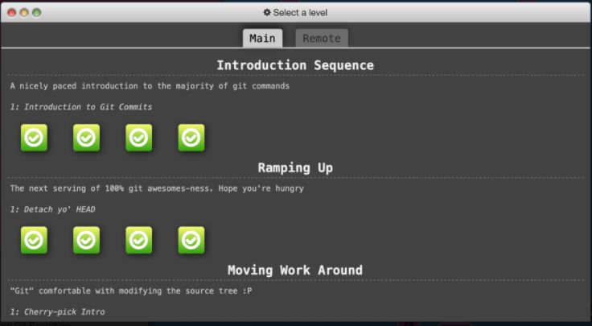

# Task 1 - Practicing Git 1

## Task 1: GitHub Tutorial - Main

Git and GitHub is a difficult thing to teach so after many years of searching, I have found the [**PERFECT** tutorial](http://learngitbranching.js.org).
This tutorial, in addition to the videos for this week, will help you get more familiar with git commands, particularly branching, and merging - things you will start encountering when you start collaboratively working in your repos.

It is important to realize that in this course, you will not explicitly be tested on any git commands except `add`, `commit`,`fetch`,`switch`,`push`,`pull`,`branch`.
You may be tempted to only do those activities, but the more you play around and experiment with Git, the more comfortable you will be with it.

I recommend that at minimum, you complete the following modules, but you're more than welcome (and encouraged!) to do more, especially if you're having fun and still learning.

- "Main: Introduction Sequence"
  - Exercise 1
  - Exercise 2
  - Exercise 3
  - Exercise 4
  
- "Ramping up"
  - Exercise 1
  - Exercise 2
  - Exercise 3
  - Exercise 4

Once you have completed these tasks, take a screenshot of the main tab as shown in the screenshot below, and move on to task 2!
You don't need to add that screenshot to your repository, just keep it with you until the end of Task 2.

