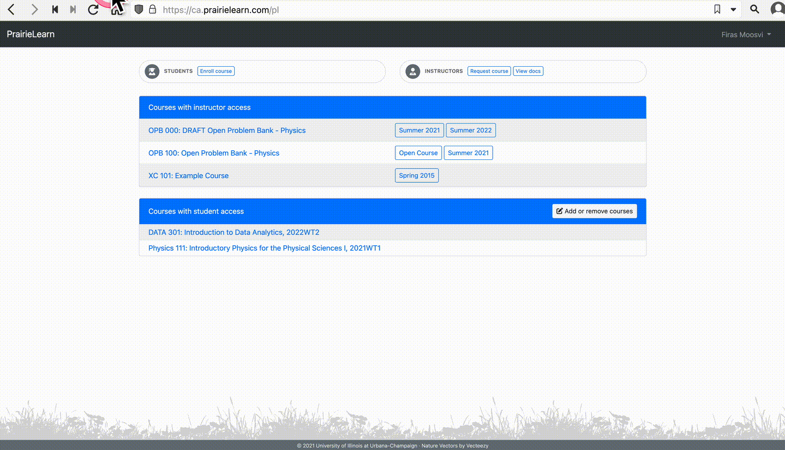

# Lab 10: Excel - Analyzing and Reporting Data

In this Lab, we will shift gears a bit and you will be working with Microsoft Excel to practice your data analysis skills.

## Submission Instructions

**Please add your screenshots in the main directory (`./`) and they will automatically be imported into PrairieLearn. Any files added to the `images` directory will not be graded.**

Once you are done with his lab, **you will need to submit your repository for grading on PrairieLearn**.

Those same instructions are summarized here in text:

1. Log in to your Canvas course, and click PrairieLearn in the left sidebar.

1. You will be enrolled in the PrairieLearn course and you'll be able to see all your active assignments if you click "Assessments" on the top bar.

1. Click on the Lab you'd like to submit, select the "Submit this lab" question, enter the URL to your GitHub repo in the box - your URL should look something like: `https://github.com/ubco-W2022T2-data301/lab01-demofiras`.

1. Answer any other questions there are about the assignment (if applicable).

1. Click `Save`.

That's it! You are all done with this Lab!

Congratulations!