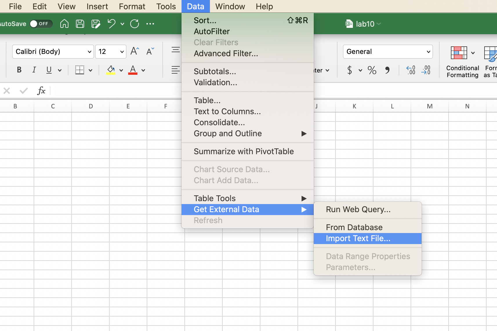
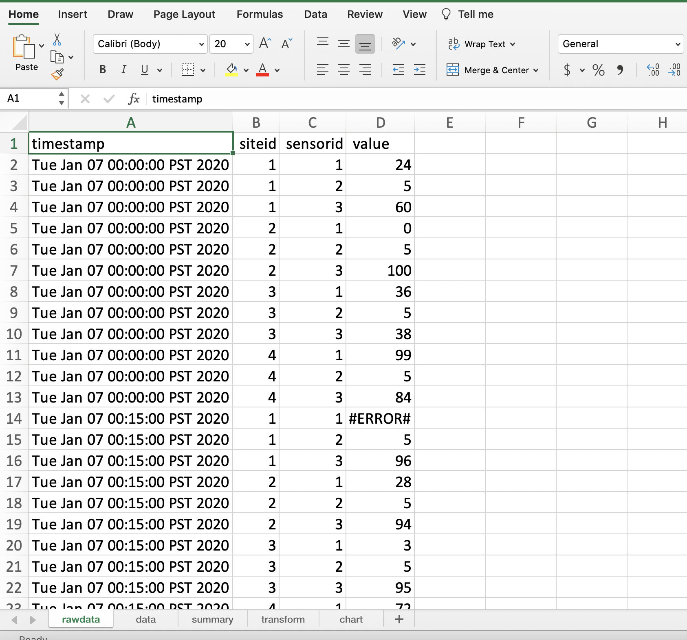
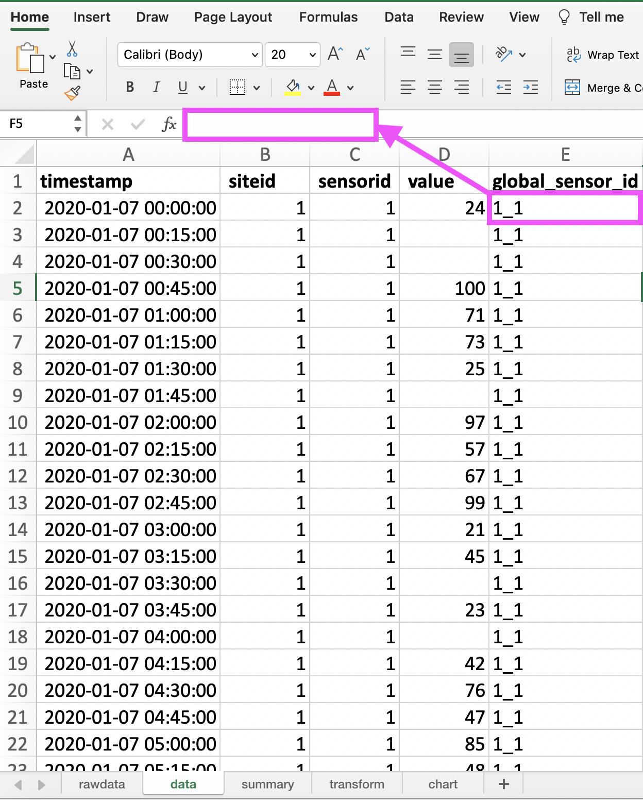

# Task 1

### 1.1 - Loading 

Create an Excel file called **lab10.xlsx** where the first sheet is called _rawdata_ and contains the orginal loaded dataset with no changes. 
Follow the following steps for loading the csv file as an excel sheet (_rawdata_)
- First open a blank workbook, click on **Data > Get External Data > Import Text File...** (See screenshot for guidance)
- Then choose the **data.csv** file located in the lab 10 directory and click **Get Data**. 
- A Text Import Wizard window will pop up where you choose **Delimited** and then **Next >**
- Choose the delimiter **Comma** and then click **Next >**
- Choose data format: **General** and click **Finish**
- Finally, rename sheet to _rawdata_ 

### loading sheet 

### `rawdata` sheet

Your output for the _rawdata_ sheet should look similar to the screenshot provided below:

### 1.2 - Cleaning and Formatting 

Create a second sheet called _data_ that contains the data set after all incorrect and out-of-range values have been removed: 

- Any data that is not a number (eg. "#ERROR#", "#NA#"), is less than 0, or above 100 should be replaced by an **empty string ("")**.
     **Hint:** May need to use [IF](https://support.office.com/en-us/article/IF-function-69aed7c9-4e8a-4755-a9bc-aa8bbff73be2)
- Header fields must be in bold font. 
- _timestamp_ field must be formatted as a date field in this format yyyy/mm/dd hh:mm:ss (Use a custom date time format). 
    - **Hint:** May need to use [DATEVALUE](https://support.office.com/en-us/article/DATEVALUE-function-df8b07d4-7761-4a93-bc33-b7471bbff252) function and function like [MID](https://support.office.com/en-us/article/MID-MIDB-functions-d5f9e25c-d7d6-472e-b568-4ecb12433028) to convert date. [More info](http://chandoo.org/wp/2010/03/23/text-to-date-convertion/). Note that both the DATE and TIME need to be converted and added together to get a DATETIME. You need to add some / between the day, month, and year. 
   e.g =DATEVALUE(MID(rawdata!A2,9,2)&"/"&.... 
- Data must be sorted by _siteid_ (ascending), _sensorid_ (ascending), then _timestamp_ (ascending).
- Add a column called **global\_sensor\_id** that is generated by siteid&"\_"&sensorid (for e.g. if _siteid_ = 3 and _sensor_id_ = 1, then _global_sensor_id_ should be 3_1) 

### `Task 1` `data` sheet

Your final output for the _data_ sheet should look similar to the screenshot provided below:

#### **SUBMISSION DETAILS:**

1. Submit ONE Screenshot of the `data` sheet with cell **D2** selected so we can see what formula you used in the formula bar 

1. Submit ONE Screenshot of the `data` sheet with cell **E2** selected so we can see what formula you used in the formula bar

  

