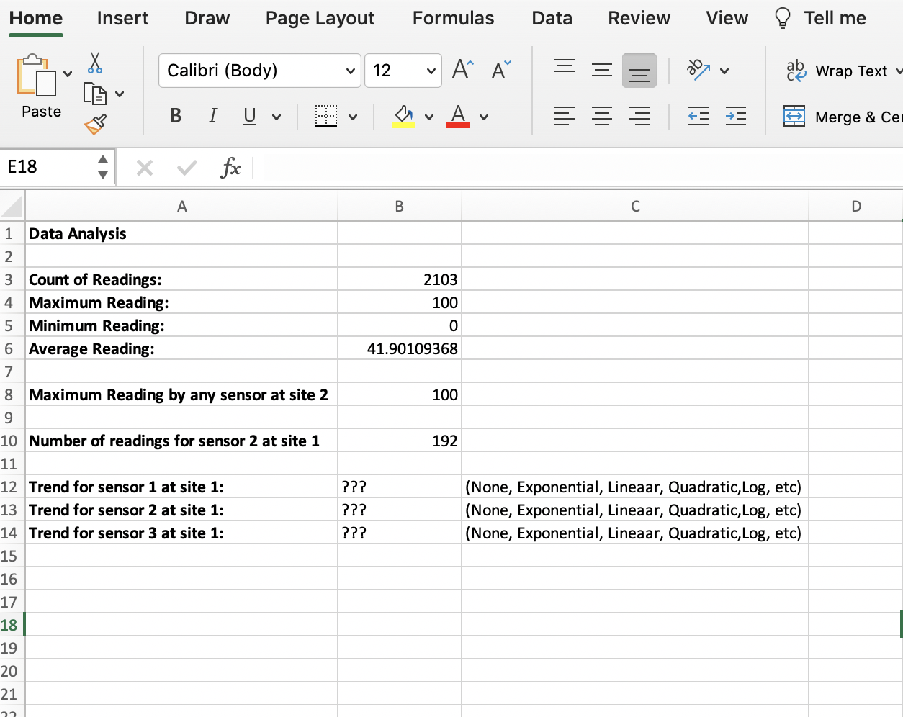

# Task 2 

## **2.1 - Summary**

Create a third sheet called _summary_ that contains the following items: 

- Count of readings in **B3** 

- Maximum reading value in **B4**

- Minimum reading value in **B5**

- Average reading in **B6** 

- Maximum reading by any sensor at **site 2** in **B8**. **Hint**: Ctrl+Shift+Enter will be useful. See: [Array Output using Ctrl+Shift+Enter](http://superuser.com/questions/674566/when-to-use-ctrlshiftenter-and-when-to-use-enter-in-excel)

- Number of readings for **sensor 2** at **site 1** in **B10**. Note: Include **all** readings including readings that were out of range/errors/blank.

- Mention in cell **B12** if **Sensor 1** at **Site 1** has any data trend (none , exponential, linear, etc).
 
- Similarly, in cell **B13** mention if **Sensor 2** at **Site 1** has any data trends

- Finally, in cell **B14** mention if **Sensor 3** at **Site 1** has any data trends

    - **Hint** For the data trends look at the appropriate charts and trendlines made in Task 4. 

### `summary` sheet

Your output for the _summary_ sheet should look similar to the screenshot provided below:

#### **SUBMISSION DETAILS:**

1. Submit ONE Screenshot of the `summary` sheet with cell **B8** selected so we can see what formula you used in the formula bar. 

1. Submit ONE Screenshot of the `summary` sheet with cell **B10** selected so we can see what formula you used in the formula bar. 

