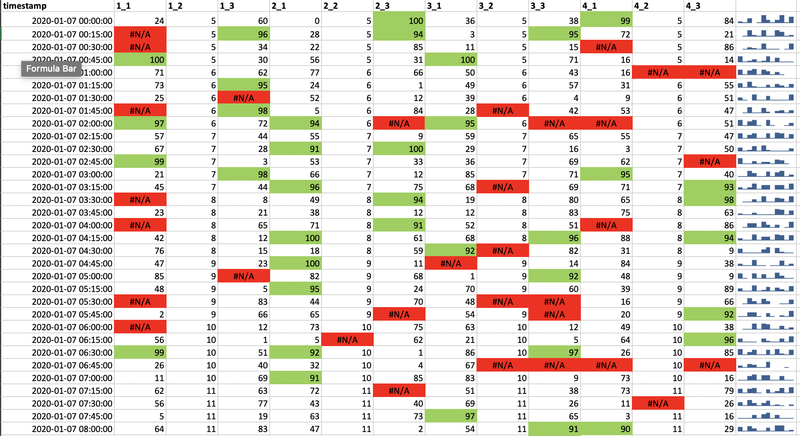

# Task 3

### 3.1 - Transformation 

Create a fourth sheet called _transform_ that contains a table where each row is a time and each column contains values for the sensor. (**Hint:** Insert a table or use Cell References to get the data, i.e. don't just copy paste the data) 

 - Create data table.
 - Replace missing values with NA(). [More info](http://www.criticaltosuccess.com/when-data-points-are-bad-or-missing-how-do-you-create-a-usable-and-decent-looking-excel-chart/) and [Using ISNA() function](http://www.extendoffice.com/documents/excel/2487-excel-conditional-formatting-if-na.html#a1)
- Add sparklines in last column for each row.
- Add conditional formatting so that cells with **#N/A** are filled in **red** and cells with values **>= 90** are filled in **green**.

### `transform` tab

Your final output for the _transform_ sheet should look similar to the screenshot provided below:

#### **SUBMISSION DETAILS:**

1. Submit ONE Screenshot of the `transform` sheet with cell **B2** selected so we can see what formula you used in the formula bar. 

