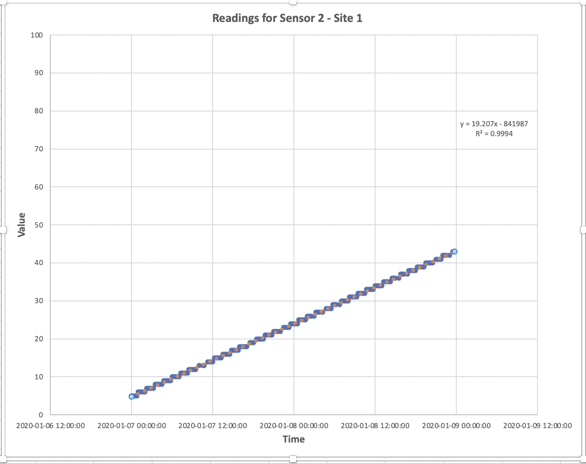

# Task 4

## 4.1 - Visualization

### **4.1.1 - Scatter Chart** 

Create three **separate XY Scatter charts (with smooth lines and markers)** on a sheet called _chart_ that shows the readings by time for:

- **sensor 1** at **site 1**. Add an appropriate trendline, and an R2 value for the trendline, for **sensor 1 at site 1**.

- **sensor 2** at **site 2**. Add an appropriate trendline, and an R2 value for the trendline, for **sensor 2 at site 1**.

- **sensor 3** at **site 1**. Add an appropriate trendline, and an R2 value for the trendline, for **sensor 3 at sire 1**.

### **4.1.2 - Histogram**

- Using all the data from **site 3**, make a histogram to show the overall distribution of the data(you can use bin size of 10)

### **4.1.3 - Box Plot**

Use a box plot to show the distribution of data from **site 2** for each sensor separately.

### `histogram` and `boxplot` charts

Screenshot provided below of **Histogram** and **Boxplot** for guidance: 

Note that your plots may not look exactly the same but this is generally what we're looking for.

#### **SUBMISSION DETAILS:**

1. Submit screenshot(s) of all three scatter plots (i.e Sensor 1, Sensor 2 and Sensor 3  at Site 1). Try to fit all three in one screenshot. 

1. Submit ONE screenshot of the **Histogram** and **Boxplot** as shown below:

