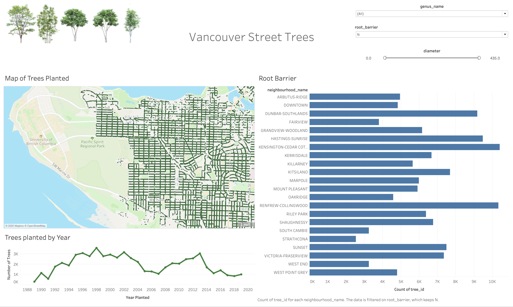

## Task 5. Putting it all Together in a Dashboard

You can take an arbitrary number of plots in sheets and lay them out in a "Dashboard". This part of the lab guides you on how to do this.

### 5.1. Making a Dashboard 

1. Create a new dashboard by clicking "**Dashboard**" in the top menu bar and selecting "**New Dashboard**"
2. Before you do anything else, under the "**Size**" heading, click the triangle beside "Desktop Browser (1000x800)". Change "**Fixed Size**" to "**Automatic**". This will now make sure your dashboard adjusts to all monitor sizes. 
3. Let drag our sheets in using Tiled objects. Under "**Sheets**" on the left-hand side, drag and drop the sheets you want to include in your dashboard. 

### Sample Output

Here is a sample dashboard, you do not have to create one exactly like this one, but you should include at least 2 filters, and at least 4 plot elements.

### Filters 

1. Decide which filters you want for each plot. 
2. Go to the sheet my navigating on the bottom and selected the worksheet of interest.
3. Under "**Tables**" Drag the column you wish to filter, in our case `Diameter`, `root_barrier` and `neighbourhood_name`  to the "**Filters**" card above "**Marks**". 
    - For `diameter`, since it is a continuous variable we want to select "**All Values**". We can decide on what kind of filtering we want but we are sticking to a "**range**". 
    - For `root_barrier` we want to select all values and then "**OK**".
    - The same applies for `neighbourhood_name`.
4. Repeat this step for each of your worksheets. (OR wait and follow the next section) 
5. To obtain filters, on the side of the dashboard you will see a ▼ icon. Click this  and under "**Filter**" Select one of the column names. 
6. We can edit the filter style by clicking the "**More Options**" ▼ icon and changing the style. 
    - If it's filtering categorical data there are options like "**Single value (list)**", "**Single value (dropdown)**", "**Single value (slider)**", "**Multiple value (dropdown)**", etc. 
7. You can "**Customize**" The filter styles to include certain features as well. 

#### One Filter For Multiple Graphs
- If you want to use a single filter for multiple plots, you can do so using the "**Apply to Worksheet**" option. 
- This gives you the ability to select which sheet to also be filtered on this column or you can apply to "**All Using This Data Source**". 

#### Using a Graph as a Filter

If you want to use a highlight something on a plot and have it act as a filter on other sheets in the dashboard, this can be done with a single mouse click. 
- Simply find the funnel icon on the side. When you hover over it, it should say "**Use Sheet as Filter**". 

## Submission

Include the Tableau Workbook file (.twb) in the main Lab 9 directory and push on github. In addition, upload all screenshots of each worksheet in the tableau workbook on **Gradescope**, i.e upload separate **screenshots** of worksheets:
1. B1 (task 2.1)
1. B2 (task 2.2)
1. C1 (task 3.1)
1. C2 (task 3.2)
1. Plot of the planted trees on a map of Vancouver (task 4.1)
1. Dashboard (task 5) 

Grading will be done based on the screenshots you submit so please don't forget to include all necessary screenshots on Gradescope.
And you're done!

## Attribution

This seminar was conducted in collaboration with [Hayley Boyce](https://www.hayleyfboyce.com). 
Hayley created the first draft of this workshop, and it was adapted in the summer of 2020 for COSC 301 and DATA 532.

