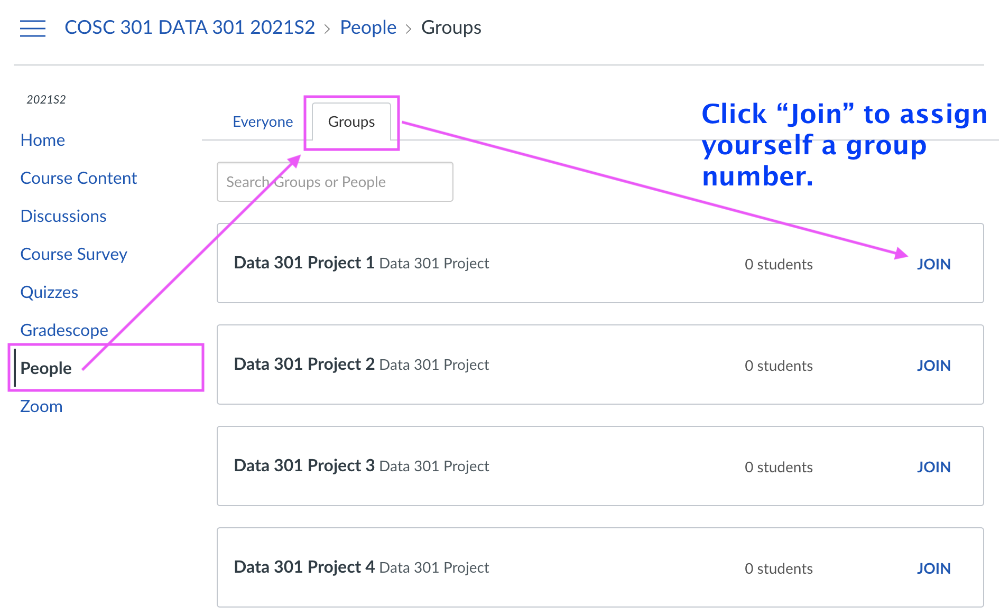

# Milestone 1 - Form Team and Find Dataset

<head>
  <base target="_blank">
</head>

In this milestone you will be expected to choose a dataset appropriate for the DATA 301 project.
The most important task for this milestone is to select an appropriate dataset.

## Overall Expectations

- On average, all team members should be contributing to the project equally!
- Each team member is responsible for their own research question(s), but the data processing, wrangling, and cleaning steps can be shared.
- Your question, analysis and visualizations should make sense, be well-formed, and it does not have to be complicated.
- You should use proper grammar and full sentences. Point form may occur, but should be less than 30% of your written documents.
- You must use proper English, spelling, and grammar and you should write concisely.
- There should be a plan in place to to deal with any teamwork conflicts and issues.

## Task 1. Form a Team

There is a little bit of additional work needed to form a team, so we can make sure that all team members are on the same page, and teamwork can happen harmoniously.

### How to find or create a group

To find or create a group of two or three, here's what you need to do:

1. Use the Ed Discussion megathread to post an "ad" looking for a team to join, or partners for your team.
2. Get in touch with your potential team members (you can message anyone in the class via the Canvas Inbox). 
3. Share contact details with each other, and arrange for an initial meeting (Zoom, phone, instagram live, whatever y'all use these days). 
    - I will give you some class time to make the initial contact and exchange information.
4. In your initial meeting discuss the following items:
    - What are your interests and goals with this project (datasets, research questions, what you want to learn)?
    - How much time will you be able to dedicate to this project?
    - What timezone(s) are you going to be in?
    - How frequently will you meet or discuss the project?
    - What are each of your strengths and weaknesses?
    - What will you do if there is a conflict or if issues arises within the team?
    - Do you all agree to stay in touch, and keep everyone informed despite how busy you are? I suggest setting a response time, say a response time of ~ 12-24 hours.
    - Do you think you will be able to work together for this project?
    - I suggest looking over Milestone 1 as a team and coming up with your answers together.
5. Once your initial meeting is done and you have answered those questions together, one person in the team should submit Milestone 1 on Gradescope and answer all the questions. 

You should try to reach out to your teammates as soon as possible via Canvas messages, Whatsapp, Snapchat, Instagram, canary bird, email, text, etc.

### Join a Group

All students (even those doing the project individually) must join a group so you can be assigned a group number. 
Group numbers are sequential from 1 onwards.
Please try to join groups sequentially - i.e. don't join group 55 when the next available group is 4.
Please do not join a group without talking to the other member(s) first and discussing a plan (see below).

## Task 2. Choose a topic and a dataset, and get it approved 

1. **YOU MUST HAVE YOUR DATA SET APPROVED BY A TA or the instructor.**
    - To get a dataset approved, fill out the questions on Gradescope for Milestone 1. The requirements to choose a dataset are below.

2. **Note: Though it may sound easy, it is not trivial to choose an interesting and relevant dataset. There are many, many thousands out there and the [tyranny of choice](https://www.economist.com/christmas-specials/2010/12/16/you-choose) is pretty overwhelming. I suggest you choose an "industry/sector" (health, technology, finance, sports, etc...), then set a 60 minute timer, start searching, and then choose one before the timer expires. You are welcome to post an issue on Ed Discussion if you want advice or approval of a dataset.**

3. Here are the requirements for choosing a dataset:

**Permission to use and distribute**

- Look for a creative commons license (CC4 for e.g.) or Public Domain and check to make sure you can make it publicly available
- Do not use datasets that require authentication, or APIs

**Data quality**

- Try to choose datasets that have no more than 5-10% missing values
- Ensure there are over 5000 observations in the dataset (this means that you can have 5 columns and 1000 rows, or 10 columns and 500 rows, etc...)
- Ensure there are at least 5 variables of potential interest in the dataset

**Interesting (to you)**

- Make sure you have some basic interest in the subject matter!
- There's nothing worse than doing a 6 week project on the a boring dataset (please don't pick a movies dataset)
- In the final weeks of the course you will be building a Dashboard with your data so choose wisely!

**Add your dataset to the repository**

- If your dataset is a file, and you have permission to redistribute it, you should add it to the `data/raw` directory

5. Below are some examples of datasets you are welcome to use for your project: 
  
- [Bike sharing](https://archive.ics.uci.edu/ml/datasets/bike+sharing+dataset)
- [Medical expenses](https://gist.github.com/meperezcuello/82a9f1c1c473d6585e750ad2e3c05a41)
- [Default of credit card](https://archive.ics.uci.edu/ml/datasets/default+of+credit+card+clients)
- [Adult incomes](https://archive.ics.uci.edu/ml/datasets/adult)
- [Parkinsons Telemonitoring](https://archive.ics.uci.edu/ml/datasets/Parkinsons+Telemonitoring)
- [Airbnb dataset](http://insideairbnb.com/get-the-data.html) (you can find information about several cities here and pick the one you want)
- [Air quality dataset](https://archive.ics.uci.edu/ml/datasets/Air+Quality)

There are literally hundreds of thousands of datasets available, I will point you to some high quality sources (keep in mind that I have not personally checked every single dataset):

- [fivethirtyeight](https://data.fivethirtyeight.com)
- [pudding.cool](https://github.com/the-pudding/data)
- [Buzzfeed](https://github.com/BuzzFeedNews/everything)
- [Data.gov](https://www.data.gov/)
- [data.world](https://data.world/) (requires free account)
- [kaggle](https://www.kaggle.com/datasets?license=cc)

6. There are a list of datasets that you are **not** allowed to choose either because A) I know them to be popular not but not great for this project, B) too complicated, C) too simple, or D) many students have chosen it in the past and I am now sick of seeing the same analyses :-).

- ~[Wine quality](http://archive.ics.uci.edu/ml/datasets/Wine+Quality)~
- ~[Pokemon](https://www.kaggle.com/rounakbanik/pokemon)~
- ~[Any YouTube Data](https://www.kaggle.com/rsrishav/youtube-trending-video-dataset)~
- ~[Spotify Dataset](https://www.kaggle.com/yamaerenay/spotify-dataset-19212020-160k-tracks)~

## Task 3: Submit Milestone 1

Milestone 1 will be submitted on Gradescope.
There are a series of questions you need to answer about your dataset.

