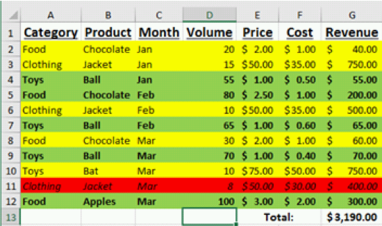
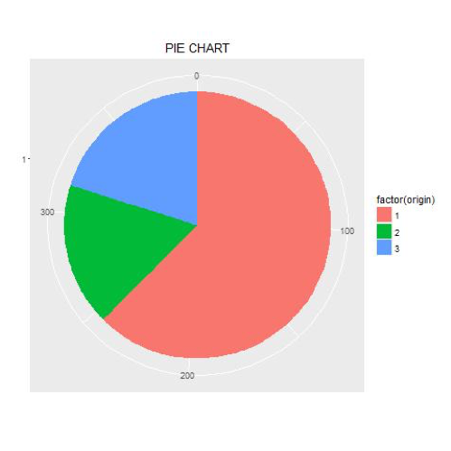
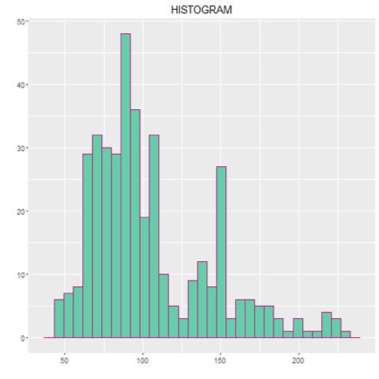
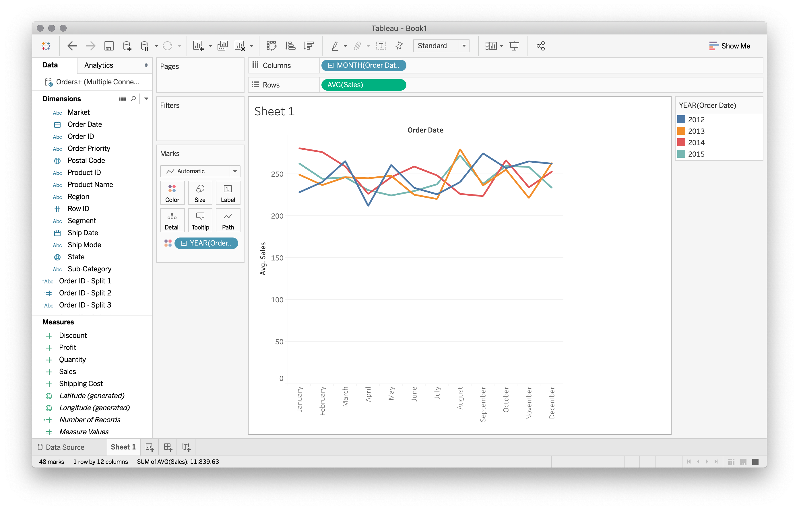
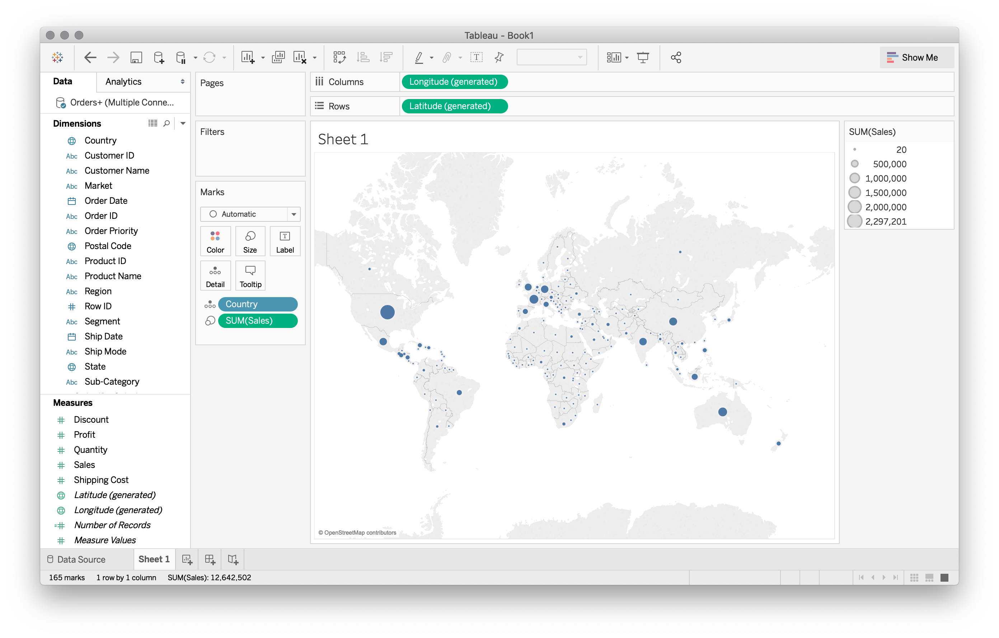
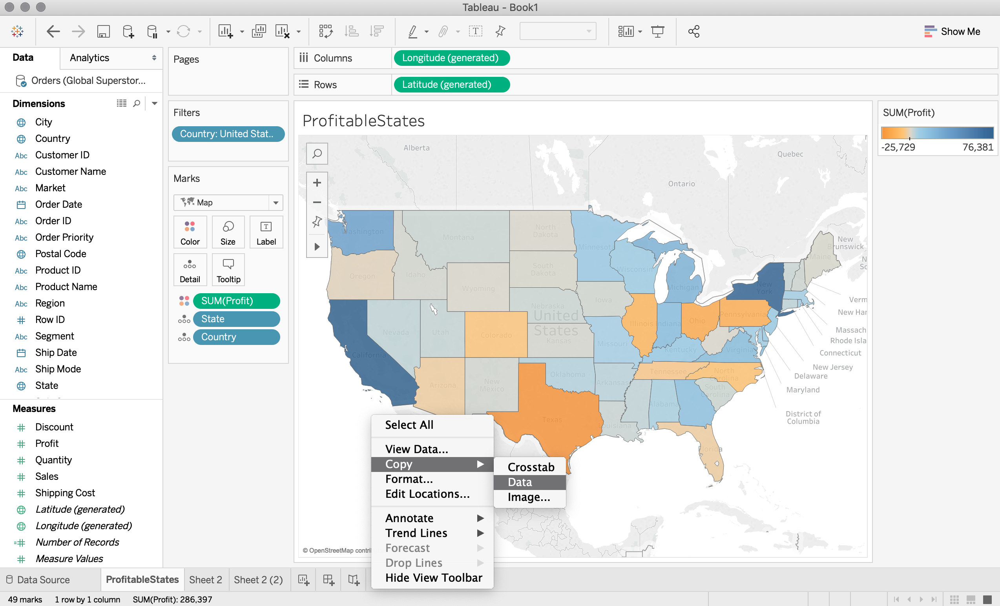

### Data 301 Data Analytics
### Data Visualization
### Why learn Visualization?
- 􏰏Visualization allows people to understand and extract information faster and with more accuracy than displaying text and numbers.
- A good visualization makes data more understandable and reachable to more people.
- High quality visualization encourages confidence in the data analysis and inspires people to utilize the data more effectively.
􏰏
### What is Data Visualization? What is Tableau?
Data visualization is the creation and presentation of visual representations of data with the goal to communicate information clearly and efficiently.
􏰏 - Data visualizations include graphs, charts, images, plots, and tables.
􏰏 - Data visualization is both an art and a science as it relies on both scientific data analysis and techniques as well as artistic creativity and presentation.

<b>Tableau</b> is a software package designed to make data visualization easy for non-expert users.

 ### Data Visualization with Previous Tools
􏰏
- We have seen data visualization in a variety of other tools including Excel, Python, and R.
- We saw how we could call to different packages to enhance visualization capabilities and improve the program’s base ability to effectively communicate the information to end users and increase simplicity in creating the visualizations.
- Each program has it’s advantages and disadvantages and there is no one perfect software package for data visualization as you must trade-off experience, time, and appearance.
􏰏
### Data Visualization with Excel
- In Excel, we saw examples of charts including pivot charts, sparklines, and visual formatting of cells.




Figure: Examples of data visualizations using Excel

### Data Visualization in Python
Using Python a variety of charting libraries are available including matplotlib and ggplot.
|||
|---|---|
|||

Figure: Examples of data visualizations using Python

### Data Visualization in R - Qualitative Data
Using in R we can create visualization for qualitative data in form of bar charts, frequency tables, pie charts,
|||
|---|---|
||||

Figure: Examples of qualitative data visualizations using ggplot in R

### Data Visualization in R - Quantitative Data
Using in R we saw examples of how we could represent quantitative data, eg. histograms, boxplots
|||
|---|---|
|||

Figure: Examples of quantitative data visualizations using R

- The last two slides demonstrate how the importance of the type of data being inputted into our graphics.
- Namely the collection of graphs we could create with qualitative data is different from the collection of graphs we could make with quantitative data.
- Tableau is a very powerful tool for data visualization, that will do a lot of the heavy lifting and allow us to gain deeper insights into our data.
- Tableau will help us guide us along the way by segregating qualitative from quantitative fields and provide suggestions on useful types of graphics depending on the inputted fields.

### Introduction to Tableau
􏰏 - [Tableau](https://www.tableau.com) was founded in 2003 as a spin-off from Stanford University by Chris Stolte, Christian Chabot and Pat Hanrahan.
 - The goal of Tableau is "to help people see and understand their data." - Christian Chabot, Tableau CEO
􏰏        - General goal: make less unknown and more known.
􏰏        - Graphical representation of data can allow us to see patterns
           that we may not necessarily see by examining the raw data.
  - Tableau has desktop and server (enterprise) products as well as Tableau Public allowing sharing of data sets.
### Getting Started
􏰏- We will be using the desktop version of [Tableau](https://www.tableau.com/academic/students)
- Visit [this](https://www.tableau.com/academic/students) site to obtain a license or to view examples of its use.
- We will be working with the Superstore data sets (Global Superstore Returns 2016.csv and Global Superstore Orders 2016.xlsx).
- The quickest way to download this data is to click the “Getting Started" video located on Tableau home page or here (you will need to register and sign in before you can see the videos).
􏰏
### Tableau Home page


### Home Page Tableau
􏰏
- On the right hand panel of the Home page, you will notice a series of instructional videos.
- These are a great resource to learn more about the features available in Tableau.
- See the training videos which use the Superstore data sets
􏰏    -  Global Superstore Orders 2016.xlsx
􏰏    - Global Superstore Returns 2016.csv
See finished workbook: getting_started_finished.twbx file
- On the left hand panel, you will notice that there are several ways that we can connect with data:
􏰏      - stored locally on our computer (eg. excel files, .csv) 
      - on a server (eg. MySQl)
   
### Home Page Tableau
􏰏 􏰏
- This requires that you have a license or trial key.
- Students qualify for a free license through the Tableau for Students Program if currently enrolled at an accredited academic institution (undergraduate/post-graduate level).
- The lab computers in SCI 234 should have Tableau installed (make sure you are using the latest version: Tableau 2019)
- Sidenote: the Professional Version of Tableau is priced at $1,999 + maintenance fee per license.
- There is also a free version of their software called [Tableau Public](https://public.tableau.com/en-us/s/).

### Superstore data
􏰏
- This excel file contains two tabs (ie two worksheets):
    - Orders which contains the products and transactions of
      customers.
    - People Customer information
- To begin, we read this file into Tableau by navigating to the Home Page > Connect (left panel) > To a file > Microsoft Excel.
- This will open a data source page, from which we can drag and add different data sources.

### Tableau Workspace


### Example Connecting to Excel


### Example Connecting to Excel
􏰏
- If we have related data in another data source, we can create an integrated data source by adding a connection, by clicking the “Add" link in the top left corner.

- For example, we can create a database-like JOIN with data from another source (eg. we can connect the Orders from Global Superstore Orders 2016.xlsx to the Returns from Global Superstore Returns 2016.csv)

### Tableau Workspace


### Tableau Workspace
Notice here that we have created a left join (on Order ID) which we can change by clicking on the Venn Diagram image.


We can also change meta-data in the excel-like spreedsheet.

### Tableau Workspace
Clicking on the ‘Sheet’ tab (orange button in the lower left hand corner) will bring us to this workspace:


### Tableau Features
   􏰏
- Supported [data types](https://help.tableau.com/current/pro/desktop/en-us/datafields_typesandroles_datatypes.htm): text , dates , numbers , geographical coordinates (latitude/longitude), Boolean
- There are a number of aggregation functions available in Tableau: sum, average, max, count, variance, etc.
- There are many built-in functions for numeric and string manipulation.
- Calculated fields can be created and are proceeded by an equal sign:
- Visualizations are created by dragging these fields (or “pills") to desired shelves, . . .

### Tableau Terminology
A pill is a field (i.e column in your data set) that can be placed in the visualization. The are stored one of two [field types](https://help.tableau.com/current/pro/desktop/en-us/datafields_typesandroles.htm)
<b>Dimension</b>or categorical/discrete information are colour-coded using blue pills
<b>Measures</b> , that is, metrics containing our quantitative information are colour-coded using green pills

Dimensions (eg. date, customer) are usually what is used for creating labels while the Measures (eg price) are the metrics we want to analyze (this data is often continuous).

### Tableau Terminology
A shelf is a location to put a pill.
􏰏 - Column shelf, row shelf, filter shelf
􏰏 - Row and column shelves are similar to Pivot tables in Excel but with built-in visualization.
Dragging pills to different shelves will change the way our graphics appears. To remove of undo a move, simple drag the pill off the shelf to delete, or press the undo button. The Clear Sheet button will erase the entire graphic


### Tableau Workspace Items


### View Cards
View or shape cards allows control of colour, shape, and size. They also enable filtering, labeling, and ability to add details on demand.

- <b>Color</b> expresses discrete or continuous values
- <b>Size</b> expresses discrete or continuous values
- <b>Label</b> one or more fields can be expressed as label on marks
- <b>Detail</b> disaggregates the marks plotted
- <b>Tooltip</b> makes fields available to tooltips without disaggregating data (shows info when hovering)
- <b>Shape</b> expresses discrete or continuous fields
Multiple fields can be placed on the colour, label, detail, and tooltip buttons.


􏰏 - Notice how Tableau will guess at useful aggregations of our data.
􏰏 
 - We can change these fields by clicking the pills located on each shelf
􏰏 􏰏
      - eg. change SUM to MEDIAN by Measure (Sum) > Median . 
      - eg. change the sales per year to sales per quarter or sales per month (see next slide for details)

For example, we may want to see average sales month-to-month for each year.
􏰏
- Click the + sign to the Left of the blue pill, to granulate the dates into finer subcategories (ie. Quarters)
- Drag year to the right of Quarter so that we see each quarter yearly (rather than each year quarterly)
- Then drag year to ‘Color’ to change this side by side line graph to a single line graph with a legend.
- Change Quarter to Month to get the next level of granularity for these dates
- Click the downarrow on the green pill and change Measure (Sum) > Average.



There are a number of other ‘quick calculations’ we have to choose from:


### Show Me Button
􏰏
􏰏- The Show Me button suggests visualization to use based on your current dimensions and measures.
- Choose the desired dimensions and measures by selecting them with your cursor while holding down the Ctrl key (window) or Cmnd key (mac).
- As your selections change, different chart types will be suggested for you (i.e. they will become highlighted) .
- Think of Show Me as your one-click option that will automatically place pills on shelves.

### Show Me
- Eg, since Country has a geographical component, a map seems like a natural choice:


### Show Me
For geographic data (small globe icon), Tableau automatically generates center-point geocodes (longitude/latitude).


### Show Me
We can click and drag ‘Sales’ onto the map to include this information in the graphic (depicted by size of the dot, also visible when hovering over the country)



### Tableau Question
``` text
Example
How many of the following statements are TRUE?
1. In Tableau blue pills are continuous.
2. A shelf is a location to place a pill.
3. The Show Me button will suggest visualizations for you.
4. A pill for a dimension may be on more than one shelf at the same time.
A) 0 B) 1 C) 2 D) 3 E) 4
```
```
Tableau Question
Answer
How many the following statements are TRUE?
1. In Tableau blue pills are continuous.#
2. A shelf is a location to place a pill. 
3. The Show Me button will suggest visualizations for you. 
4. A pill for a dimension may be on more than one shelf at the same time. 
```
A) 0 B) 1 C) 2 <b>D) 3<b> E) 4
  
 ### Try it: Tableau Visulations
 Example
- 􏰏Install Tableau.Use trial version or [Tableau for students](https://www.tableau.com/academic/students)
- Start Tableau. Use the sample.twbx file or the Superstore example and explore the visualizations.
- Try create any visualization of the data.

### Tableau - Data Sources
Tableau can connect to a wide variety of data sources including:
􏰏 􏰏 􏰏
- Microsoft Excel and Access Text files (txt, csv)
- Relational databases (MySQL, SQL Server, Oracle, PostgreSQL)
- NoSQL databases (MongoDB)
- Parallel and analytical databases (Greenplum, Vertica, Teradata)
- Other ODBC sources (note JDBC is not supported)

### Connecting to relational databases

 Connecting to a relational database like MySQL and Microsoft SQL requires:
􏰏 - Driver (often need to [download](https://www.tableau.com/support/drivers) from database vendor) 􏰏 
 - Database connection information

### Connecting to relational databases
Once you have the necessary driver, you simple click on the appropriate option on the left hand panel of the home screen:


### Connecting to relational databases
At this point you will be asked to fill in the required fields in a pop a window like this:


Using the above credentials with password ubc should grant you access to the WorksOn database that we have studied in out SQL unit.
In order to connect to this database you need to be on ubcsecure wifi on campus.
To access it from home:
􏰏- Download VPN tool at: https://myvpn.ok.ubc.ca/ and follow instructions there.
- Launch Cisco AnyConnect and enter myvpn.ok.ubc.ca as the host and click Connect.
- Enter CWL to authenticate.

### Connecting to MySQL
||
|---|
||

### Connect or Extract Data
Tableau has its own internal data engine. There are two options when retrieving data to visualize:
1. Direct connect to source to get live data
􏰏   - Can refresh data using F5 or selecting refresh menu item
􏰏   - May be faster depending on data set/visualization
2. Extract and import data into Tableau’s data engine
􏰏   - May get a performance improvement as data is local
􏰏   - May set certain scheduled times to extract and keep data up to date
􏰏    - Portability (as consumer of report does not need access to data source)
### Tableau Data Source Question
```text
 Example
How many of the following statements are TRUE?
1. Tableau can connect to relational databases.
2. Tableau can process data in text and Excel files.
3. Tableau can JOIN information across tables from multiple sources.
4. Tableau will try to identify types and relationships from the data sources.
A) 0 B) 1 C) 2 D) 3 E) 4
```
||
|---|
|
Answer
How many of the following statements are TRUE?
1. Tableau can connect to relational databases. 
2. Tableau can process data in text and Excel files.
3. Tableau can JOIN information across tables from multiple sources.
4. Tableau will try to identify types and relationships from the data sources.
<br> A) 0 B) 1 C) 2 D) 3 <b>E) 4</b>|

### Try it: Tableau Data Sources
|Example|
|---|
|Use Tableau to connect to Excel and MySQL data sources.<br> - Start Tableau. Open up Superstore Excel data source (either XLS or TDS file) in <br>Tableau/defaults/Datasources directory.<br> - [install](https://dev.mysql.com/downloads/connector/odbc/) the MySQL ODBC connector<br>- Server: cosc304.ok.ubc.ca Database: data301 User:data301 Password: ubc <br>Superstore visualizations:<br>-  Map showing profit by state. Save this sheet as State Profit<br>- Visualization to indicate what is the best selling product category per market. Save this sheet as Best Product<br>- Annotate the best selling product category for each marke|

### Some notes
􏰏 - You can rename the tabs in Tableau in the same way we would in Excel (double click the the tab and rename).
􏰏 - If we want the raw data associated with a visualization, it is as simple as right clicking on the image, then selecting Copy > Data and pasting this information into Excel.
􏰏 - Alternatively, you could go to toolbar and select Worksheet > Duplicate as Crosstab.
### Copy data in Tableau



### Paste into Excel


### Duplicate as crosstab

### Interactive plots
 - We can also make the plot interactive by right clicking a desired field and selecting "Show Filter".

- For instance, if we select "Show Filter" for Country, the list of countries will appear in the right hand panel of our graphic.
 
- The user can now select of deselect other countries for our visualization or "viz"

### Subcategories
􏰏
- Hierarchies are groupings of data that make it easier to roll-up and drill-down into data. Examples:
􏰏    - year, quarter, month
􏰏    - country, state, city
- We can create own hierarchies by dragging dimensions on top of each other.
- For example, in the Superstore data, ‘Sub-category’ is a, for lack of better term, sub-category of ‘Category’.
- To have Tableau recognize it as such, we simply drag the sub-category pill over-top of category (in addition, we could do that with product name).
- We might name this new pill ‘Product’.

### User made dimension
Notice that the ‘Product’ pill now has a clickable + sign to expand and collapse the levels of the hierarchy.


